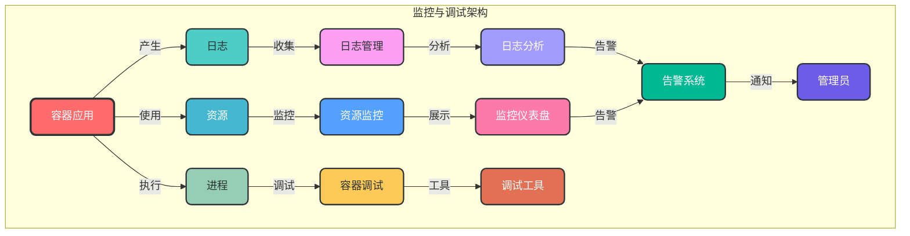

# 8. 监控与调试

## 8.1 核心概念

Docker 监控与调试是确保容器化应用稳定运行的重要环节。监控用于实时了解容器和应用的运行状态，调试用于定位和解决容器运行中的问题。

### 8.1.1 监控与调试架构



## 8.2 容器监控

### 8.2.1 Docker 内置监控工具

#### 8.2.1.1 Docker Stats

Docker Stats 是 Docker 内置的监控工具，用于实时查看容器的资源使用情况。

```bash
# 查看所有运行中容器的资源使用情况
docker stats

# 查看指定容器的资源使用情况
docker stats <container_name>

# 格式化输出
docker stats --format "table {{.Name}}\t{{.CPUPerc}}\t{{.MemUsage}}\t{{.NetIO}}\t{{.BlockIO}}"

# 非交互式模式
docker stats --no-stream

# 示例：查看 nginx 容器的资源使用情况
docker stats nginx
```

#### 8.2.1.2 Docker Events

Docker Events 用于监控 Docker 系统事件，如容器创建、启动、停止等。

```bash
# 查看 Docker 系统事件
docker events

# 过滤容器事件
docker events --filter "type=container"

# 查看最近 10 分钟的事件
docker events --since "10m"

# 格式化输出
docker events --format '{{.Time}} {{.Type}} {{.Action}} {{.Actor.Attributes.name}}'
```

### 8.2.2 第三方监控工具

#### 8.2.2.1 cAdvisor

cAdvisor（Container Advisor）是 Google 开源的容器监控工具，用于收集、聚合和导出容器的资源使用情况和性能数据。

```bash
# 运行 cAdvisor 容器
docker run \
  --volume=/:/rootfs:ro \
  --volume=/var/run:/var/run:ro \
  --volume=/sys:/sys:ro \
  --volume=/var/lib/docker/:/var/lib/docker:ro \
  --publish=8080:8080 \
  --detach=true \
  --name=cadvisor \
  gcr.io/cadvisor/cadvisor:latest
```

访问 `http://localhost:8080` 查看 cAdvisor 监控界面。

#### 8.2.2.2 Prometheus + Grafana

Prometheus 是一个开源的监控和告警系统，Grafana 是一个开源的数据可视化工具，两者结合可以构建强大的容器监控平台。

```yaml
# docker-compose.yml
version: '3.8'

services:
  prometheus:
    image: prom/prometheus
    ports:
      - "9090:9090"
    volumes:
      - ./prometheus.yml:/etc/prometheus/prometheus.yml
      - prometheus-data:/prometheus
    command:
      - '--config.file=/etc/prometheus/prometheus.yml'
      - '--storage.tsdb.path=/prometheus'
      - '--web.console.libraries=/etc/prometheus/console_libraries'
      - '--web.console.templates=/etc/prometheus/consoles'
      - '--web.enable-lifecycle'
    restart: always

  grafana:
    image: grafana/grafana
    ports:
      - "3000:3000"
    volumes:
      - grafana-data:/var/lib/grafana
    restart: always
    depends_on:
      - prometheus

  node-exporter:
    image: prom/node-exporter
    ports:
      - "9100:9100"
    restart: always

  cadvisor:
    image: gcr.io/cadvisor/cadvisor
    ports:
      - "8080:8080"
    volumes:
      - /:/rootfs:ro
      - /var/run:/var/run:ro
      - /sys:/sys:ro
      - /var/lib/docker/:/var/lib/docker:ro
    restart: always

volumes:
  prometheus-data:
  grafana-data:
```

```yaml
# prometheus.yml
global:
  scrape_interval: 15s

scrape_configs:
  - job_name: 'prometheus'
    static_configs:
      - targets: ['localhost:9090']
  
  - job_name: 'node-exporter'
    static_configs:
      - targets: ['node-exporter:9100']
  
  - job_name: 'cadvisor'
    static_configs:
      - targets: ['cadvisor:8080']
```

#### 8.2.2.3 Sysdig

Sysdig 是一个系统级监控和分析工具，提供了深入的容器监控和调试功能。

```bash
# 安装 Sysdig
sudo curl -s https://s3.amazonaws.com/download.draios.com/stable/install-sysdig | sudo bash

# 运行 Sysdig
sudo sysdig

# 监控指定容器
sudo sysdig container.name=nginx

# 使用 csysdig（Sysdig 的交互式界面）
sudo csysdig
```

### 8.2.3 日志管理

#### 8.2.3.1 Docker 日志驱动

Docker 支持多种日志驱动，用于管理容器日志。

| 日志驱动 | 描述 | 适用场景 |
|---------|------|----------|
| json-file | 默认日志驱动，将日志存储为 JSON 文件 | 开发环境、小规模部署 |
| syslog | 将日志发送到 syslog 服务器 | 企业级日志管理 |
| journald | 将日志发送到 systemd journal | 基于 systemd 的系统 |
| gelf | 将日志发送到 Graylog 或 Logstash | 集中式日志管理 |
| fluentd | 将日志发送到 Fluentd 服务器 | 日志聚合、分析 |

#### 8.2.3.2 日志收集工具

##### 8.2.3.2.1 Fluentd

Fluentd 是一个开源的日志收集和聚合工具，用于统一日志管理。

```bash
# 运行 Fluentd 容器
docker run -d --name fluentd -p 24224:24224 -v $(pwd)/fluentd.conf:/fluentd/etc/fluentd.conf fluent/fluentd:v1.14-1
```

```conf
# fluentd.conf
<source>
  @type forward
  port 24224
  bind 0.0.0.0
</source>

<match **>
  @type stdout
</match>
```

##### 8.2.3.2.2 ELK Stack

ELK Stack（Elasticsearch、Logstash、Kibana）是一个流行的集中式日志管理解决方案。

```yaml
# docker-compose.yml
version: '3.8'

services:
  elasticsearch:
    image: elasticsearch:7.17.0
    ports:
      - "9200:9200"
      - "9300:9300"
    environment:
      - discovery.type=single-node
    volumes:
      - es-data:/usr/share/elasticsearch/data

  logstash:
    image: logstash:7.17.0
    ports:
      - "5044:5044"
      - "5000:5000/tcp"
      - "5000:5000/udp"
    volumes:
      - ./logstash.conf:/usr/share/logstash/pipeline/logstash.conf
    depends_on:
      - elasticsearch

  kibana:
    image: kibana:7.17.0
    ports:
      - "5601:5601"
    depends_on:
      - elasticsearch

volumes:
  es-data:
```

```conf
# logstash.conf
input {
  tcp {
    port => 5000
    codec => json
  }
  udp {
    port => 5000
    codec => json
  }
}

output {
  elasticsearch {
    hosts => ["elasticsearch:9200"]
    index => "docker-logs-%{+YYYY.MM.dd}"
  }
}
```

## 8.3 容器调试

### 8.3.1 基本调试命令

```bash
# 查看容器日志
docker logs <container_name>

# 实时查看容器日志
docker logs -f <container_name>

# 查看容器进程
docker top <container_name>

# 查看容器网络配置
docker inspect <container_name> | grep -A 20 "Networks"

# 查看容器文件系统变化
docker diff <container_name>

# 进入容器（交互式）
docker exec -it <container_name> <shell>

# 示例：进入 nginx 容器
docker exec -it nginx sh
```

### 8.3.2 高级调试技巧

#### 8.3.2.1 调试容器网络

```bash
# 测试容器网络连通性
docker exec <container_name> ping -c 3 <target>

# 查看容器 DNS 配置
docker exec <container_name> cat /etc/resolv.conf

# 测试容器 DNS 解析
docker exec <container_name> nslookup www.baidu.com

# 查看容器端口映射
docker port <container_name>

# 示例：测试 nginx 容器到 mysql 容器的连通性
docker exec nginx ping -c 3 mysql
```

#### 8.3.2.2 调试容器存储

```bash
# 查看容器挂载的卷
docker inspect <container_name> | grep -A 20 "Mounts"

# 查看容器内文件系统
docker exec <container_name> df -h

# 查看容器内磁盘使用情况
docker exec <container_name> du -sh /*

# 示例：查看 nginx 容器的挂载卷
docker inspect nginx | grep -A 20 "Mounts"
```

#### 8.3.2.3 调试容器进程

```bash
# 查看容器内进程
docker top <container_name>

# 查看容器内进程详细信息
docker exec <container_name> ps aux

# 查看进程打开的文件
docker exec <container_name> lsof -p <pid>

# 查看进程网络连接
docker exec <container_name> netstat -tuln

# 示例：查看 nginx 容器内的进程
docker top nginx
```

### 8.3.3 调试工具

#### 8.3.3.1 Docker Debug

Docker 19.03+ 引入了 `docker debug` 命令，用于调试运行中的容器。

```bash
# 调试容器
docker debug <container_name>

# 示例：调试 nginx 容器
docker debug nginx
```

#### 8.3.3.2 调试镜像

```bash
# 运行一个临时容器进行调试
docker run -it --rm --entrypoint sh <image_name>

# 示例：调试 nginx 镜像
docker run -it --rm --entrypoint sh nginx:alpine
```

#### 8.3.3.3 使用 Busybox 进行调试

Busybox 是一个轻量级的工具集，包含了常用的 Unix 命令，适用于调试容器。

```bash
# 运行 Busybox 容器
docker run -it --rm --network container:<container_name> busybox

# 示例：使用 Busybox 调试 nginx 容器的网络
docker run -it --rm --network container:nginx busybox ping -c 3 www.baidu.com
```

## 8.4 监控与调试最佳实践

1. **建立完善的监控体系**：使用多种监控工具，全面监控容器和应用
2. **集中式日志管理**：将所有容器日志集中收集和管理
3. **设置合理的告警阈值**：根据实际情况设置资源使用和性能告警阈值
4. **定期分析监控数据**：定期分析监控数据，发现潜在问题
5. **使用标准化的调试流程**：建立标准化的容器调试流程
6. **保留足够的日志**：配置合适的日志保留策略，便于故障排查
7. **使用调试镜像**：为生产镜像创建对应的调试镜像，包含完整的调试工具
8. **监控应用性能**：除了容器资源，还要监控应用的性能指标
9. **定期进行压力测试**：定期进行压力测试，了解系统的极限性能
10. **文档化调试经验**：将常见问题和解决方案文档化，便于团队共享

## 8.5 常见监控与调试问题

### 8.5.1 容器日志过大

```bash
# 问题：容器日志占用过多磁盘空间
# 解决方案：

# 1. 配置日志驱动的日志大小限制
echo '{"log-driver": "json-file", "log-opts": {"max-size": "10m", "max-file": "3"}}' > /etc/docker/daemon.json
systemctl restart docker

# 2. 清理现有日志文件
docker system prune --volumes

# 3. 使用外部日志管理系统
# 配置 Docker 使用 syslog 或其他外部日志驱动
```

### 8.5.2 容器资源使用过高

```bash
# 问题：容器 CPU 或内存使用过高
# 解决方案：

# 1. 查看容器资源使用情况
docker stats <container_name>

# 2. 查看容器进程
docker top <container_name>

# 3. 进入容器进行调试
docker exec -it <container_name> <shell>

# 4. 优化应用代码或配置
# 5. 调整容器资源限制
docker update --cpus 0.5 --memory 512m <container_name>
```

### 8.5.3 容器网络不通

```bash
# 问题：容器无法访问外部网络
# 解决方案：

# 1. 检查容器网络配置
docker inspect <container_name> | grep -A 20 "Networks"

# 2. 测试容器网络连通性
docker exec <container_name> ping -c 3 www.baidu.com

# 3. 检查 Docker 网络配置
docker network inspect <network_name>

# 4. 检查宿主机网络配置
ip addr

# 5. 重启 Docker 服务
systemctl restart docker
```

## 8.6 监控与调试工具对比

| 工具 | 类型 | 优势 | 劣势 | 适用场景 |
|------|------|------|------|----------|
| Docker Stats | 内置工具 | 简单易用，无需额外安装 | 功能有限，仅支持基础监控 | 快速查看容器资源使用情况 |
| cAdvisor | 开源工具 | 全面的容器监控，支持多种指标 | 配置复杂，需要额外的存储和可视化 | 中大型容器集群 |
| Prometheus + Grafana | 开源组合 | 强大的监控和可视化能力，支持告警 | 部署和配置复杂 | 大规模容器集群，生产环境 |
| Sysdig | 商业工具 | 深入的系统级监控和调试功能 | 商业版收费，资源消耗较大 | 复杂应用的调试和性能分析 |
| ELK Stack | 开源组合 | 强大的日志管理和分析能力 | 部署和维护复杂，资源消耗大 | 大规模日志管理和分析 |
| Fluentd | 开源工具 | 灵活的日志收集和聚合，支持多种数据源和输出 | 配置复杂，需要一定的学习成本 | 日志聚合和转发 |

通过本章节的学习，您已经掌握了 Docker 监控与调试的核心概念、工具和最佳实践。监控与调试是确保容器化应用稳定运行的重要环节，熟练掌握这些知识将帮助您快速定位和解决容器运行中的问题，提高应用的可靠性和稳定性。