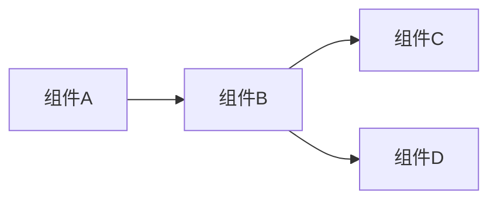

# 模块实现文档模板

## 1. 文档概述

### 1.1 实现目标

[描述本模块的实现目标，包括功能特性、性能要求和业务价值]

### 1.2 适用范围

[描述本实现文档适用的场景、系统组件和业务范围]

### 1.3 术语定义

| 术语 | 解释 |
|------|------|
| [术语1] | [解释1] |
| [术语2] | [解释2] |
| [术语3] | [解释3] |

## 2. 实现架构

### 2.1 模块结构

[描述模块的整体结构和组件关系，可使用流程图或架构图展示]



### 2.2 技术栈

| 技术/框架 | 版本 | 用途 |
|-----------|------|------|
| FastAPI | [版本] | Web框架 |
| SQLAlchemy | [版本] | ORM框架 |
| Pydantic | [版本] | 数据校验 |
| [技术1] | [版本1] | [用途1] |
| [技术2] | [版本2] | [用途2] |

## 3. 目录结构

```
├── app/
│   ├── [module_name]/          # 模块核心目录
│   │   ├── __init__.py         # 包初始化，导出核心组件
│   │   ├── base.py             # 基础类定义
│   │   ├── config.py           # 配置类
│   │   ├── models/             # 数据模型目录
│   │   │   ├── __init__.py     # 模型包初始化
│   │   │   └── [model1].py     # 具体模型实现
│   │   ├── schemas/            # 数据校验目录
│   │   │   ├── __init__.py     # 模式包初始化
│   │   │   └── [schema1].py    # 具体模式实现
│   │   ├── services/           # 服务层目录
│   │   │   ├── __init__.py     # 服务包初始化
│   │   │   └── [service1].py   # 具体服务实现
│   │   └── utils/              # 工具函数目录
│   │       ├── __init__.py     # 工具包初始化
│   │       └── [util1].py      # 具体工具实现
│   └── main.py                 # 应用入口，模块注册
├── tests/
│   └── [module_name]/          # 测试目录
│       ├── __init__.py         # 测试包初始化
│       └── test_[module].py    # 测试用例
└── docs/
    └── [module_name]/          # 文档目录
        └── implementation.md   # 本实现文档
```

## 4. 核心功能实现

### 4.1 功能1：[功能名称]

#### 4.1.1 功能描述

[详细描述该功能的业务逻辑和实现目标]

#### 4.1.2 实现细节

[描述功能的实现细节，包括核心算法、关键流程和设计决策]

#### 4.1.3 代码示例

```python
# 核心功能实现示例
from fastapi import APIRouter, Depends
from sqlalchemy.orm import Session
from app.dependencies.db import get_db
from app.[module_name].schemas import [Schema]
from app.[module_name].services import [Service]

router = APIRouter(prefix="/[module_name]", tags=["[模块] 功能管理"])

@router.post("/", response_model=[Schema])
def create_[resource](
    [resource]_in: [SchemaCreate],
    db: Session = Depends(get_db)
):
    """创建[资源]"""
    return [Service].create(db, [resource]_in)
```

#### 4.1.4 测试用例

```python
# 测试用例示例
import pytest
from fastapi.testclient import TestClient
from app.main import app

client = TestClient(app)

@pytest.mark.parametrize("[param], expected", [
    ([value1], [expected1]),
    ([value2], [expected2]),
])
def test_[function]([param], expected):
    """测试[功能]"""
    response = client.post("/[module_name]/", json={"[field]": [param]})
    assert response.status_code == 201
    assert response.json()["[field]"] == expected
```

### 4.2 功能2：[功能名称]

[类似功能1的结构]

## 5. API 接口文档

### 5.1 接口列表

| 接口路径 | 方法 | 功能描述 | 请求体 | 响应体 | 状态码 |
|----------|------|----------|--------|--------|--------|
| /[module]/ | POST | 创建[资源] | [请求体Schema] | [响应体Schema] | 201 |
| /[module]/{id} | GET | 获取[资源] | N/A | [响应体Schema] | 200 |
| /[module]/{id} | PUT | 更新[资源] | [请求体Schema] | [响应体Schema] | 200 |
| /[module]/{id} | DELETE | 删除[资源] | N/A | N/A | 204 |

### 5.2 接口详情

#### 5.2.1 创建[资源]

**请求 URL**：`/[module]/`

**请求方法**：`POST`

**请求头**：
- Content-Type: application/json
- Authorization: Bearer [token] (如果需要认证)

**请求体**：
```json
{
  "[field1]": "[value1]",
  "[field2]": [value2],
  "[field3]": "[value3]"
}
```

**响应体**：
```json
{
  "id": 1,
  "[field1]": "[value1]",
  "[field2]": [value2],
  "[field3]": "[value3]",
  "created_at": "2023-01-01T00:00:00"
}
```

#### 5.2.2 获取[资源]

[类似创建资源的结构]

## 6. 配置与部署

### 6.1 配置项

| 配置项 | 类型 | 默认值 | 描述 | 环境变量 |
|--------|------|--------|------|----------|
| [配置1] | [类型1] | [默认值1] | [描述1] | [ENV_VAR1] |
| [配置2] | [类型2] | [默认值2] | [描述2] | [ENV_VAR2] |
| [配置3] | [类型3] | [默认值3] | [描述3] | [ENV_VAR3] |

### 6.2 部署步骤

1. **环境准备**
   - 安装依赖：`pip install -r requirements.txt`
   - 配置环境变量：`cp .env.example .env`，并修改相关配置

2. **数据库迁移**
   - 初始化数据库：`alembic upgrade head`

3. **启动服务**
   - 开发环境：`uvicorn app.main:app --reload`
   - 生产环境：`gunicorn -w 4 -k uvicorn.workers.UvicornWorker app.main:app`

### 6.3 监控与日志

- **日志配置**：日志输出到控制台和文件，配置文件位于 `app/logger/config.py`
- **监控指标**：可集成 Prometheus 监控，配置文件位于 `app/config/prometheus.py`

## 7. 使用指南

### 7.1 快速开始

```python
# 导入模块
from app.[module_name] import [Component]

# 初始化组件
[component] = [Component](config)

# 调用方法
result = [component].[method]([param])
```

### 7.2 典型用例

#### 7.2.1 用例1：[用例名称]

[描述典型使用场景和示例代码]

```python
# 用例示例
from app.[module_name] import [Component]

# 初始化
[component] = [Component](config)

# 业务逻辑
[result] = [component].[method]([param])

# 处理结果
print(f"处理结果: {[result]}")
```

#### 7.2.2 用例2：[用例名称]

[类似用例1的结构]

## 8. 性能优化

### 8.1 优化点1：[优化项]

[描述优化的具体内容、实现方式和效果]

### 8.2 优化点2：[优化项]

[类似优化点1的结构]

## 9. 故障处理与调试

### 9.1 常见问题

| 问题 | 原因 | 解决方案 |
|------|------|----------|
| [问题1] | [原因1] | [解决方案1] |
| [问题2] | [原因2] | [解决方案2] |
| [问题3] | [原因3] | [解决方案3] |

### 9.2 调试技巧

[描述常用的调试方法、日志查看技巧和问题定位策略]

## 10. 测试与质量保证

### 10.1 测试覆盖率

| 模块 | 覆盖率 | 备注 |
|------|--------|------|
| [模块1] | [覆盖率1] | [备注1] |
| [模块2] | [覆盖率2] | [备注2] |

### 10.2 测试工具

- **单元测试**：pytest
- **集成测试**：FastAPI TestClient
- **API测试**：Swagger UI (http://localhost:8000/docs)
- **性能测试**：locust

### 10.3 测试命令

```bash
# 运行所有测试
pytest

# 运行特定模块测试
pytest tests/[module_name]/ -v

# 生成测试覆盖率报告
pytest --cov=app.[module_name] --cov-report=html

# 运行性能测试
locust -f tests/perf_test.py
```

## 11. 版本管理与升级

### 11.1 版本历史

| 版本 | 发布日期 | 主要变更 |
|------|----------|----------|
| v1.0.0 | YYYY-MM-DD | 初始版本，实现核心功能 |
| v1.1.0 | YYYY-MM-DD | 新增[功能]，优化[性能] |
| v2.0.0 | YYYY-MM-DD | 重构API，支持[新特性] |

### 11.2 升级指南

#### 11.2.1 从 v1.x 升级到 v2.x

1. **依赖升级**
   ```bash
   pip install -U [package]==2.0.0
   ```

2. **代码变更**
   - [变更1]：修改[接口]调用方式
   - [变更2]：更新[配置]项

3. **数据库迁移**
   ```bash
   alembic upgrade head
   ```

## 12. 最佳实践

### 12.1 编码规范

- 遵循 PEP 8 编码规范
- 使用类型注解提高代码可读性和可维护性
- 编写清晰的文档字符串，遵循 Google 风格
- 保持函数单一职责，避免大而全的函数

### 12.2 安全建议

- 输入验证：使用 Pydantic 进行严格的数据校验
- 认证授权：使用 OAuth2/JWT 进行身份验证
- 防止 SQL 注入：使用 SQLAlchemy ORM 或参数化查询
- 防止 XSS 攻击：对输出进行适当的转义
- 保护敏感数据：使用环境变量存储密钥和敏感信息

### 12.3 性能建议

- 使用缓存：对频繁访问的数据进行缓存
- 数据库优化：添加适当的索引，优化查询语句
- 异步处理：对IO密集型操作使用异步IO
- 批量处理：对大量数据操作使用批量处理

## 13. 总结与展望

### 13.1 实现总结

[总结模块的实现情况，包括完成的功能、达到的效果和存在的不足]

### 13.2 未来规划

[描述模块的未来发展方向，包括计划新增的功能、性能优化和架构改进]

## 14. 附录

### 14.1 相关文档

| 文档名称 | 链接 |
|----------|------|
| [设计文档] | [链接1] |
| [API文档] | [链接2] |
| [部署文档] | [链接3] |

### 14.2 参考资料

- [参考1]：[链接1]
- [参考2]：[链接2]
- [参考3]：[链接3]
