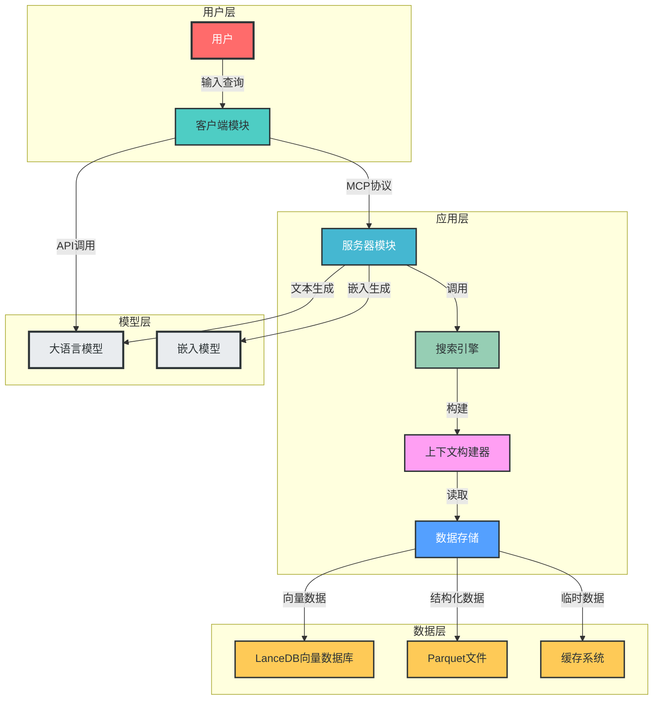
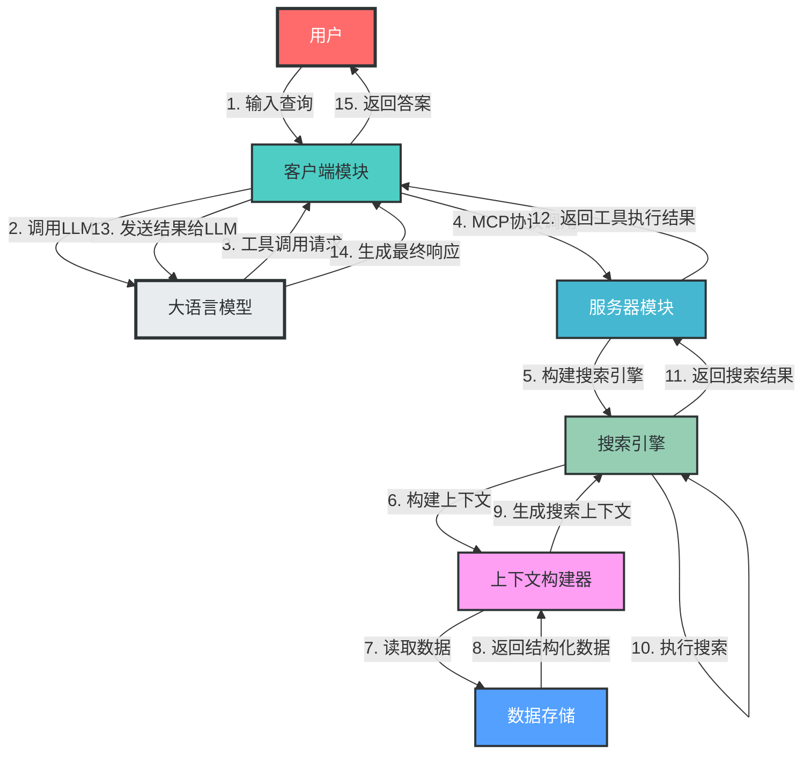
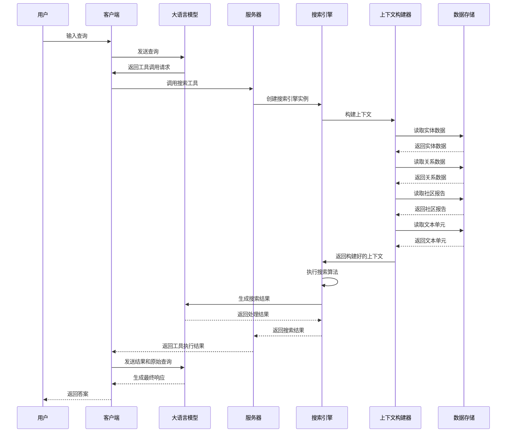
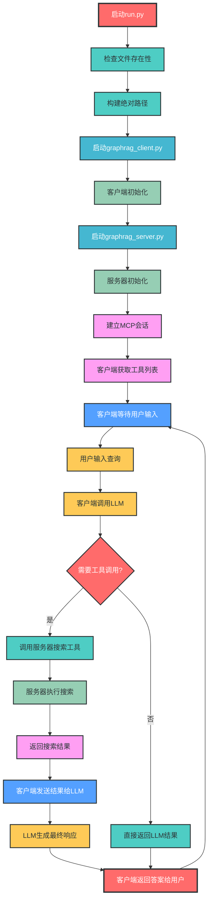

# GraphRAG 智能问答系统设计文档

## 1. 文档概述

### 1.1 设计目标

#### 业务目标
- 为《斗破苍穹》小说内容提供精准的智能问答服务
- 实现实体关系的检索与分析
- 支持多模式搜索能力，满足不同场景需求
- 提供自然语言交互界面，提升用户体验

#### 技术目标
- 基于 FastAPI 框架构建高效、可扩展的服务模块
- 实现 GraphRAG（图检索增强生成）技术架构
- 集成向量数据库与大语言模型，提供精准的知识检索
- 采用客户端-服务器架构，通过 MCP 协议实现模块间通信
- 支持异步处理，提高系统响应速度

### 1.2 核心概念

| 概念 | 解释 |
|------|------|
| GraphRAG | 图检索增强生成技术，结合知识图谱与检索增强生成，提供更精准的问答能力 |
| MCP | Model Context Protocol，模型上下文协议，用于模块间通信 |
| 向量数据库 | 存储实体向量表示，支持相似度搜索的数据库系统 |
| 实体 | 小说中的人物、地点、物品等具体对象 |
| 关系 | 实体之间的关联，如人物关系、事件关联等 |
| 社区 | 基于实体关系构建的社区结构，用于全局搜索 |
| 本地搜索 | 在局部上下文内进行的搜索，适合具体问题 |
| 全局搜索 | 在整个知识图谱范围内进行的搜索，适合主题性问题 |
| DRIFT搜索 | 动态上下文驱动的搜索，结合多种搜索模式 |

### 1.3 技术栈

- **框架**：FastAPI（后端服务）
- **语言**：Python 3.8+
- **数据库**：LanceDB（向量数据库）
- **数据格式**：Parquet（结构化数据存储）
- **通信协议**：MCP（模型上下文协议）
- **大语言模型**：兼容 OpenAI API 的模型
- **向量嵌入**：OpenAI Embeddings 或兼容模型

### 1.4 依赖包

| 依赖包 | 版本要求 | 用途 |
|--------|----------|------|
| graphrag | 最新版 | GraphRAG 框架核心功能 |
| lancedb | 最新版 | 向量数据库 |
| pandas | ^2.0.0 | 数据处理 |
| tiktoken | ^0.5.0 | 令牌编码 |
| mcp | 最新版 | 模块通信协议 |
| openai | ^1.0.0 | 大语言模型接口 |
| python-dotenv | ^1.0.0 | 环境变量管理 |
| httpx | ^0.25.0 | HTTP 客户端 |
| fastapi | ^0.100.0 | Web 框架 |
| uvicorn | ^0.23.0 | ASGI 服务器 |

## 2. 目录结构设计

```
mcp_rag_agent_graphrag_demo/
├── doupocangqiong/           # 项目数据目录
│   ├── cache/                # 缓存目录
│   │   ├── community_reporting/  # 社区报告缓存
│   │   ├── entity_extraction/    # 实体提取缓存
│   │   ├── summarize_descriptions/  # 摘要生成缓存
│   │   └── text_embedding/        # 文本嵌入缓存
│   ├── input/                # 输入数据目录
│   │   └── doupocangqiong.txt     # 小说源文件
│   ├── logs/                 # 日志目录
│   │   └── logs.json         # 日志文件
│   ├── output/               # 输出数据目录
│   │   ├── lancedb/          # LanceDB 向量数据库
│   │   ├── create_final_communities.parquet  # 社区数据
│   │   ├── create_final_community_reports.parquet  # 社区报告
│   │   ├── create_final_documents.parquet    # 文档数据
│   │   ├── create_final_entities.parquet     # 实体数据
│   │   ├── create_final_nodes.parquet        # 节点数据
│   │   ├── create_final_relationships.parquet # 关系数据
│   │   ├── create_final_text_units.parquet   # 文本单元数据
│   │   └── stats.json        # 统计信息
│   ├── prompts/              # 提示词目录
│   └── settings.yaml         # 配置文件
├── .env.example              # 环境变量示例
├── graphrag_client.py        # 客户端实现
├── graphrag_server.py        # 服务器实现
├── run.py                    # 启动脚本
└── __init__.py               # 包初始化文件
```

### 目录结构说明

- **doupocangqiong/**：存放项目核心数据，包括输入、输出、缓存和配置
- **cache/**：存储各阶段生成的缓存数据，优化重复运行性能
- **input/**：存放原始输入数据（小说文本）
- **logs/**：记录系统运行日志
- **output/**：存储处理后的结构化数据和向量数据库
- **prompts/**：存放各类提示词模板
- **graphrag_client.py**：客户端模块，提供用户交互和模型调用
- **graphrag_server.py**：服务器模块，实现核心搜索功能
- **run.py**：启动脚本，协调客户端和服务器的启动

## 3. 核心组件设计

### 3.1 组件架构图



### 3.2 核心组件说明

#### 3.2.1 启动模块 (`run.py`)

**功能**：负责项目的启动和资源协调

**关键特性**：
- 自动检查依赖文件存在性
- 构建绝对路径确保跨平台兼容性
- 处理启动异常和用户中断

**代码示例**：
```python
# 构建客户端和服务器路径
client_path = os.path.join(script_dir, "graphrag_client.py")
server_path = os.path.join(script_dir, "graphrag_server.py")

# 执行启动命令
command = [sys.executable, client_path, server_path]
subprocess.run(command, check=True)
```

#### 3.2.2 客户端模块 (`graphrag_client.py`)

**功能**：提供用户交互界面，处理用户查询并与服务器通信

**核心组件**：
- `MCPClient` 类：管理客户端会话和大语言模型交互
- 连接管理：负责与服务器建立和维护通信
- 查询处理：将用户查询转换为模型可处理的格式
- 工具调用：调用服务器提供的搜索工具

**代码示例**：
```python
async def connect_server(self, server_script_path):
    # 创建服务器启动参数
    server_params = StdioServerParameters(
        command="python",
        args=[server_script_path],
        env=None
    )

    # 启动服务并建立会话
    self.stdio, self.write = await self.exit_stack.enter_async_context(stdio_client(server_params))
    self.session = await self.exit_stack.enter_async_context(ClientSession(self.stdio, self.write))
    await self.session.initialize()
```

#### 3.2.3 服务器模块 (`graphrag_server.py`)

**功能**：提供 GraphRAG 搜索能力，处理客户端请求

**核心组件**：
- 搜索引擎构建器：创建不同类型的搜索引擎
  - 本地搜索 (`build_local_search_engine`)
  - 全局搜索 (`build_global_search_engine`)
  - DRIFT搜索 (`build_drift_search_engine`)
- 上下文构建器：构建搜索所需的上下文信息
- 向量存储：管理实体和文档的向量表示
- MCP 服务：提供工具接口供客户端调用

**代码示例**：
```python
@mcp.tool()
async def local_asearch(query) -> str:
    """为斗破苍穹小说提供相关的知识补充"""
    search_engine = build_local_search_engine()
    result = await search_engine.asearch(query)
    return result.response
```

#### 3.2.4 数据存储模块

**功能**：管理小说内容的结构化数据和向量表示

**核心组件**：
- LanceDB 向量数据库：存储实体和文档的向量表示
- Parquet 文件：存储结构化的实体、关系、社区报告等数据
- 缓存系统：优化搜索性能的中间缓存

**数据结构**：
- 实体表 (`create_final_nodes.parquet`)
- 实体向量表 (`create_final_entities.parquet`)
- 社区表 (`create_final_communities.parquet`)
- 社区报告表 (`create_final_community_reports.parquet`)
- 文本单元表 (`create_final_text_units.parquet`)
- 关系表 (`create_final_relationships.parquet`)

## 4. 代码示例

### 4.1 本地搜索引擎实现

```python
def build_local_search_engine() -> LocalSearch:
    return LocalSearch(
        llm=llm,
        context_builder=build_local_context_builder(),
        token_encoder=token_encoder,
        llm_params=llm_params,
        context_builder_params=local_context_params,
        response_type='multiple paragraphs'
    )
```

### 4.2 上下文构建器实现

```python
def build_local_context_builder() -> LocalSearchMixedContext:
    entity_df = pd.read_parquet(f'{DATA_DIR}/{ENTITY_NODES_TABLE}.parquet')
    entity_embedding_df = pd.read_parquet(f'{DATA_DIR}/{ENTITY_EMBEDDING_TABLE}.parquet')
    entities = read_indexer_entities(entity_df, entity_embedding_df, COMMUNITY_LEVEL)
    
    # 加载向量存储
    description_embedding_store = LanceDBVectorStore(collection_name='default-entity-description')
    description_embedding_store.connect(db_uri=LANCEDB_URI)
    
    # 读取关系数据
    relationship_df = pd.read_parquet(f'{DATA_DIR}/{RELATIONSHIP_TABLE}.parquet')
    relationships = read_indexer_relationships(relationship_df)
    
    # 读取报告和文本单元数据
    report_df = pd.read_parquet(f'{DATA_DIR}/{COMMUNITY_REPORT_TABLE}.parquet')
    reports = read_indexer_reports(report_df, entity_df, COMMUNITY_LEVEL)
    
    text_unit_df = pd.read_parquet(f'{DATA_DIR}/{TEXT_UNIT_TABLE}.parquet')
    text_units = read_indexer_text_units(text_unit_df)
    
    # 构建上下文构建器
    context_builder = LocalSearchMixedContext(
        community_reports=reports,
        text_units=text_units,
        entities=entities,
        relationships=relationships,
        entity_text_embeddings=description_embedding_store,
        embedding_vectorstore_key=EntityVectorStoreKey.ID,
        text_embedder=text_embedder,
        token_encoder=token_encoder
    )
    
    return context_builder
```

### 4.3 MCP 工具定义

```python
import asyncio
from typing import Any
from mcp.server.fastmcp import FastMCP

# 创建 MCP 实例
mcp = FastMCP("graphrag")

@mcp.tool()
async def local_asearch(query) -> str:
    """为斗破苍穹小说提供相关的知识补充"""
    search_engine = build_local_search_engine()
    result = await search_engine.asearch(query)
    return result.response

@mcp.tool()
async def global_asearch(query) -> str:
    """在全局范围内搜索斗破苍穹相关知识"""
    search_engine = build_global_search_engine()
    result = await search_engine.asearch(query)
    return result.response

@mcp.tool()
async def drift_asearch(query) -> str:
    """使用 DRIFT 搜索斗破苍穹相关知识"""
    search_engine = build_drift_search_engine()
    result = await search_engine.asearch(query)
    return result.response
```

## 5. 完整数据流程

### 5.1 系统架构图



### 5.2 数据流程图



### 5.3 关键流程 mermaid 流程图

#### 5.3.1 本地搜索流程

```mermaid
flowchart LR
    subgraph 搜索初始化
        A[接收查询] --> B[构建本地搜索引擎]
        B --> C[加载本地上下文构建器]
    end
    
    subgraph 上下文构建
        C --> D[读取实体数据]
        C --> E[读取关系数据]
        C --> F[读取社区报告]
        C --> G[读取文本单元]
        D --> H[构建实体向量索引]
        E --> I[构建关系图]
        F --> J[构建社区索引]
        G --> K[构建文本单元索引]
        H & I & J & K --> L[合并上下文]
    end
    
    subgraph 搜索执行
        L --> M[生成查询嵌入]
        M --> N[向量相似度搜索]
        N --> O[过滤相关实体]
        O --> P[检索相关关系]
        P --> Q[提取相关文本]
        Q --> R[生成搜索结果]
    end
    
    R --> S[返回结果]
    
    style A fill:#FF6B6B,stroke:#2D3436,stroke-width:2px,color:white
    style B fill:#4ECDC4,stroke:#2D3436,stroke-width:2px,color:#2D3436
    style C fill:#45B7D1,stroke:#2D3436,stroke-width:2px,color:white
    style D fill:#96CEB4,stroke:#2D3436,stroke-width:2px,color:#2D3436
    style E fill:#96CEB4,stroke:#2D3436,stroke-width:2px,color:#2D3436
    style F fill:#96CEB4,stroke:#2D3436,stroke-width:2px,color:#2D3436
    style G fill:#96CEB4,stroke:#2D3436,stroke-width:2px,color:#2D3436
    style H fill:#FF9FF3,stroke:#2D3436,stroke-width:2px,color:#2D3436
    style I fill:#FF9FF3,stroke:#2D3436,stroke-width:2px,color:#2D3436
    style J fill:#FF9FF3,stroke:#2D3436,stroke-width:2px,color:#2D3436
    style K fill:#FF9FF3,stroke:#2D3436,stroke-width:2px,color:#2D3436
    style L fill:#54A0FF,stroke:#2D3436,stroke-width:2px,color:white
    style M fill:#FECA57,stroke:#2D3436,stroke-width:2px,color:#2D3436
    style N fill:#FECA57,stroke:#2D3436,stroke-width:2px,color:#2D3436
    style O fill:#FECA57,stroke:#2D3436,stroke-width:2px,color:#2D3436
    style P fill:#FECA57,stroke:#2D3436,stroke-width:2px,color:#2D3436
    style Q fill:#FECA57,stroke:#2D3436,stroke-width:2px,color:#2D3436
    style R fill:#E9ECEF,stroke:#2D3436,stroke-width:2px,color:#2D3436
    style S fill:#FF6B6B,stroke:#2D3436,stroke-width:2px,color:white
```



#### 5.3.2 客户端-服务器交互流程



## 6. 最佳实践

### 6.1 实现最佳实践

1. **配置管理**：使用环境变量和配置文件分离敏感信息，便于不同环境部署
2. **错误处理**：各层添加完善的异常处理机制，提高系统稳定性
3. **日志记录**：关键操作添加日志记录，便于调试和监控
4. **异步处理**：使用异步编程模型提高系统并发处理能力
5. **模块化设计**：严格遵循模块化设计原则，降低组件间耦合度
6. **类型注解**：添加完整的类型注解，提高代码可读性和可维护性
7. **文档注释**：为公共API添加详细的文档字符串
8. **测试驱动开发**：编写单元测试和集成测试，确保功能正确性

### 6.2 使用最佳实践

1. **环境变量配置**：
   ```bash
   # 复制示例配置文件
   cp .env.example .env
   
   # 编辑.env文件，配置API密钥和模型信息
   API_KEY=your_api_key
   BASE_URL=your_api_base_url
   MODEL=your_model_name
   ```

2. **启动方式选择**：
   - 生产环境：使用服务器模式，通过MCP协议与其他系统集成
   - 开发测试：使用测试模式，直接执行查询并查看结果

3. **查询优化**：
   - 具体问题使用本地搜索
   - 主题性问题使用全局搜索
   - 复杂问题使用DRIFT搜索

4. **性能优化**：
   - 定期清理缓存目录，避免磁盘空间占用过大
   - 根据硬件资源调整并发参数
   - 选择合适的模型上下文窗口大小

## 7. 扩展与演进

### 7.1 功能扩展

1. **多数据源支持**：扩展支持多种输入数据源，如PDF、HTML等格式
2. **多语言支持**：添加多语言处理能力，支持中英文等多种语言
3. **可视化界面**：开发Web界面，提供更友好的用户交互
4. **实时更新机制**：支持知识图谱的实时更新，适应动态内容
5. **多模型集成**：支持同时调用多个模型，提高回答质量

### 7.2 技术演进

1. **向量数据库优化**：探索使用更高效的向量数据库，如Milvus、Pinecone等
2. **图神经网络应用**：引入图神经网络，提升关系推理能力
3. **模型微调**：基于特定领域数据微调模型，提高回答准确性
4. **分布式架构**：支持分布式部署，提高系统 scalability
5. **边缘计算支持**：支持在边缘设备上部署，降低延迟

### 7.3 架构演进

1. **微服务化**：将各功能模块拆分为独立微服务，提高系统灵活性
2. **事件驱动架构**：引入事件驱动架构，支持异步处理和实时响应
3. **服务网格**：使用服务网格技术，简化服务间通信和管理
4. **容器化部署**：提供Docker镜像，支持容器化部署和Kubernetes编排

## 8. 总结

### 8.1 设计要点

1. **模块化架构**：采用客户端-服务器架构，通过MCP协议实现模块间通信，降低耦合度
2. **多模式搜索**：支持本地搜索、全局搜索和DRIFT搜索，满足不同场景需求
3. **向量增强检索**：结合向量数据库和图结构，提高检索准确性
4. **异步处理**：使用异步编程模型，提高系统响应速度和并发处理能力
5. **灵活的模型集成**：支持多种大语言模型，便于切换和升级
6. **完善的错误处理**：各层均有异常处理机制，提高系统稳定性

### 8.2 价值与意义

本项目基于GraphRAG技术构建了一个针对特定领域（《斗破苍穹》小说）的智能问答系统，具有以下价值：

1. **技术价值**：展示了GraphRAG技术在特定领域知识问答中的应用，为类似系统的构建提供参考
2. **业务价值**：为小说内容提供了智能问答能力，提升了内容的可访问性和用户体验
3. **架构价值**：采用模块化、松耦合的架构设计，便于扩展和维护
4. **学习价值**：为开发者提供了一个完整的GraphRAG系统实现，便于学习和研究

### 8.3 未来展望

随着大语言模型和图检索技术的不断发展，GraphRAG系统将在更多领域得到应用。未来，该系统可以扩展到更多类型的内容（如文档、视频、音频等），支持更复杂的查询类型，并提供更精准的回答。同时，随着硬件性能的提升和算法的优化，系统的响应速度和处理能力也将进一步提高。

## 9. 附录

### 9.1 环境变量说明

| 环境变量 | 说明 | 示例值 |
|----------|------|--------|
| API_KEY | 大语言模型API密钥 | sk-xxxxxxxxxxxxxxxxxxxxxxxx |
| BASE_URL | API基础URL | https://api.example.com/v1 |
| MODEL | 模型名称 | gpt-4o |

### 9.2 命令行参数说明

| 参数 | 说明 | 可选值 | 默认值 |
|------|------|--------|--------|
| --mode | 运行模式 | server, test | server |
| --query | 测试模式下的查询语句 | 任意字符串 | 萧炎的女性朋友有那些? |

### 9.3 常见问题

1. **问题**：启动时提示找不到文件
   **解决方案**：检查文件路径是否正确，确保所有依赖文件存在

2. **问题**：连接服务器失败
   **解决方案**：检查网络连接，确保服务器已正确启动

3. **问题**：搜索结果不准确
   **解决方案**：尝试调整搜索参数，或使用不同的搜索模式

4. **问题**：内存占用过高
   **解决方案**：调整向量数据库配置，或增加系统内存

5. **问题**：API调用失败
   **解决方案**：检查API密钥和URL配置，确保网络连接正常

### 9.4 联系方式

如有问题或建议，欢迎提交Issue或Pull Request。

---

**文档版本**：v1.0
**编制日期**：2025-12-21
**编制人员**：AI Assistant