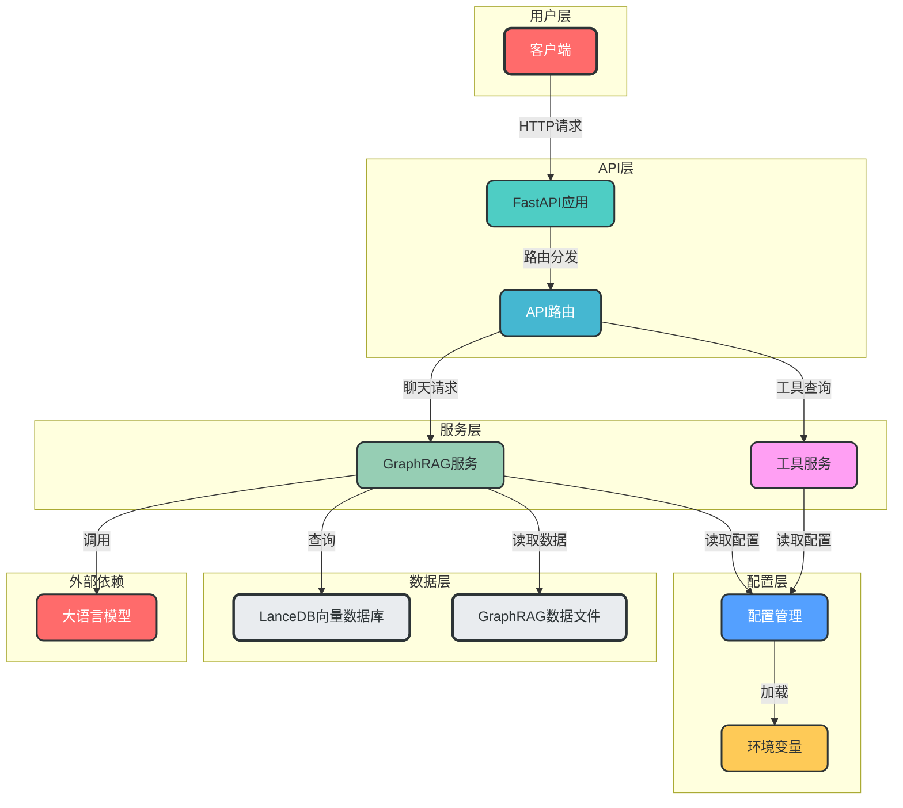
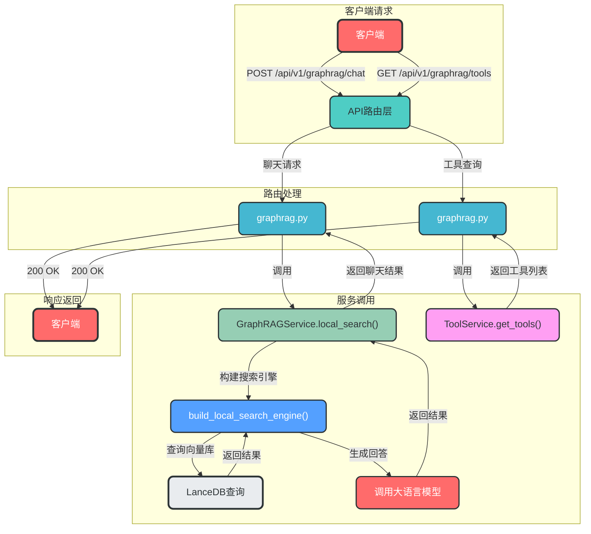

# GraphRAG+MCP+RAG功能集成说明

## 1. 项目结构概述

本项目将GraphRAG+MCP+RAG功能集成到现有的FastAPI项目中，实现了基于GraphRAG的智能问答功能。集成后的项目结构如下：

```
├── app/
│   ├── api/
│   │   └── v1/
│   │       ├── __init__.py          # API主路由，已添加GraphRAG路由
│   │       ├── auth.py              # 原有认证路由
│   │       ├── users.py             # 原有用户路由
│   │       └── graphrag.py          # 新增GraphRAG路由
│   ├── config/
│   │   └── graphrag_config.py       # 新增GraphRAG配置管理
│   ├── domains/
│   │   └── graphrag/
│   │       └── services/
│   │           ├── graphrag_service.py      # 新增GraphRAG服务封装
│   │           └── tool_service.py          # 新增工具服务
│   └── ...                          # 原有项目结构
├── docs/
│   └── mcp_rag_agent_graphrag_demo/ # GraphRAG演示代码和数据
│   └── 集成 graphrag 功能说明.md       # 本集成说明文档
├── .env                             # 环境变量配置文件
└── main.py                          # FastAPI主入口
```

## 2. 集成的功能和API接口

### 2.1 功能概述

- **基于GraphRAG的智能问答**：利用图检索增强生成技术，为用户提供精准的问答服务
- **多模式搜索**：支持本地搜索、全局搜索和DRIFT搜索（目前API只暴露了本地搜索）
- **工具查询**：提供API接口查询支持的工具列表

### 2.2 API接口

#### 2.2.1 Chat接口

**路径**: `/api/v1/graphrag/chat`
**方法**: POST
**请求体**:
```json
{
  "query": "萧炎的父亲是谁?"
}
```
**响应体**:
```json
{
  "tool_info": {
    "name": "local_asearch",
    "description": "为斗破苍穹小说提供相关的知识补充"
  },
  "result": "萧炎的父亲是萧战，他是萧家的族长..."
}
```

#### 2.2.2 工具查询接口

**路径**: `/api/v1/graphrag/tools`
**方法**: GET
**响应体**:
```json
{
  "tools": [
    {
      "name": "local_asearch",
      "description": "为斗破苍穹小说提供相关的知识补充",
      "parameters": {
        "query": {
          "type": "string",
          "description": "查询字符串"
        }
      }
    }
  ]
}
```

## 3. 配置说明

### 3.1 环境变量配置

在项目根目录的`.env`文件中添加以下配置：

```env
# GraphRAG配置
API_KEY=your_api_key
BASE_URL=your_api_base
MODEL=qwen-turbo
```

### 3.2 配置文件

GraphRAG的配置管理位于`app/config/graphrag_config.py`，主要配置项包括：

| 配置项 | 描述 | 默认值 |
|-------|------|-------|
| DATA_DIR | 数据目录 | docs/mcp_rag_agent_graphrag_demo/doupocangqiong/output |
| LANCEDB_URI | LanceDB向量数据库URI | docs/mcp_rag_agent_graphrag_demo/doupocangqiong/output/lancedb |
| COMMUNITY_LEVEL | 社区级别 | 2 |
| API_KEY | API密钥 | None |
| BASE_URL | API基础地址 | None |
| MODEL | 模型名称 | qwen-turbo |

## 4. 使用示例

### 4.1 启动应用

```bash
python main.py
```

### 4.2 测试Chat接口

使用curl命令测试：

```bash
curl -X POST "http://localhost:8001/api/v1/graphrag/chat" \
  -H "Content-Type: application/json" \
  -d '{"query": "萧炎的父亲是谁?"}'
```

### 4.3 测试工具查询接口

使用curl命令测试：

```bash
curl -X GET "http://localhost:8001/api/v1/graphrag/tools"
```

### 4.4 使用API文档测试

访问Swagger UI：http://localhost:8001/docs

在API文档中可以直接测试GraphRAG相关接口。

## 5. 依赖安装说明

### 5.1 推荐依赖安装方式

由于GraphRAG依赖与现有项目存在版本冲突，建议使用以下方式安装依赖：

1. 使用虚拟环境：
   ```bash
   python -m venv venv
   source venv/bin/activate  # Linux/Mac
   # 或
   venv\Scripts\activate     # Windows
   ```

2. 安装基础依赖：
   ```bash
   pip install fastapi uvicorn pydantic-settings
   ```

3. 安装GraphRAG相关依赖：
   ```bash
   pip install graphrag lancedb pandas tiktoken python-dotenv mcp --pre
   ```

### 5.2 已知依赖冲突

- **numpy版本冲突**：GraphRAG要求numpy<2.0.0，而某些依赖可能需要更高版本
- **graspologic版本冲突**：GraphRAG依赖graspologic>=3.4.1，可能与其他包冲突
- **langchain-community版本冲突**：GraphRAG与langchain-community>=0.4.1存在兼容性问题

建议使用`--pre`选项允许预发布版本，或使用虚拟环境隔离依赖。

## 6. 测试方法

### 6.1 单元测试

项目中包含了单元测试框架，可以使用以下命令运行测试：

```bash
pytest tests/
```

### 6.2 集成测试

1. 启动应用：
   ```bash
   python main.py
   ```

2. 使用API测试工具（如Postman、curl）测试GraphRAG接口：
   - POST /api/v1/graphrag/chat
   - GET /api/v1/graphrag/tools

3. 验证返回结果是否符合预期。

### 6.3 性能测试

对于性能测试，可以使用以下工具：

- **ab**：Apache Bench，用于测试HTTP请求性能
  ```bash
  ab -n 100 -c 10 http://localhost:8001/api/v1/graphrag/tools
  ```

- **locust**：分布式负载测试工具
  ```bash
  pip install locust
  locust -f locustfile.py
  ```

## 7. 架构设计

### 7.1 核心组件

- **GraphRAG服务**：封装了GraphRAG的核心搜索功能，提供异步接口供API调用
- **API路由**：定义了GraphRAG相关的API接口，处理HTTP请求和响应
- **工具服务**：管理支持的工具列表，提供工具查询功能
- **配置管理**：使用Pydantic管理GraphRAG的配置设置

### 7.2 系统架构图



### 7.3 API请求处理流程图



### 7.4 数据流详细说明

1. **Chat请求**：
   - 客户端发送POST请求到`/api/v1/graphrag/chat`
   - API路由调用GraphRAG服务的`local_search`方法
   - GraphRAG服务构建搜索引擎并执行搜索
   - 返回搜索结果给客户端

2. **工具查询请求**：
   - 客户端发送GET请求到`/api/v1/graphrag/tools`
   - API路由调用工具服务的`get_tools`方法
   - 返回工具列表给客户端

## 8. 性能优化建议

1. **搜索引擎实例缓存**：考虑将搜索引擎实例缓存起来，避免每次请求都重新构建
2. **异步处理**：目前已使用异步接口，但可以考虑进一步优化，例如使用线程池处理CPU密集型任务
3. **数据预加载**：在应用启动时预加载部分数据，减少请求处理时间
4. **缓存搜索结果**：对于频繁查询的内容，添加缓存机制，提高响应速度
5. **监控与日志**：添加日志记录和性能监控，便于优化和调试

## 9. 故障排除

### 9.1 常见问题

1. **环境变量配置错误**：
   - 确保`.env`文件中配置了正确的API_KEY和BASE_URL
   - 检查环境变量是否被正确加载

2. **依赖冲突**：
   - 尝试使用虚拟环境隔离依赖
   - 使用`--pre`选项允许预发布版本
   - 检查依赖版本兼容性

3. **数据文件路径错误**：
   - 确保`DATA_DIR`和`LANCEDB_URI`配置正确
   - 检查数据文件是否存在

4. **API调用失败**：
   - 检查API文档中的接口定义
   - 检查请求格式是否正确
   - 查看应用日志获取详细错误信息

### 9.2 日志查看

应用日志可以通过以下方式查看：

1. 控制台输出：应用启动时会在控制台输出日志
2. 日志文件：默认日志文件为`app.log`（可在配置中修改）
3. API日志：使用中间件记录的请求日志

## 10. 总结

本项目成功将GraphRAG+MCP+RAG功能集成到现有FastAPI项目中，实现了基于GraphRAG的智能问答功能。集成后的项目具有以下特点：

- **模块化设计**：各模块职责明确，便于维护和扩展
- **松耦合架构**：通过服务封装和依赖注入，降低模块间耦合度
- **异步处理**：使用异步接口提高性能和并发处理能力
- **完善的API文档**：自动生成Swagger UI文档，便于测试和使用
- **灵活的配置管理**：使用Pydantic管理配置，支持环境变量和配置文件

通过本集成，现有FastAPI项目获得了基于GraphRAG的智能问答能力，可以为用户提供更加精准、全面的信息服务。