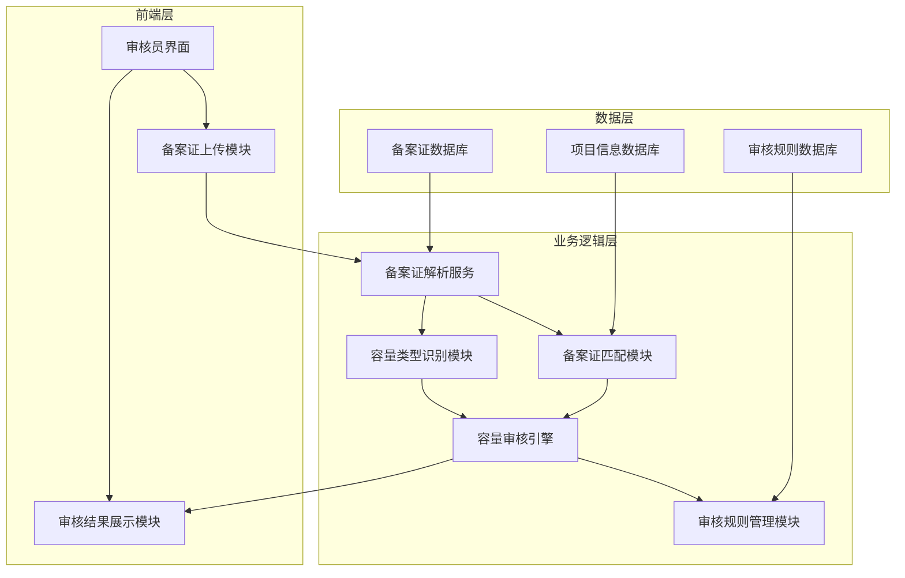
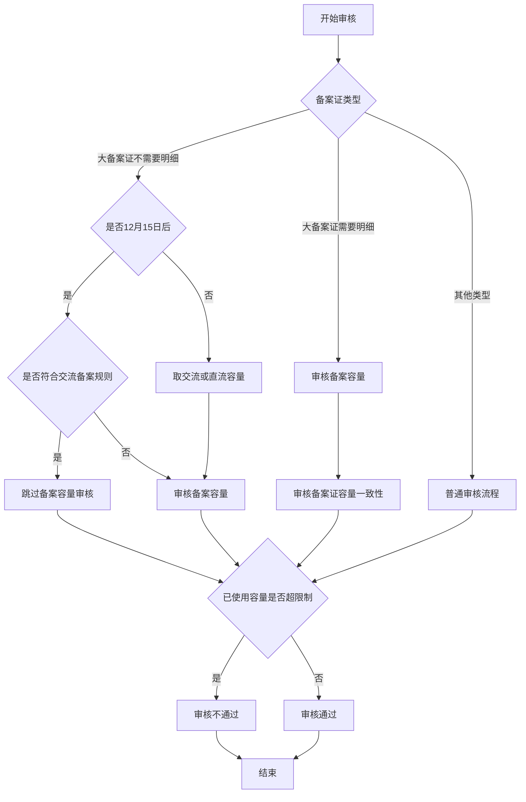
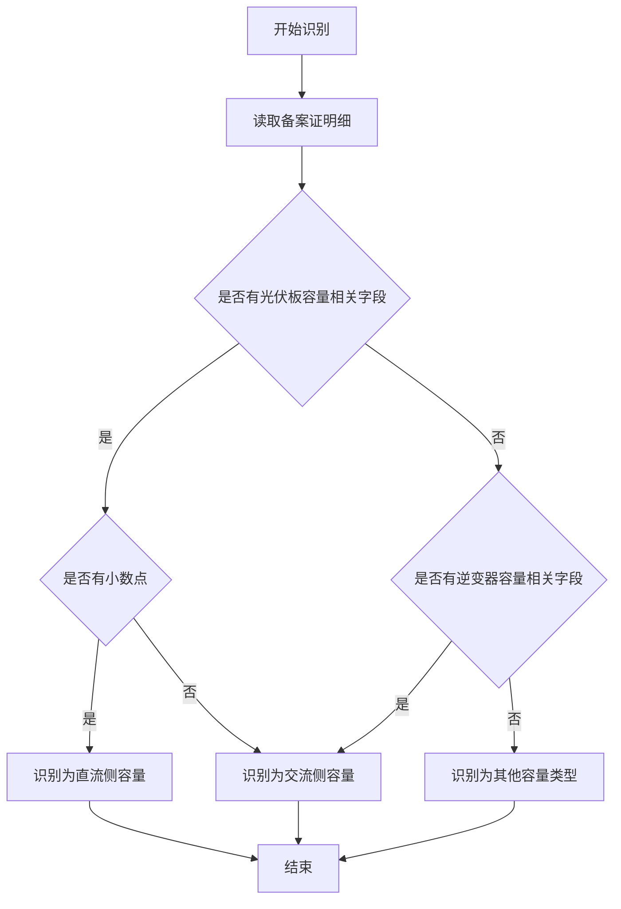
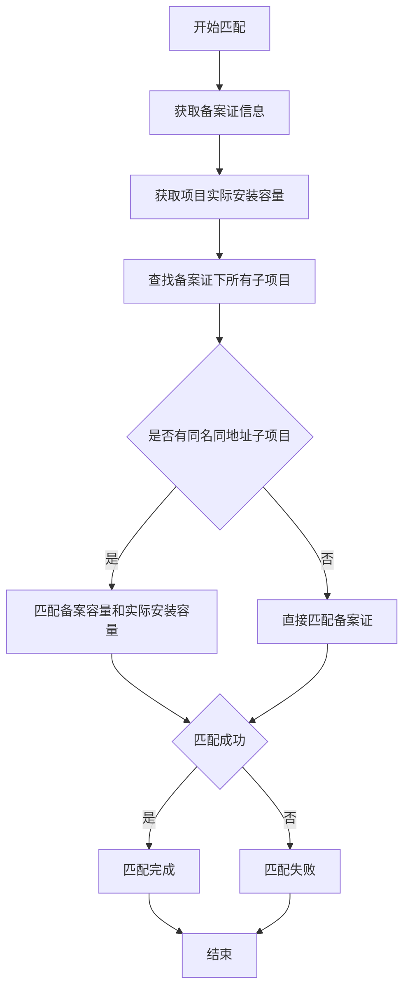

# 备案证审核逻辑结构化需求文档

## 1. 需求概述

### 1.1 背景
备案证审核是光伏项目并网前的重要环节，需要对备案证的各项信息进行严格审核，确保项目符合相关规定。由于不同地区的备案证格式和内容存在差异，审核逻辑复杂，需要明确统一的审核规则和流程。

### 1.2 目标
建立一套清晰、统一的备案证审核逻辑，确保审核过程标准化、自动化，提高审核效率和准确性，减少人工审核的主观性和误差。

### 1.3 范围
- 备案证容量审核规则
- 不同容量类型的定义和使用场景
- 备案证与项目的匹配规则
- 备案证日期审核要求

## 2. 功能描述

### 2.1 备案容量审核

#### 2.1.1 大备案证审核（不需要出具明细）
- **审核规则**：
  1. 按照12月15号之后的规则审核备案证容量，符合交流备案规则的不需要审核备案容量
  2. 核对本备案证下所有订单的实际安装容量总和与备案证容量的比值，不得超过100%或120%

#### 2.1.2 大备案证审核（需要出具明细）
- **审核规则**：
  1. 需要审核备案容量
  2. 需要审核备案证容量，同一个备案证的备案证容量应一致

### 2.2 容量类型定义与使用

#### 2.2.1 容量类型定义
| 容量类型 | 含义 | 大白话解释 |
|---------|------|------------|
| 光伏板容量 | 单块光伏板的容量 | 一块光伏板能发多少电的能力 |
| 光伏板总容量 | 所有光伏板的容量总和 | 所有光伏板加起来能发多少电的能力（直流侧） |
| 逆变器容量 | 逆变器的额定容量 | 逆变器能转换多少电的能力（交流侧） |
| 装机容量 | 项目的设计安装容量 | 整个项目设计能发多少电的能力 |
| 额定功率 | 设备的额定输出功率 | 设备正常工作时能输出的功率 |

#### 2.2.2 容量使用规则
- 12月15号之后通过物流阶段备案审核的取交流侧容量
- 12月15号之前的取交流容量和直流容量都行，哪个能满足范围要求取哪个
- 针对特殊地区的备案证，根据具体情况分辨：
  - 有小数点的是光伏板总容量即直流侧容量
  - 没小数点且能符合逆变器容量的是交流侧容量

### 2.3 备案证匹配规则
- 对于备案证中同名同地址的多个子项目，通过匹配备案容量和实际安装容量来确认需要匹配的子项目

### 2.4 备案日期审核
- 需根据具体审核要求处理备案日期

## 3. 用户故事

| 角色 | 场景 | 需求 | 价值 |
|------|------|------|------|
| 审核员 | 审核大备案证项目 | 系统能自动判断备案证类型，应用相应的审核规则 | 提高审核效率，减少人工判断误差 |
| 审核员 | 审核不同地区的备案证 | 系统能自动识别不同地区备案证的容量类型，应用正确的审核逻辑 | 统一审核标准，提高审核准确性 |
| 审核员 | 审核同一备案证下的多个项目 | 系统能自动统计备案证下所有项目的已使用容量，判断是否超过限制 | 避免容量超配，确保符合规定 |
| 系统管理员 | 维护审核规则 | 能灵活配置审核规则，适应政策变化 | 提高系统适应性，降低维护成本 |

## 4. 系统架构图

## 5. 流程图

### 5.1 备案证审核主流程

### 5.2 容量类型识别流程

### 5.3 备案证匹配流程

## 6. 关键术语定义

| 术语 | 定义 |
|------|------|
| 大备案证 | 涵盖多个项目的备案证，不需要为每个项目单独出具明细 |
| 直流侧容量 | 光伏板总容量，通常有小数点，代表光伏板能产生的直流电容量 |
| 交流侧容量 | 逆变器容量，通常为整数，代表逆变器能转换的交流电容量 |
| 备案容量 | 备案证上注明的项目容量 |
| 装机容量 | 项目实际安装的设备容量 |
| 额定功率 | 设备正常工作时的输出功率 |

## 7. 审核规则表

| 规则编号 | 规则名称 | 适用场景 | 规则内容 |
|---------|---------|---------|---------|
| R001 | 大备案证容量审核规则 | 大备案证不需要明细 | 12月15日后符合交流备案规则的项目跳过备案容量审核 |
| R002 | 已使用容量限制规则 | 所有备案证 | 备案证下所有项目已使用容量与备案证容量比值不得超过120% |
| R003 | 备案证容量一致性规则 | 大备案证需要明细 | 同一个备案证的备案证容量应一致 |
| R004 | 容量类型判断规则 | 所有备案证 | 有小数点的为直流侧容量，无小数点且符合逆变器容量的为交流侧容量 |
| R005 | 容量取值规则 | 所有备案证 | 12月15日后取交流侧容量，12月15日前取能满足范围要求的容量 |

## 8. 风险与约束

1. **地区差异风险**：不同地区的备案证格式和内容存在差异，可能导致自动识别失败
2. **政策变化风险**：备案审核政策可能随时变化，需要及时更新审核规则
3. **数据质量约束**：备案证信息不完整或不规范可能影响审核结果
4. **系统性能约束**：大量备案证同时审核时，系统性能需要满足要求

## 9. 后续迭代计划

1. **优化容量识别算法**：提高不同地区备案证容量类型的识别准确率
2. **增加机器学习能力**：通过机器学习自动学习不同地区备案证的格式和规则
3. **完善审核规则管理**：提供更灵活的审核规则配置界面，支持业务人员自主配置
4. **增加异常处理机制**：对无法自动审核的备案证提供人工审核通道
5. **加强数据统计分析**：提供备案证审核数据的统计分析功能，支持决策参考