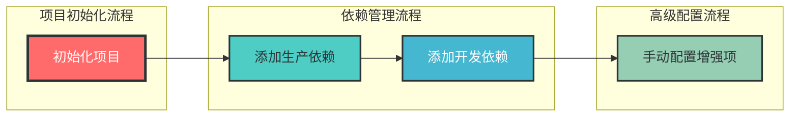
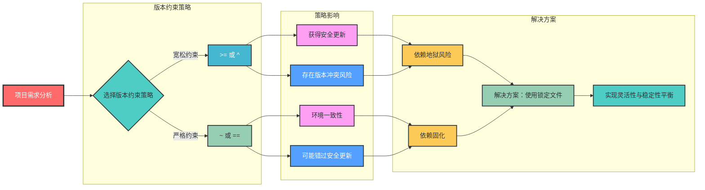
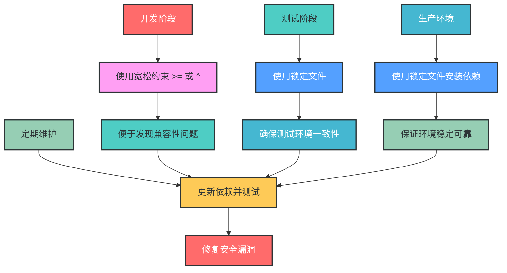

# 1. 完整的 `pyproject.toml` 配置示例

## 1.1 配置文件结构与说明

```toml
[build-system]
# 指定项目构建系统，使用 setuptools 作为构建后端
requires = ["setuptools>=42", "wheel"]
build-backend = "setuptools.build_meta"

[project]
# 项目基本元数据 - uv init 自动生成
name = "my-project"
version = "0.1.0"
description = "一个使用uv管理的Python项目"
readme = "README.md"
requires-python = ">=3.8"
license = { text = "MIT" }
authors = [
  { name = "Your Name", email = "your.email@example.com" }
]
classifiers = [
  "Programming Language :: Python :: 3",
  "License :: OSI Approved :: MIT License",
  "Operating System :: OS Independent",
]

# 项目依赖 - uv add 自动生成
dependencies = [
  "requests>=2.25.1",
  "numpy>=1.20.0",
]

# 开发依赖 - uv add --dev 自动生成
[project.optional-dependencies]
dev = [
  "pytest>=6.2.5",        # 测试框架
  "flake8>=4.0.1",        # 代码检查工具
  "black>=22.1.0",        # 代码格式化工具
  "mypy>=0.931",          # 类型检查工具
  "coverage>=6.3.2",      # 测试覆盖率工具
  "pre-commit>=2.17.0",   # 提交前钩子工具
]

# 脚本入口 - 手动添加
[project.scripts]
my-cli = "my_project.cli:main"

# 命令行工具入口点 - 手动添加
[project.entry-points."console_scripts"]
my-tool = "my_project.tool:run"

# 配置pip镜像源 - 手动添加
[tool.uv]
# 指定pip安装时的镜像源，加速依赖下载
index-url = "https://pypi.tuna.tsinghua.edu.cn/simple"
extra-index-url = ["https://pypi.org/simple"]  # 添加官方源作为备用

# pytest配置 - 手动添加
[tool.pytest.ini_options]
addopts = "-v --cov=my_project"
testpaths = ["tests"]

# flake8配置 - 手动添加
[tool.flake8]
max-line-length = 88
ignore = ["E203", "W503"]
select = ["E", "F", "W", "C90"]

# black配置 - 手动添加
[tool.black]
line-length = 88
target-version = ['py38', 'py39', 'py310']

# mypy配置 - 手动添加
[tool.mypy]
python_version = "3.8"
strict = true
show_error_codes = true
ignore_missing_imports = true

# 预提交钩子配置 - 手动添加
[tool.pre-commit]
repos = [
  { repo = "<https://github.com/psf/black>", rev = "22.1.0", hooks = [{ id = "black" }] },
  { repo = "<https://github.com/PyCQA/flake8>", rev = "4.0.1", hooks = [{ id = "flake8" }] },
  { repo = "<https://github.com/pre-commit/mirrors-mypy>", rev = "v0.931", hooks = [{ id = "mypy" }] },
]

# 包数据配置 - 手动添加
[tool.setuptools.package-data]
my_project = ["data/*.json", "templates/*.html"]

```

## 1.2 配置生成步骤



具体命令步骤：

1. **初始化项目**：
    
    ```bash
    uv init
    
    ```
    
    自动生成项目基本结构和 `pyproject.toml` 的基础部分
    
2. **添加生产依赖**：
    
    ```bash
    uv add requests numpy
    
    ```
    
    自动在 `[project.dependencies]` 中添加相应依赖
    
3. **添加开发依赖**：
    
    ```bash
    uv add --dev pytest flake8 black mypy coverage pre-commit
    
    ```
    
    自动在 `[project.optional-dependencies.dev]` 中添加开发工具
    
4. **手动配置增强项**：
    - 镜像源配置（`[tool.uv]`）
    - 代码质量工具配置（pytest、flake8、black、mypy）
    - 预提交钩子配置（`[tool.pre-commit]`）
    - 包数据和资源文件配置
    - 控制台脚本和入口点配置

## 1.3 最小化模板配置

如果只需要最基本的配置，可以使用以下最小化模板，仅包含必要选项：

```toml
[build-system]
requires = ["setuptools>=42", "wheel"]
build-backend = "setuptools.build_meta"

[project]
name = "my-project"
version = "0.1.0"
description = "一个使用uv管理的Python项目"
readme = "README.md"
requires-python = ">=3.8"
license = { text = "MIT" }
authors = [
  { name = "Your Name", email = "your.email@example.com" }
]
dependencies = [
  "requests>=2.25.1",
]

[project.optional-dependencies]
dev = [
  "pytest>=6.2.5",
]

[tool.uv]
index-url = "https://pypi.tuna.tsinghua.edu.cn/simple"
```

这个最小化模板包含了：

- 必要的构建系统配置
- 最基本的项目元数据
- 最小化的生产依赖示例
- 单个核心开发依赖
- 简化的镜像源配置

## 2. 依赖版本管理策略

### 2.1 版本约束的选择与影响



### 2.2 版本约束符号说明

| 约束符号 | 说明 | 示例 | 匹配版本 |
| --- | --- | --- | --- |
| `>=` | 大于等于指定版本 | `requests>=2.25.1` | 2.25.1, 2.26.0, 3.0.0 |
| `^` | 兼容的次要版本更新 | `requests^2.25.1` | 2.25.1, 2.26.0, 2.99.9 |
| `~` | 兼容的补丁版本更新 | `requests~2.25.1` | 2.25.1, 2.25.2, 2.25.9 |
| `==` | 完全固定版本 | `requests==2.25.1` | 仅2.25.1 |

### 2.3 最佳实践建议

### 2.3.1 使用锁定文件确保环境一致性

虽然 `pyproject.toml` 中使用宽松的版本约束，但可以通过以下命令生成锁定文件：

```bash
uv lock  # 生成poetry.lock文件（如果uv支持）
# 或
uv export --format requirements.txt --output-file requirements.txt --dev  # 生成requirements.txt

```

### 2.3.2 不同阶段的版本策略



### 2.4 固定版本配置示例（适用于严格环境）

```toml
[build-system]
requires = ["setuptools>=42", "wheel"]
build-backend = "setuptools.build_meta"

[project]
name = "my-project"
version = "0.1.0"
description = "一个使用uv管理的Python项目"
readme = "README.md"
requires-python = ">=3.8"
license = { text = "MIT" }
authors = [
  { name = "Your Name", email = "your.email@example.com" }
]

# 使用固定版本的依赖配置
dependencies = [
  "requests==2.25.1",
  "numpy==1.20.3",
  "pandas==1.3.5",
  "flask==2.0.2",
]

[project.optional-dependencies]
dev = [
  "pytest==6.2.5",
  "flake8==4.0.1",
  "black==22.1.0",
  "mypy==0.931",
  "coverage==6.3.2",
  "pre-commit==2.17.0",
]

# 配置pip镜像源 - 手动添加
[tool.uv]
# 指定pip安装时的镜像源，加速依赖下载
index-url = "https://pypi.tuna.tsinghua.edu.cn/simple"
extra-index-url = ["https://pypi.org/simple"]  # 添加官方源作为备用
```

## 3. 依赖管理最佳实践总结

| 阶段 | 策略 | 工具 | 目的 |
| --- | --- | --- | --- |
| 开发 | 宽松约束 | `uv add` | 保持灵活性，发现兼容性问题 |
| 测试 | 锁定版本 | `uv lock/export` | 确保测试环境一致性 |
| 生产 | 锁定版本 | `uv install --locked` | 保证环境稳定可靠 |
| 维护 | 定期更新 | `uv update +` 测试 | 修复安全漏洞，获取新特性 |

通过这种分层策略，可以在灵活性和稳定性之间取得平衡，既避免"依赖地狱"，又能及时获得安全更新。