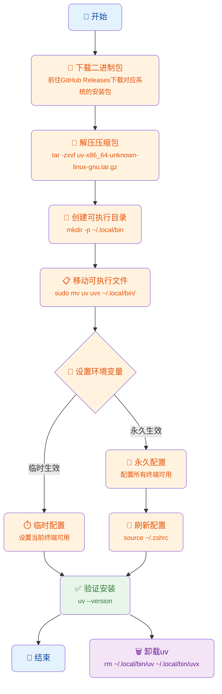

# 一图流



# 一、工具简介

uv 是一款跨平台的 Python 管理工具，具备高效的包管理、虚拟环境管理等功能，能显著提升 Python 项目开发效率。

# 二、相关链接

- 官方 GitHub 仓库：https://github.com/astral-sh/uv
- 0.8.13 版本 Releases 页面：https://github.com/astral-sh/uv/releases/tag/0.8.13

# 三、离线安装步骤

## **1. 下载二进制包**

前往上述 GitHub Releases 页面，根据自身操作系统选择并下载对应的 uv 离线安装包。以 Linux 系统为例，常见的安装包文件名为 uv-x86_64-unknown-linux-gnu.tar.gz。

## **2. 解压与移动可执行文件**

- **解压压缩包**

在终端中进入压缩包所在目录，执行以下命令将压缩包解压到当前路径：

```bash
tar -zxvf uv-x86_64-unknown-linux-gnu.tar.gz
```

解压后会生成一个名为 uv-x86_64-unknown-linux-gnu 的目录，目录内包含 uv 和 uvx 两个可执行文件，如下所示：

```bash
➜  uv-x86_64-unknown-linux-gnu tree
.
├── uv
└── uvx
```

- **移动可执行文件**

首先确保系统可执行路径 `~/.local/bin` 存在，若不存在则创建该目录：

```bash
mkdir -p ~/.local/bin
```

然后将解压得到的 uv 和 uvx 可执行文件移动到 ~/.local/bin 目录下：

```bash
sudo mv uv uvx ~/.local/bin/
```

## **3. 设置环境变量**

为了能在任意目录下直接使用 uv 命令，需要配置环境变量，分为临时生效和永久生效两种方式。

- **临时生效（仅当前终端会话有效）**

在终端中执行以下命令，临时将 ~/.local/bin 目录添加到系统环境变量 PATH 中：

```bash
export PATH="$HOME/.local/bin:$PATH"
```

- **永久生效（所有终端会话均有效）**

将环境变量配置命令添加到 shell 配置文件中（根据使用的 shell 选择对应的配置文件，如 ~/.bashrc 对应 bash  shell，~/.zshrc 对应 zsh shell）。以 zsh 为例，执行以下命令：

```bash
echo 'export PATH="$HOME/.local/bin:$PATH"' >> ~/.zshrc
```

添加完成后，执行以下命令使配置立即生效：

```bash
source ~/.zshrc
```

若使用的是 bash shell，则将上述命令中的 `~/.zshrc` 替换为 `~/.bashrc` 即可。

## **4. 验证安装结果**

完成上述所有操作后，打开新的终端或重启终端，执行以下命令验证 uv 是否安装成功：

```bash
uv --version
```

若终端输出 uv 的版本信息（如 uv 0.8.13），则表示安装成功。

# 四、卸载 uv

若需卸载 uv，只需在终端中执行以下命令，删除对应的可执行文件即可：

```bash
rm ~/.local/bin/uv ~/.local/bin/uvx
```

- 执行 uv 需要 cpython 环境，自动安装

```bash
uv --version
uv 0.8.13
➜  servo_ai git:(release_20250826) ✗ uv sync
cpython-3.12.0-linux-x86_64-gnu (download) ------------------------------ 53.17 MiB/64.64 MiB  
```