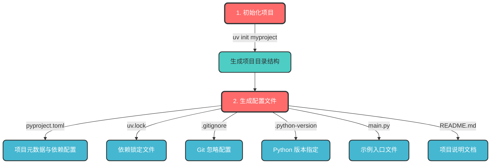
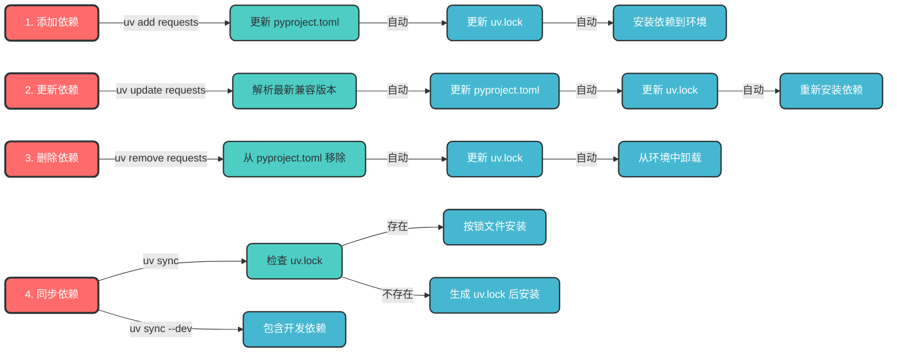
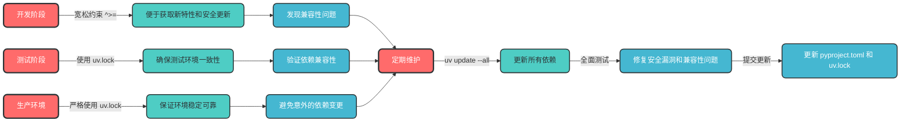
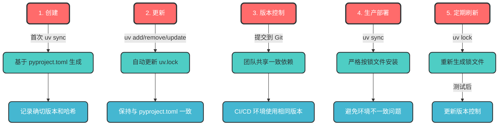
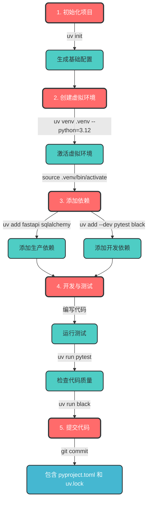
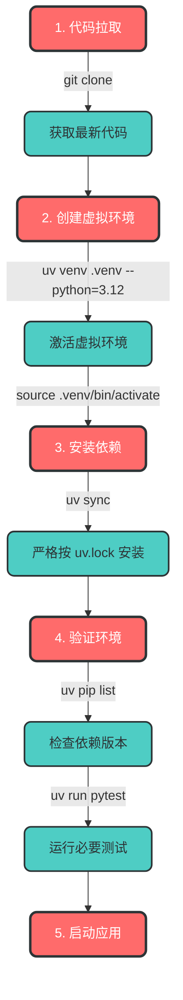
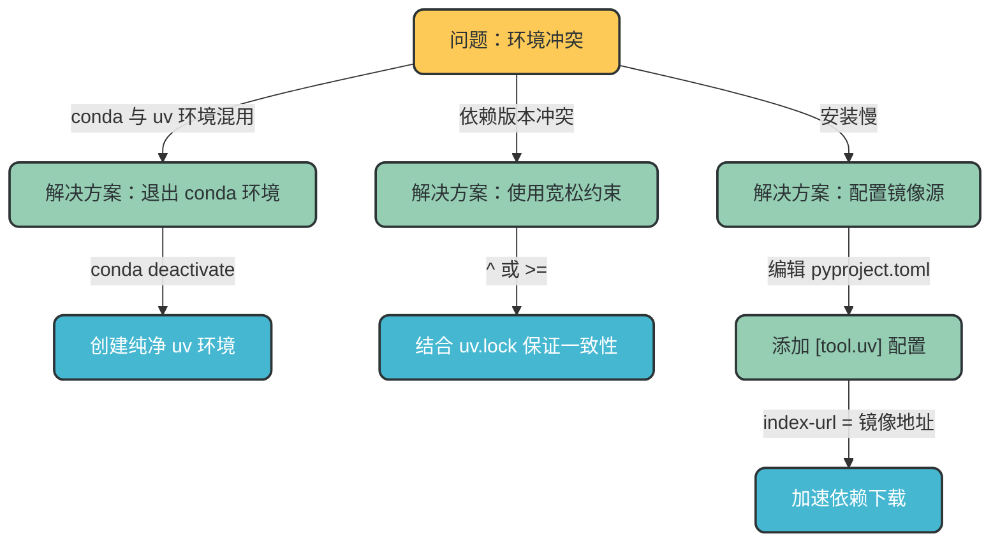

## 1. 引言

### 1.1 UV 工具简介

UV 是新一代高性能 Python 包管理工具，由 Astral 团队（同属 Pylance 和 Ruff 团队）开发，专注于提供快速、可靠的 Python 依赖管理和虚拟环境管理解决方案。

### 1.2 与其他包管理工具的对比

| 特性 | UV | pip + venv | conda |
| --- | --- | --- | --- |
| 性能 | 10-100倍于pip | 基础性能 | 较慢 |
| 功能定位 | Python依赖+虚拟环境管理 | 分离的工具链 | 跨语言包管理 |
| 并行依赖解析 | ✅ 支持 | ❌ 不支持 | ❌ 不支持 |
| 自带缓存机制 | ✅ 内置高效缓存 | ❌ 需额外配置 | ✅ 支持 |
| 配置文件支持 | pyproject.toml + uv.lock | requirements.txt | environment.yml |
| 跨平台兼容性 | ✅ 优秀 | ✅ 良好 | ✅ 良好 |

## 2. UV 安装与基础配置

### 2.1 安装方法

```bash
# 通过 pip 安装
pip install uv

# Homebrew 安装（仅 macOS）
brew install uv

# Linux/macOS 脚本安装
curl -LsSf <https://astral.sh/uv/install.sh> | sh

# Windows PowerShell 安装
powershell -ExecutionPolicy ByPass -c "irm <https://astral.sh/uv/install.ps1> | iex"

```

### 2.2 安装验证

```bash
uv help

```

## 3. 虚拟环境管理

### 3.1 创建与激活虚拟环境

```mermaid
flowchart LR
    A[1. 创建虚拟环境] -->|uv venv .venv| B[生成 .venv 目录]
    B -->|uv venv .venv --python=3.12| C[指定 Python 版本]
    C --> D[2. 激活虚拟环境]
    D -->|Linux/macOS| E[source .venv/bin/activate]
    D -->|Windows PowerShell| F[.venv\\Scripts\\Activate.ps1]
    E --> G[3. 验证环境]
    F --> G
    G -->|which python| H[确认解释器路径]
    H -->|.venv/bin/python| I[环境激活成功]
    I --> J[4. 退出环境]
    J -->|deactivate| K[回到系统环境]

    classDef step fill:#FF6B6B,stroke:#2D3436,stroke-width:3px,color:white,rx:8,ry:8;
    classDef action fill:#4ECDC4,stroke:#2D3436,stroke-width:2px,color:#2D3436,rx:8,ry:8;
    classDef result fill:#45B7D1,stroke:#2D3436,stroke-width:2px,color:white,rx:8,ry:8;

    class A,D,G,J step;
    class B,C,E,F,K action;
    class H,I result;

```



### 3.2 Python 版本管理

```bash
# 查看可用 Python 版本
uv python list

# 查看当前 Python 安装路径
uv python dir

# 创建虚拟环境时指定 Python 版本
uv venv .venv --python=3.12

```

## 4. 项目初始化

### 4.1 初始化项目结构



### 4.2 pyproject.toml 核心配置

```toml
[build-system]
requires = ["setuptools>=42", "wheel"]
build-backend = "setuptools.build_meta"

[project]
name = "my-project"
version = "0.1.0"
description = "一个使用uv管理的Python项目"
readme = "README.md"
requires-python = ">=3.8"
license = { text = "MIT" }
authors = [{ name = "Your Name", email = "your.email@example.com" }]

# 生产依赖
dependencies = [
  "requests>=2.25.1",
  "numpy>=1.20.0",
]

# 开发依赖
[project.optional-dependencies]
dev = [
  "pytest>=6.2.5",
  "black>=22.1.0",
]

# UV 配置
[tool.uv]
index-url = "<https://pypi.tuna.tsinghua.edu.cn/simple>"
extra-index-url = ["<https://pypi.org/simple>"]

```

## 5. 依赖管理

### 5.1 依赖生命周期管理



### 5.2 依赖管理命令详解

| 命令 | 功能 | 示例 |
| --- | --- | --- |
| `uv add` | 添加生产依赖 | `uv add requests` |
| `uv add --dev` | 添加开发依赖 | `uv add --dev pytest` |
| `uv update` | 更新指定依赖 | `uv update requests` |
| `uv update --all` | 更新所有依赖 | `uv update --all` |
| `uv remove` | 删除依赖 | `uv remove requests` |
| `uv sync` | 同步生产依赖 | `uv sync` |
| `uv sync --dev` | 同步所有依赖 | `uv sync --dev` |
| `uv tree` | 查看依赖树 | `uv tree` |
| `uv sync --extra dev --reinstall` | **强制重装所有依赖包** | `uv sync --extra dev --reinstall` |
| `uv cache clean` | 清空 uv 本地缓存 | `uv cache clean` |

## 6. 依赖版本管理策略

### 6.1 版本约束类型

| 约束符号 | 说明 | 示例 | 匹配版本 |
| --- | --- | --- | --- |
| `>=` | 大于等于指定版本 | `requests>=2.25.1` | 2.25.1, 2.26.0, 3.0.0 |
| `^` | 兼容的次要版本更新 | `requests^2.25.1` | 2.25.1, 2.26.0, 2.99.9 |
| `~` | 兼容的补丁版本更新 | `requests~2.25.1` | 2.25.1, 2.25.2, 2.25.9 |
| `==` | 完全固定版本 | `requests==2.25.1` | 仅2.25.1 |

### 6.2 不同环境下的版本策略



### 6.3 锁定文件（uv.lock）管理

uv.lock 是保证跨环境依赖一致性的核心文件，记录了所有依赖（直接+传递性）的确切版本号和哈希值。

### 6.3.1 uv.lock 生命周期



### 6.3.2 uv.lock 最佳实践

1. **始终提交 uv.lock 到版本控制**
2. **禁止手动编辑 uv.lock**，必须通过 uv 命令修改
3. **生产环境严格使用 `uv sync`**，禁止使用 `-no-lock`
4. **团队成员更新代码后需重新执行 `uv sync`**
5. **定期使用 `uv update --all` 更新依赖并测试**

## 7. 完整工作流最佳实践

### 7.1 开发工作流



### 7.2 生产部署工作流



## 8. 常见问题与解决方案

### 8.1 环境冲突问题



### 8.2 镜像源配置

```toml
[tool.uv]
# 主镜像源
index-url = "<https://pypi.tuna.tsinghua.edu.cn/simple>"
# 备用镜像源
extra-index-url = ["<https://pypi.org/simple>"]

```

### 8.3 性能优化

1. **利用缓存**：UV 自动缓存依赖，避免重复下载
2. **并行安装**：UV 自动并行安装依赖，提高安装速度
3. **清理缓存**：定期使用 `uv cache clean` 清理过期缓存
4. **使用锁定文件**：生产环境使用 `uv sync` 避免依赖解析开销

## 9. 总结

UV 作为新一代 Python 包管理工具，提供了快速、可靠的依赖管理和虚拟环境管理解决方案。通过遵循本指南中的最佳实践，您可以：

1. **提高开发效率**：快速的依赖安装和管理
2. **保证环境一致性**：通过锁定文件确保跨环境一致
3. **简化工作流**：统一的工具链管理虚拟环境和依赖
4. **提高安全性**：便于定期更新依赖修复安全漏洞

UV 正在改变 Python 生态系统的依赖管理方式，是现代 Python 项目的理想选择。

## 10. 参考资料

- [UV 官方文档](https://docs.astral.sh/uv/)
- [UV 中文文档](https://hellowac.github.io/uv-zh-cn/)
- [Python 包管理最佳实践](https://packaging.python.org/en/latest/tutorials/managing-dependencies/)