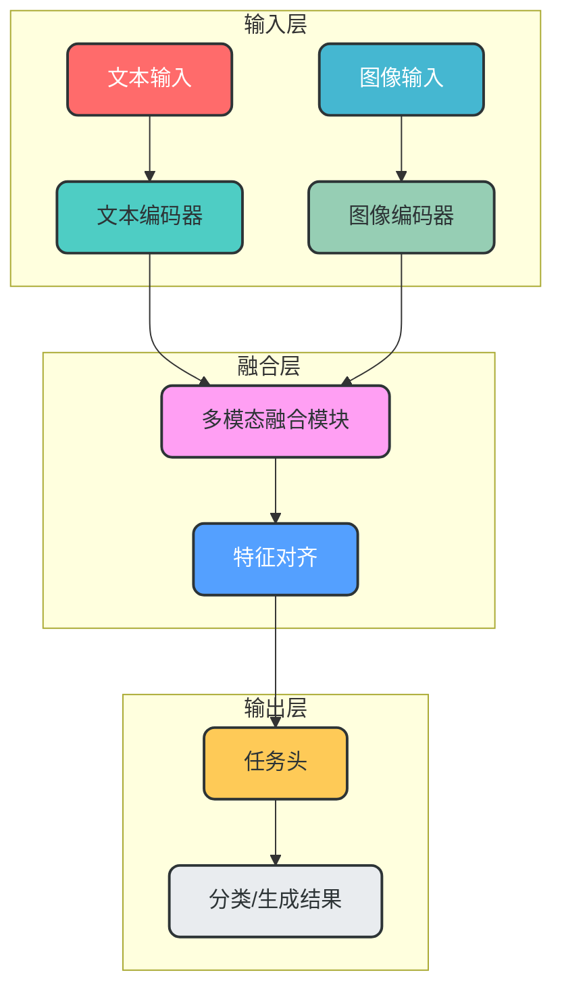
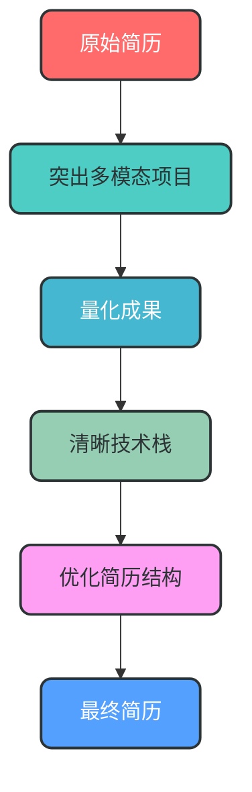
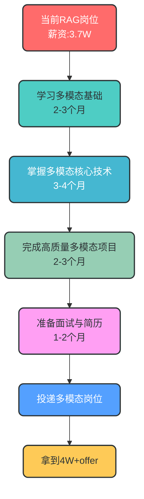

# AI工程师薪资分析与多模态学习路线规划

## 一、薪资情况分析

### 1. RAG方向薪资现状

深圳RAG应用开发的中级工程师薪资普遍在**2.5-3.8W**区间，存在薪资天花板。主要原因：

- RAG技术相对成熟，入门门槛较低
- 更多是工程实现，算法深度要求不高
- 市场供给充足，竞争激烈

### 2. 高薪方向对比

要达到深圳4W+的ML岗位薪资，以下方向更有优势：

| 方向 | 深圳薪资区间（中级） | 核心优势 |
|------|----------------------|----------|
| 多模态 | 3.5-5.5W | 技术融合性强，市场需求增长快 |
| 大模型蒸馏 | 4.0-6.0W | 技术稀缺性高，企业降本需求强烈 |
| 算法工程师（NLP/CV） | 3.8-5.0W | 技术门槛高，核心业务价值大 |
| 大模型应用架构 | 4.0-6.0W | 兼具工程能力和模型理解，稀缺性强 |

### 3. 多模态方向优势

- **技术融合性**：结合NLP、CV等多个领域，技术壁垒更高
- **市场需求**：短视频、直播、电商等行业大量需求多模态技术
- **薪资潜力**：深圳大厂多模态岗位普遍能达到4W+，头部企业甚至更高
- **发展前景**：是AI未来的重要发展方向，长期价值明确

## 二、多模态学习路线规划

### 整体学习路径流程图

```mermaid
flowchart TD
    subgraph 基础阶段
        A[Python进阶] --> B[深度学习框架]
        B --> C[Transformer原理]
        C --> D[深度学习数学基础]
    end
    
    subgraph 核心阶段
        E[图文融合基础] --> F[多模态预训练模型]
        F --> G[多模态数据处理]
        G --> H[多模态生成技术]
    end
    
    subgraph 实战阶段
        I[项目1:图文检索] --> J[项目2:多模态对话]
        J --> K[项目3:视频内容理解]
        K --> L[项目4:多模态生成]
    end
    
    subgraph 高级阶段
        M[多模态大模型优化] --> N[多模态前沿研究]
        N --> O[面试重点准备]
        O --> P[简历优化]
    end
    
    D --> E
    H --> I
    L --> M
    
    style A fill:#FF6B6B,stroke:#2D3436,stroke-width:2px,color:white,rx:8,ry:8
    style B fill:#4ECDC4,stroke:#2D3436,stroke-width:2px,color:#2D3436,rx:8,ry:8
    style C fill:#45B7D1,stroke:#2D3436,stroke-width:2px,color:white,rx:8,ry:8
    style D fill:#96CEB4,stroke:#2D3436,stroke-width:2px,color:#2D3436,rx:8,ry:8
    style E fill:#FF9FF3,stroke:#2D3436,stroke-width:2px,color:#2D3436,rx:8,ry:8
    style F fill:#54A0FF,stroke:#2D3436,stroke-width:2px,color:white,rx:8,ry:8
    style G fill:#FECA57,stroke:#2D3436,stroke-width:2px,color:#2D3436,rx:8,ry:8
    style H fill:#E9ECEF,stroke:#2D3436,stroke-width:2px,color:#2D3436,rx:8,ry:8
    style I fill:#FF6B6B,stroke:#2D3436,stroke-width:2px,color:white,rx:8,ry:8
    style J fill:#4ECDC4,stroke:#2D3436,stroke-width:2px,color:#2D3436,rx:8,ry:8
    style K fill:#45B7D1,stroke:#2D3436,stroke-width:2px,color:white,rx:8,ry:8
    style L fill:#96CEB4,stroke:#2D3436,stroke-width:2px,color:#2D3436,rx:8,ry:8
    style M fill:#FF9FF3,stroke:#2D3436,stroke-width:2px,color:#2D3436,rx:8,ry:8
    style N fill:#54A0FF,stroke:#2D3436,stroke-width:2px,color:white,rx:8,ry:8
    style O fill:#FECA57,stroke:#2D3436,stroke-width:2px,color:#2D3436,rx:8,ry:8
    style P fill:#E9ECEF,stroke:#2D3436,stroke-width:2px,color:#2D3436,rx:8,ry:8
```



### 阶段1：基础能力构建（2-3个月）

**核心目标**：掌握Python、深度学习框架和Transformer基础

| 学习内容 | 学习资源 | 实操项目 |
|----------|----------|----------|
| Python进阶 | 《Fluent Python》第2版 | 实现Python装饰器、上下文管理器 |
| PyTorch/TensorFlow | 李沐《动手学深度学习》 | 实现简单的CNN、RNN模型 |
| Transformer原理 | 《Attention Is All You Need》论文<br>李宏毅深度学习课程 | 手动实现简化版Transformer |
| 深度学习数学基础 | 吴恩达《机器学习》课程<br>《深度学习》花书 | 推导反向传播、梯度下降 |

**代码示例：简化版Transformer实现**

```python
import torch
import torch.nn as nn
import torch.nn.functional as F

class SelfAttention(nn.Module):
    def __init__(self, embed_size, heads):
        super(SelfAttention, self).__init__()
        self.embed_size = embed_size
        self.heads = heads
        self.head_dim = embed_size // heads
        
        # 线性层用于生成查询、键、值
        self.values = nn.Linear(self.head_dim, self.head_dim, bias=False)
        self.keys = nn.Linear(self.head_dim, self.head_dim, bias=False)
        self.queries = nn.Linear(self.head_dim, self.head_dim, bias=False)
        self.fc_out = nn.Linear(heads * self.head_dim, embed_size)
    
    def forward(self, values, keys, query, mask):
        N = query.shape[0]
        value_len, key_len, query_len = values.shape[1], keys.shape[1], query.shape[1]
        
        # 重塑输入以应用多头注意力
        values = values.reshape(N, value_len, self.heads, self.head_dim)
        keys = keys.reshape(N, key_len, self.heads, self.head_dim)
        queries = query.reshape(N, query_len, self.heads, self.head_dim)
        
        # 线性变换
        values = self.values(values)
        keys = self.keys(keys)
        queries = self.queries(queries)
        
        # 计算注意力分数
        energy = torch.einsum("nqhd,nkhd->nhqk", [queries, keys])
        
        # 应用掩码
        if mask is not None:
            energy = energy.masked_fill(mask == 0, float("-1e20"))
        
        # 注意力权重
        attention = F.softmax(energy / (self.embed_size ** (1/2)), dim=3)
        
        # 应用注意力权重到值
        out = torch.einsum("nhql,nlhd->nqhd", [attention, values]).reshape(
            N, query_len, self.heads * self.head_dim
        )
        
        # 最终线性层
        out = self.fc_out(out)
        return out

# 简单的Transformer编码器层
class TransformerBlock(nn.Module):
    def __init__(self, embed_size, heads, dropout, forward_expansion):
        super(TransformerBlock, self).__init__()
        self.attention = SelfAttention(embed_size, heads)
        self.norm1 = nn.LayerNorm(embed_size)
        self.norm2 = nn.LayerNorm(embed_size)
        
        self.feed_forward = nn.Sequential(
            nn.Linear(embed_size, forward_expansion * embed_size),
            nn.ReLU(),
            nn.Linear(forward_expansion * embed_size, embed_size),
        )
        
        self.dropout = nn.Dropout(dropout)
    
    def forward(self, value, key, query, mask):
        attention = self.attention(value, key, query, mask)
        x = self.dropout(self.norm1(attention + query))
        forward = self.feed_forward(x)
        out = self.dropout(self.norm2(forward + x))
        return out
```

### 阶段2：多模态核心技术（3-4个月）

**核心目标**：掌握多模态融合技术和主流模型

| 学习内容 | 学习资源 | 实操项目 |
|----------|----------|----------|
| 图文融合基础 | CLIP论文<br>OpenAI CLIP官方文档 | 实现基于CLIP的图像分类 |
| 多模态预训练模型 | BLIP、LLaVA论文<br>Hugging Face模型库 | 微调LLaVA实现图文问答 |
| 多模态数据处理 | Pillow、librosa库<br>COCO、Flickr30k数据集 | 构建多模态数据处理流水线 |
| 多模态生成技术 | DALL·E、MidJourney技术原理 | 实现简单的图文生成系统 |

**多模态模型工作流程图**



### 阶段3：实战项目深化（2-3个月）

**核心目标**：完成1-2个高质量多模态项目，写入简历

| 项目类型 | 项目示例 | 技术栈 | 项目亮点 |
|----------|----------|--------|----------|
| 图文检索 | 基于CLIP的商品图文检索系统 | CLIP、FastAPI、Elasticsearch | 实现百万级商品的快速图文匹配 |
| 多模态对话 | 基于LLaVA的智能客服系统 | LLaVA、LangChain、FastAPI | 支持图文混合输入的智能对话 |
| 视频内容理解 | 短视频内容标签生成系统 | VideoBERT、PyTorch | 实现视频自动打标签和分类 |
| 多模态生成 | 基于Diffusion的图文生成应用 | Stable Diffusion、Gradio | 支持文本描述生成图像 |

**代码示例：基于CLIP的图像分类**

```python
from PIL import Image
import requests
from transformers import CLIPProcessor, CLIPModel

# 加载预训练的CLIP模型和处理器
model = CLIPModel.from_pretrained("openai/clip-vit-base-patch32")
processor = CLIPProcessor.from_pretrained("openai/clip-vit-base-patch32")

# 示例图像和文本标签
url = "http://images.cocodataset.org/val2017/000000039769.jpg"
image = Image.open(requests.get(url, stream=True).raw)
labels = ["a photo of a cat", "a photo of a dog", "a photo of a bird"]

# 处理输入
inputs = processor(text=labels, images=image, return_tensors="pt", padding=True)

# 模型推理
outputs = model(**inputs)
logits_per_image = outputs.logits_per_image  # 图像到文本的相似度分数
probs = logits_per_image.softmax(dim=1)  # 转换为概率

# 输出结果
print("标签概率:")
for label, prob in zip(labels, probs[0]):
    print(f"{label}: {prob.item():.4f}")
```

### 阶段4：高级技术与面试准备（1-2个月）

**核心目标**：掌握高级技术点，针对性准备面试

| 学习内容 | 学习资源 | 准备要点 |
|----------|----------|----------|
| 多模态大模型优化 | 模型量化、剪枝技术<br>ONNX、TensorRT | 掌握模型部署和优化技巧 |
| 多模态前沿研究 | 最新顶会论文（CVPR、ICCV、ACL）<br>大厂技术博客 | 了解最新技术趋势 |
| 面试重点准备 | 多模态融合机制<br>模型微调技巧<br>项目架构设计 | 准备3-5个深度技术问题的回答 |
| 简历优化 | STAR法则<br>量化项目成果 | 突出多模态项目经验和技术深度 |

## 三、求职策略与面试准备

### 1. 简历优化

**优化策略流程图**



### 2. 面试策略

- **重点展示多模态技术深度**：主动讲解多模态融合机制、模型选择理由
- **强调工程能力**：结合项目讲解多模态系统的部署、优化和监控
- **关注业务价值**：说明多模态技术如何解决实际业务问题
- **准备前沿问题**：了解多模态领域最新研究进展，展示学习能力

### 3. 岗位投递策略

- **优先投递大厂多模态岗位**：字节、腾讯、阿里、华为等
- **关注垂直领域头部企业**：比如短视频、电商、自动驾驶行业
- **考虑大模型创业公司**：这类公司多模态需求强烈，薪资竞争力强

## 四、薪资突破路径分析

### 薪资提升流程图



## 五、总结与建议

1. **薪资突破点**：深圳4W+的ML岗位确实存在，多模态方向是较好的突破口
2. **学习路径**：从基础到实战，循序渐进构建多模态技术栈
3. **项目为王**：高质量的多模态项目是简历的核心竞争力
4. **面试准备**：重点展示技术深度和业务价值
5. **投递策略**：针对性投递多模态相关岗位

通过6-12个月的系统学习和项目实战，你完全有机会冲击深圳4W+的多模态高薪岗位。建议从基础开始，稳扎稳打，重点做好项目实战，将理论知识转化为实际能力。

祝你求职顺利，早日拿到理想的高薪offer！