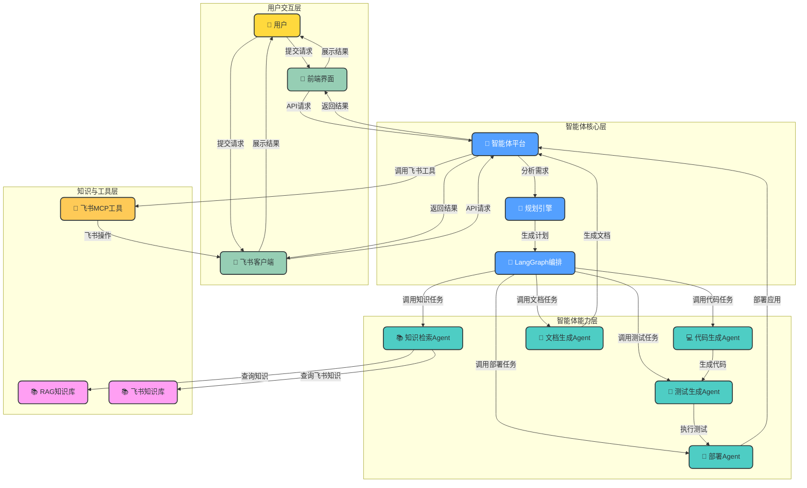
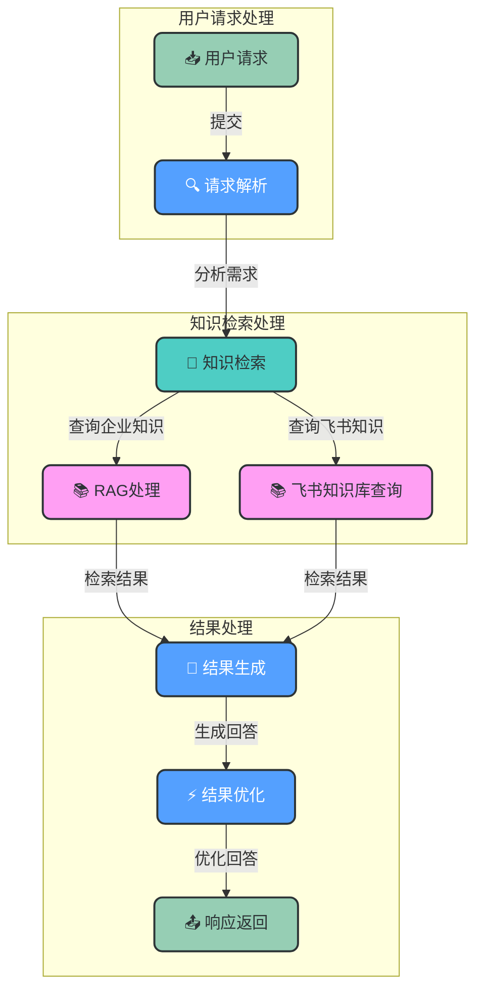
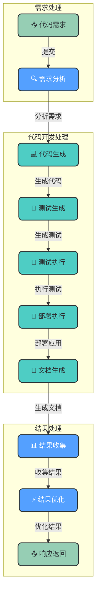
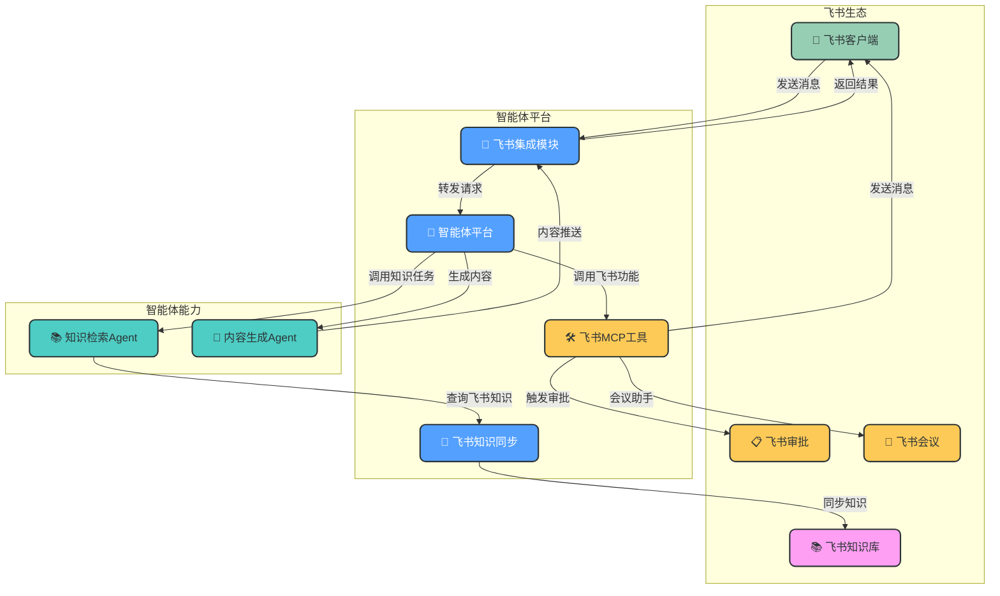

 # 智能体平台技术评审报告

## 评审基础信息

- **项目/服务名称**：智能体平台（Agent Platform）
- **版本号**：v1.0
- **负责方**：
  - 技术方案：架构设计团队
  - 工程开发：后端开发团队
- **评审日期**：2026-02-04
- **评审类型**：技术方案预研/重大迭代评审

## 1. 项目背景与目标

### 1.1 项目背景

随着企业数字化转型的深入，传统的知识管理和软件开发模式面临着诸多挑战：

- **知识管理痛点**：企业内部知识分散，难以有效整合和检索，知识传递效率低下
- **软件开发效率**：传统开发流程繁琐，代码生成、测试、部署等环节自动化程度低
- **客户服务质量**：人工客服响应速度慢，难以提供24/7全天候服务
- **系统集成复杂度**：企业内部系统众多，集成难度大，数据孤岛现象严重
- **飞书生态融合**：企业广泛使用飞书作为协作工具，但缺乏与AI智能体的深度集成

### 1.2 业务目标

本项目旨在构建一个基于FastAPI的企业级智能体平台，通过整合RAG知识库和AI编程智能体功能，实现以下业务目标：

- **提升知识管理效率**：构建企业级知识库，实现智能知识检索和问答
- **提高软件开发自动化程度**：实现从需求到部署的全流程代码自动化
- **优化客户服务体验**：提供智能客服，实现24/7全天候服务
- **简化系统集成**：通过统一的API接口，简化企业内部系统集成
- **深度融合飞书生态**：实现飞书客户端接入、飞书知识库集成和飞书MCP工具调用

## 2. 需求概述与用例

### 2.1 核心功能需求

- **智能体核心功能**：
  - 知识检索与问答
  - 代码生成与优化
  - 测试生成与执行
  - 部署自动化
  - 文档生成
  - 内容创作

- **飞书集成功能**：
  - 飞书客户端接入
  - 飞书知识库集成
  - 飞书MCP工具调用
  - 飞书消息通知
  - 飞书审批流程集成

- **系统管理功能**：
  - 监控与告警
  - 日志管理
  - 权限控制
  - 系统配置

### 2.2 核心性能指标

- **响应时间**：智能体响应时间≤3秒（95%请求）
- **并发处理能力**：支持≥1000 QPS
- **知识库检索准确率**：≥90%
- **代码生成质量**：生成代码通过率≥85%
- **系统可用性**：≥99.9%
- **飞书集成响应时间**：≤2秒（95%请求）

### 2.3 典型用户用例

#### 用例1：企业知识问答
**用户**：企业员工
**场景**：员工通过飞书客户端向智能体平台提问关于企业政策、产品信息等问题
**流程**：
1. 员工在飞书客户端发送问题
2. 智能体平台接收请求并分析
3. 知识检索Agent查询企业知识库和飞书知识库
4. 生成器基于检索结果生成回答
5. 通过飞书客户端返回回答给员工

#### 用例2：代码开发自动化
**用户**：软件开发工程师
**场景**：工程师通过前端界面提交代码开发需求
**流程**：
1. 工程师提交代码需求
2. 智能体平台分析需求并生成开发计划
3. 代码生成Agent生成代码
4. 测试生成Agent生成测试用例
5. 执行测试验证代码质量
6. 部署Agent将代码部署到目标环境
7. 文档生成Agent生成技术文档

### 2.4 核心业务处理流程

## 3. 总体方案概述

### 3.1 整体架构设计

系统采用分层架构设计，包含以下核心层级：

1. **用户层**：用户通过前端界面或飞书客户端与系统交互
2. **应用接口层**：提供API接口和前端界面，处理用户请求和响应
3. **智能体核心层**：作为系统核心，协调各组件工作，包括智能体平台、规划引擎、LangGraph编排等
4. **智能体能力集群**：包含知识检索、代码生成、测试生成、部署、文档生成、内容生成等专业智能体
5. **RAG核心层**：包含RAG管道、检索器、生成器、外挂知识库等
6. **知识与工具层**：包含向量存储、知识图谱、工具集、MCP服务接口、函数执行器等
7. **数据处理层**：包含数据采集器、文档加载器、文本分割器、嵌入模型等
8. **运行环境层**：包含Docker环境、操作系统环境、数据库服务、网络服务等
9. **监控与管理层**：包含监控系统、日志系统、管理面板等
10. **飞书集成层**：包含飞书客户端、飞书知识库、飞书MCP工具等

### 3.2 核心能力拆分

- **知识管理能力**：
  - 知识采集与存储
  - 知识检索与问答
  - 知识图谱构建
  - 飞书知识库同步

- **代码开发能力**：
  - 代码生成与优化
  - 测试生成与执行
  - 部署自动化
  - 文档生成

- **内容创作能力**：
  - 营销内容生成
  - 报告自动生成
  - 创意写作辅助

- **系统集成能力**：
  - 飞书生态集成
  - 外部工具调用
  - API接口管理

- **运维管理能力**：
  - 系统监控
  - 日志分析
  - 告警处理
  - 权限管理

### 3.3 性能优化方案

- **异步处理**：采用FastAPI的异步特性，实现高并发处理
- **缓存策略**：对频繁访问的知识和结果进行缓存
- **负载均衡**：通过Kubernetes实现服务水平扩展
- **数据库优化**：使用向量数据库和索引优化，提高检索效率
- **批量处理**：对大量数据采用批量处理策略
- **飞书集成优化**：使用飞书SDK的异步API，减少集成延迟

## 4. 逻辑架构与模块详情

### 4.1 核心模块划分及职责

| 模块名称 | 职责描述 | 核心功能 |
|---------|---------|--------|
| 智能体平台 | 系统核心，协调各组件工作 | 请求处理、任务调度、结果整合 |
| 规划引擎 | 分析用户需求，生成任务执行计划 | 需求分析、计划生成、任务分解 |
| LangGraph编排 | 协调智能体执行，管理工作流 | 工作流编排、状态管理、异常处理 |
| 知识检索Agent | 处理知识查询和检索任务 | 知识检索、结果排序、上下文构建 |
| 代码生成Agent | 根据需求生成高质量代码 | 代码生成、代码优化、代码验证 |
| 测试生成Agent | 生成测试用例 | 测试用例生成、测试执行、结果分析 |
| 部署Agent | 负责应用部署和环境配置 | 部署执行、环境配置、状态监控 |
| 文档生成Agent | 生成技术文档和使用手册 | 文档生成、格式优化、内容整合 |
| 内容生成Agent | 生成各类文本内容 | 内容创作、风格调整、质量控制 |
| RAG管道 | 协调检索和生成过程，管理数据流 | 检索协调、生成管理、结果优化 |
| 飞书集成模块 | 实现飞书生态集成 | 飞书客户端接入、飞书知识库同步、飞书MCP工具调用 |

### 4.2 关键业务逻辑流程

#### 知识检索流程

#### 代码开发流程

### 4.3 核心技术难点及解决方案

| 技术难点 | 解决方案 |
|---------|--------|
| 知识检索准确率 | 采用混合检索策略（向量检索+关键词检索），结合知识图谱增强 |
| 代码生成质量 | 引入代码风格检查和静态分析，使用多轮反馈机制优化生成结果 |
| 多智能体协同 | 使用LangGraph实现智能体间的高效协作和状态管理 |
| 飞书知识库同步 | 设计增量同步机制，使用Webhook实时接收飞书知识更新 |
| 系统可扩展性 | 采用微服务架构，通过Kubernetes实现水平扩展 |
| 性能优化 | 引入缓存机制，使用异步处理，优化数据库查询 |

## 5. 数据架构与模型设计

### 5.1 数据流向说明

- **用户输入数据**：从前端界面或飞书客户端流向API接口，再流向智能体平台
- **知识数据**：从外部源和飞书知识库流向数据处理层，经过处理后存储到向量存储和知识图谱
- **智能体执行数据**：在智能体核心层和智能体能力集群之间流转
- **结果数据**：从智能体能力集群流向智能体平台，再通过API接口返回给前端界面或飞书客户端
- **监控数据**：从各组件流向监控系统，进行分析和告警

### 5.2 数据存储设计

- **向量数据库**：使用Pinecone或Milvus存储文本向量嵌入，支持高效相似性搜索
- **关系型数据库**：使用PostgreSQL存储结构化数据，如用户信息、任务状态等
- **文档数据库**：使用MongoDB存储非结构化数据，如对话历史、配置信息等
- **缓存**：使用Redis缓存频繁访问的数据和结果
- **文件存储**：使用对象存储服务存储文档、代码等文件
- **飞书数据**：通过飞书API实时同步和访问，部分热点数据缓存到本地

## 6. 接口与集成设计

### 6.1 外部第三方接口集成

- **飞书开放平台API**：
  - 飞书客户端消息API
  - 飞书知识库API
  - 飞书审批流程API
  - 飞书用户管理API

- **大模型API**：
  - OpenAI API
  - Anthropic API
  - 本地部署模型API

- **向量数据库API**：
  - Pinecone API
  - Milvus API
  - Weaviate API

### 6.2 内部系统/基础设施集成

- **容器编排**：Kubernetes
- **服务网格**：Istio
- **监控系统**：Prometheus + Grafana
- **日志系统**：ELK Stack
- **CI/CD**：Jenkins + GitLab CI

### 6.3 业务接口设计

- **RESTful API**：
  - `/api/agent`：智能体相关接口
  - `/api/knowledge`：知识管理相关接口
  - `/api/code`：代码开发相关接口
  - `/api/feishu`：飞书集成相关接口
  - `/api/admin`：系统管理相关接口

- **WebSocket接口**：
  - 用于实时消息推送和长连接交互

- **飞书机器人Webhook**：
  - 接收飞书客户端消息
  - 推送处理结果到飞书

## 7. 安全合规保障

### 7.1 数据合规性设计

- **数据隐私保护**：
  - 敏感数据加密存储
  - 数据访问审计
  - 符合GDPR和国内数据隐私法规

- **飞书数据合规**：
  - 遵循飞书开放平台数据使用规范
  - 获得用户授权后访问飞书数据
  - 定期清理不必要的飞书数据

### 7.2 安全防护措施

- **认证与授权**：
  - JWT token认证
  - 基于角色的权限控制
  - API接口访问控制

- **网络安全**：
  - HTTPS加密传输
  - 网络访问控制
  - DDoS防护

- **代码安全**：
  - 代码审计
  - 依赖包安全扫描
  - 防止注入攻击

- **飞书集成安全**：
  - 飞书应用密钥安全管理
  - 飞书API调用权限控制
  - 飞书Webhook签名验证

## 8. 方案总结与未来展望

### 8.1 方案核心优势与可行性总结

- **技术架构优势**：
  - 模块化设计，易于扩展和维护
  - 基于FastAPI和LangGraph，技术栈先进
  - 分层架构清晰，职责明确

- **功能优势**：
  - 整合了知识管理和代码开发能力
  - 深度集成飞书生态，扩展应用场景
  - 支持多种智能体协作，提高执行效率

- **性能优势**：
  - 异步处理，高并发支持
  - 缓存策略，提高响应速度
  - 可水平扩展，适应不同规模需求

- **可行性评估**：
  - 技术方案成熟，使用的框架和工具均为业内主流
  - 团队具备相关技术栈经验
  - 飞书开放平台提供了完善的API支持
  - 系统架构设计合理，风险可控

### 8.2 后续优化与发展方向

- **技术优化**：
  - 引入更先进的大模型，提高生成质量
  - 优化向量检索算法，提高检索准确率
  - 增强系统自学习能力，持续改进性能

- **功能扩展**：
  - 支持更多外部系统集成
  - 增强多语言支持能力
  - 开发更多专业领域智能体

- **飞书生态深度融合**：
  - 开发飞书专属智能体应用
  - 支持飞书会议智能助手
  - 实现飞书文档智能分析

- **商业化探索**：
  - 提供SaaS版本，服务更多企业
  - 开发行业专属解决方案
  - 构建智能体生态系统

## 9. 下一步实施计划

### 9.1 本次评审待确认事项

- **技术选型确认**：
  - 向量数据库最终选型（Pinecone/Milvus）
  - 大模型服务提供商确认
  - 容器编排平台细节

- **飞书集成细节**：
  - 飞书应用权限范围确认
  - 飞书知识库同步频率
  - 飞书MCP工具具体功能清单

- **性能指标确认**：
  - 具体并发处理能力目标
  - 响应时间详细要求
  - 系统可用性指标

- **实施计划确认**：
  - 项目里程碑时间点
  - 资源分配方案
  - 风险应对策略

### 9.2 分阶段实施任务

| 阶段 | 任务描述 | 责任方 | 输出物 | 截止时间 |
|-----|---------|-------|-------|--------|
| 第一阶段 | 系统架构搭建 | 架构设计团队 | 架构设计文档、基础代码框架 | |
| 第二阶段 | 核心功能实现 | 后端开发团队 | 智能体核心功能、RAG知识库 |  |
| 第三阶段 | 飞书集成开发 | 集成开发团队 | 飞书客户端接入、飞书知识    库集成、飞书MCP工具 |  |
| 第四阶段 | 性能优化与测试 | 测试团队 | 性能测试报告、优化方案 |  |
| 第五阶段 | 系统部署与上线 | 运维团队 | 部署方案、监控系统 |  |

### 9.3 待讨论重点问题

- **飞书集成安全**：如何确保飞书数据的安全访问和使用
- **系统可扩展性**：如何设计系统以支持未来业务增长
- **成本控制**：如何在保证性能的同时控制基础设施成本
- **用户体验**：如何优化智能体交互体验，提高用户满意度
- **合规风险**：如何应对不同地区的数据合规要求

## 飞书集成专题分析

### 飞书集成架构

### 飞书集成优势

- **用户体验提升**：通过飞书客户端提供统一的交互入口，用户无需切换系统
- **知识资源扩展**：整合飞书知识库，丰富知识来源
- **工作流自动化**：通过飞书MCP工具，实现飞书相关工作流自动化
- **消息触达及时**：利用飞书消息通知，确保重要信息及时触达用户
- **企业协作增强**：深度融合飞书生态，提升企业内部协作效率

### 飞书集成风险与应对

- **API限制风险**：飞书API存在调用频率限制
  - 应对策略：实现请求限流和重试机制，合理缓存飞书数据

- **数据安全风险**：飞书数据访问需要严格控制
  - 应对策略：遵循最小权限原则，加密存储飞书凭证，实现数据访问审计

- **集成稳定性风险**：飞书平台变更可能影响集成稳定性
  - 应对策略：建立监控机制，定期测试集成健康状态，预留回滚方案

- **性能影响风险**：飞书API调用可能增加响应时间
  - 应对策略：使用异步调用，优化缓存策略，选择合适的同步频率

## 附录

### 相关参考文档

- 《智能体平台架构设计文档》
- 《FastAPI官方文档》
- 《LangGraph官方文档》
- 《飞书开放平台API文档》
- 《向量数据库技术白皮书》

### 项目相关沟通群聊

- 技术方案讨论群
- 开发实施群
- 测试验证群
- 飞书集成专项群

## 评审关键动作

- 相关负责人完成评审结果确认
- 技术选型最终决策
- 实施计划细化与确认
- 飞书集成方案详细设计
- 系统安全方案评审