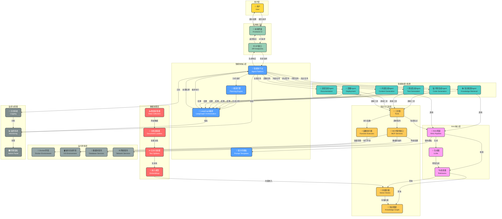
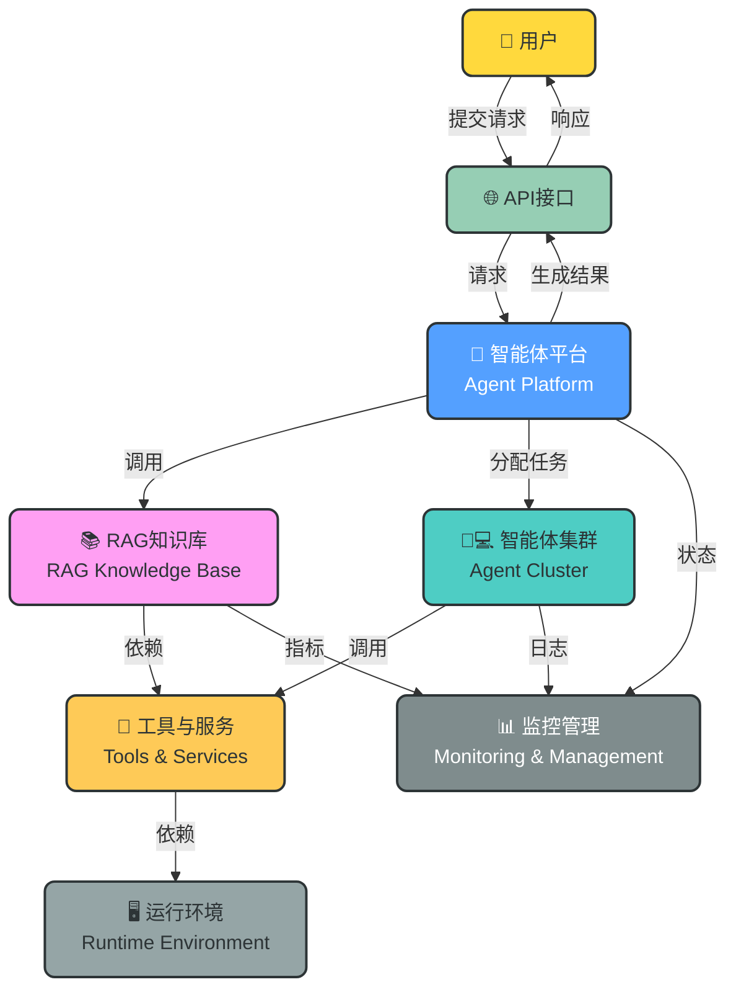

# 智能体平台架构设计

## 项目概述

本项目是一个基于FastAPI的企业级智能体平台，整合了RAG（检索增强生成）知识库和AI编程智能体功能。系统采用模块化设计，提供高性能、可扩展的智能体解决方案，能够处理知识检索、内容生成、代码开发、测试部署等多种任务，适用于企业知识管理、软件开发自动化、客户支持等多种场景。

## 核心架构图

## 极简架构图（汇报版）

## 架构组成

### 1. 用户层
- **用户**：通过前端界面与系统交互，提交各种智能体请求

### 2. 应用接口层
- **API接口**：提供标准化的RESTful API，处理用户请求和响应
- **前端界面**：提供用户友好的交互界面，展示任务执行状态和结果

### 3. 智能体核心层
- **智能体平台**：作为系统核心，协调各组件工作
- **规划引擎**：分析用户需求，生成任务执行计划
- **LangGraph编排**：协调智能体执行，管理工作流
- **提示词模板**：管理和优化提示词，提高生成质量

### 4. 智能体能力集群
- **知识检索Agent**：处理知识查询和检索任务
- **代码生成Agent**：根据需求生成高质量代码
- **测试生成Agent**：生成单元测试和集成测试
- **部署Agent**：负责应用部署和环境配置
- **文档生成Agent**：生成技术文档和使用手册
- **内容生成Agent**：生成各类文本内容

### 5. RAG核心层
- **RAG管道**：协调检索和生成过程，管理数据流
- **检索器**：根据用户查询检索相关文档
- **生成器**：基于检索的上下文生成回答

### 6. 知识与工具层
- **向量存储**：存储文本向量嵌入，支持高效相似性搜索
- **知识图谱**：构建和管理实体之间的关系网络
- **工具集**：集成各种智能体工具
- **MCP服务接口**：调用外部微服务
- **函数执行器**：执行代码和脚本

### 7. 数据处理层
- **数据采集器**：从多种来源采集数据
- **文档加载器**：将不同格式的文档加载为统一表示
- **文本分割器**：将长文本分割为合适大小的文本块
- **嵌入模型**：将文本转换为向量表示

### 8. 运行环境层
- **Docker环境**：提供隔离的容器运行环境
- **操作系统环境**：支持多种操作系统
- **数据库服务**：提供数据存储支持
- **网络服务**：处理网络通信

### 9. 监控与管理
- **监控系统**：监控系统健康和性能
- **日志系统**：记录系统运行日志
- **管理面板**：提供系统管理界面

## 核心流程

### 1. 请求处理流程
1. **用户提交请求**：用户通过前端界面提交智能体请求
2. **API请求处理**：API接口接收并验证请求
3. **请求分析与规划**：智能体平台分析需求，规划引擎生成任务执行计划
4. **智能体编排**：LangGraph根据计划编排智能体执行
5. **任务分配**：智能体平台将任务分配给相应的专业智能体

### 2. 知识处理流程
1. **数据采集**：从多种来源采集数据
2. **文档加载**：加载不同格式的文档
3. **文本分割**：将长文本分割为合适大小的文本块
4. **嵌入生成**：将文本转换为向量表示
5. **向量存储**：将向量存储到向量数据库
6. **知识图谱构建**：基于向量数据构建知识图谱

### 3. 智能体执行流程
1. **知识检索**：知识检索Agent处理知识查询请求
2. **内容生成**：内容生成Agent生成各类文本内容
3. **代码生成**：代码生成Agent生成符合需求的代码
4. **测试生成**：测试生成Agent生成测试用例
5. **测试执行**：执行测试用例，验证代码质量
6. **部署执行**：部署Agent将代码部署到目标环境
7. **文档生成**：文档生成Agent生成相关文档

### 4. 结果反馈流程
1. **结果收集**：收集各智能体的执行结果
2. **结果处理**：处理和整合执行结果
3. **响应生成**：生成用户友好的响应
4. **结果返回**：通过API接口返回结果给用户
5. **结果展示**：前端界面展示执行结果

### 5. 监控管理流程
1. **状态监控**：监控系统实时监控各组件状态
2. **日志记录**：日志系统记录系统运行日志
3. **性能分析**：分析系统性能指标
4. **告警处理**：当出现异常时触发告警
5. **系统管理**：通过管理面板进行系统配置和管理

## 技术特点

- **模块化设计**：各组件解耦，支持独立扩展和替换
- **多智能体协作**：多个专业智能体协同工作，提高执行效率
- **RAG增强**：结合检索增强生成，提高内容质量和准确性
- **LangGraph编排**：基于LangGraph的强大工作流管理
- **代码自动化**：支持从需求到部署的全流程代码自动化
- **Docker化部署**：支持容器化部署，环境一致性好
- **完整监控体系**：实时监控系统状态，确保高可用性
- **可扩展性**：支持水平扩展，适应不同规模需求
- **安全可靠**：完善的安全措施和权限管理
- **多场景支持**：支持知识管理、内容生成、软件开发等多种场景

## 应用场景

### 1. 企业知识管理
- **内部知识库**：存储和检索企业内部知识
- **智能问答**：提供智能客服，回答员工问题
- **知识图谱**：构建企业知识图谱，展示知识关联

### 2. 内容生成与创作
- **营销内容**：生成产品描述、营销文案等
- **报告生成**：自动生成数据分析报告、业务报告
- **创意写作**：辅助生成小说、诗歌等创意内容

### 3. 软件开发自动化
- **代码生成**：根据需求生成高质量代码
- **测试自动化**：自动生成和执行测试用例
- **CI/CD流程**：自动化持续集成和持续部署
- **文档生成**：自动生成技术文档和API文档

### 4. 客户支持与服务
- **智能客服**：回答客户常见问题
- **工单处理**：自动处理和分类客户工单
- **个性化推荐**：根据客户需求推荐产品和服务

### 5. 教育培训
- **学习辅导**：辅助学生学习，解答问题
- **课程设计**：生成课程大纲和教学材料
- **个性化学习**：根据学生情况推荐学习路径

### 6. 金融服务
- **金融知识查询**：提供金融知识检索服务
- **投资分析**：辅助生成投资分析报告
- **风险评估**：自动化风险评估和预警

### 7. 医疗健康
- **医疗知识管理**：管理医疗知识，辅助诊断和治疗
- **患者教育**：生成患者教育材料
- **医学研究辅助**：辅助医学研究和文献分析

### 8. 政府与公共服务
- **政策咨询**：提供政策查询和解读服务
- **公共信息发布**：生成公共信息公告
- **政务服务辅助**：辅助处理政务服务请求

## 技术栈

### 核心框架
- **FastAPI**：高性能API框架
- **LangGraph**：智能体编排框架
- **LangChain**：AI应用开发框架
- **LlamaIndex**：RAG应用开发框架

### 大模型支持
- **OpenAI API**：GPT系列模型
- **Anthropic API**：Claude系列模型
- **本地部署模型**：如Qwen、DeepSeek、Llama 3等

### 向量数据库
- **Pinecone**：托管向量数据库
- **Milvus**：开源向量数据库
- **Weaviate**：开源向量搜索引擎
- **Chroma**：轻量级向量数据库

### 工具集
- **代码生成**：GitHub Copilot、CodeLlama
- **测试生成**：TestGPT、Diffblue
- **部署工具**：Docker、Kubernetes
- **文档生成**：Docusaurus、Sphinx
- **监控工具**：Prometheus、Grafana
- **日志工具**：ELK Stack、Loki

### 基础设施
- **容器编排**：Kubernetes
- **服务网格**：Istio
- **云服务**：AWS、Azure、GCP
- **数据库**：MongoDB、MySQL、PostgreSQL

## 总结

本架构设计提供了一个完整、可扩展、高性能的智能体平台解决方案，整合了RAG知识库和AI编程智能体的优势。系统采用分层设计，包含用户层、应用接口层、智能体核心层、智能体能力集群、RAG核心层、知识与工具层、数据处理层、运行环境层以及监控与管理层。

通过模块化设计和插件系统，支持灵活的功能扩展和定制，满足不同场景的需求。系统支持知识检索、内容生成、代码开发、测试部署等多种任务，适用于企业知识管理、软件开发自动化、客户支持等多种场景。

该架构不仅满足当前的智能体需求，也为未来的技术发展和业务增长预留了空间，是构建现代智能体平台的理想选择。通过整合多种智能体能力，企业可以提高运营效率，降低成本，加速创新，获得竞争优势。