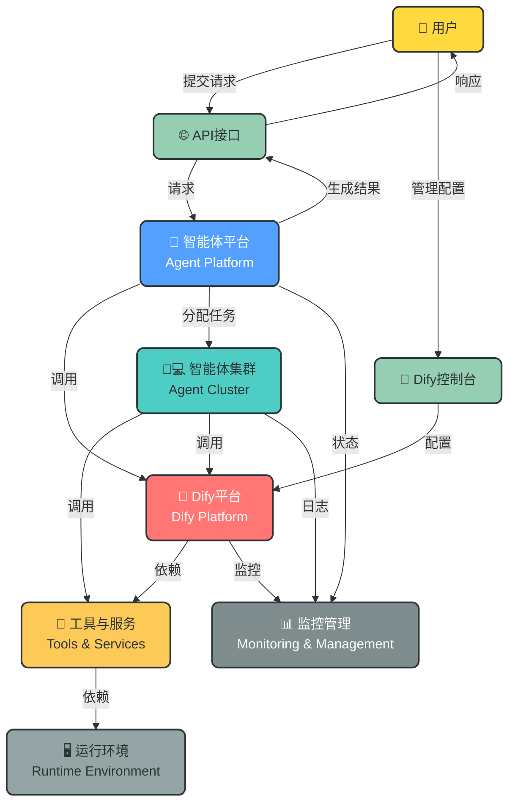

# 智能体平台架构设计_v2（集成Dify）

## 1. 集成Dify可行性分析

### 1.1 Dify核心功能概述

Dify是一个开源的LLM应用开发平台，提供完整的LLMOps能力，包括：
- 大模型管理与调用
- 提示词设计与管理
- 工作流编排
- RAG知识库管理
- 应用部署与监控
- API接口服务
- 数据统计与分析

### 1.2 集成可行性分析

| 分析维度 | 可行性评估 | 理由 |
|---------|-----------|------|
| 技术兼容性 | ⭐⭐⭐⭐⭐ | Dify提供标准化RESTful API，可与现有FastAPI架构无缝集成 |
| 功能互补性 | ⭐⭐⭐⭐⭐ | Dify的LLMOps能力可增强现有平台，避免重复开发 |
| 架构融合性 | ⭐⭐⭐⭐ | 现有架构采用模块化设计，可将Dify作为核心组件或外部服务接入 |
| 性能影响 | ⭐⭐⭐⭐ | Dify支持水平扩展，可根据负载调整资源，对现有系统性能影响小 |
| 维护成本 | ⭐⭐⭐⭐ | 采用Dify成熟方案可降低开发和维护成本 |
| 安全合规 | ⭐⭐⭐⭐ | Dify支持企业级安全配置，符合合规要求 |

### 1.3 集成价值

- **加速开发**：复用Dify成熟的LLMOps能力，减少重复开发
- **增强功能**：获得完整的模型管理、工作流编排、监控分析等能力
- **降低成本**：减少运维和开发成本
- **提高可靠性**：采用成熟的开源方案，降低系统风险
- **增强扩展性**：Dify支持多种大模型和插件，便于未来扩展

## 2. 核心架构图

```mermaid
flowchart TD
    subgraph "用户层"
        U["👤 用户<br/>User"]:::user
    end

    subgraph "应用接口层"
        API["🌐 API接口<br/>API Endpoints"]:::api
        UI["📱 前端界面<br/>Frontend UI"]:::api
        DIFY_UI["🎨 Dify控制台<br/>Dify Console"]:::api
    end

    subgraph "智能体核心层"
        AGP["🤖 智能体平台<br/>Agent Platform"]:::core
        PL["🔄 需求规划引擎<br/>Planning Engine"]:::core
        LC["🔗 LangGraph编排<br/>LangGraph Orchestration"]:::core
        DIFY["🚀 Dify平台<br/>Dify Platform"]:::core
    end

    subgraph "智能体能力集群"
        KBA["📚 知识检索Agent<br/>Knowledge Retrieval"]:::agent
        CA["💻 代码生成Agent<br/>Code Generation"]:::agent
        TA["🧪 测试生成Agent<br/>Test Generation"]:::agent
        DA["🚀 部署Agent<br/>Deployment"]:::agent
        DOA["📄 文档生成Agent<br/>Documentation"]:::agent
        CAI["🎨 内容生成Agent<br/>Content Generation"]:::agent
    end

    subgraph "Dify核心能力"
        DIFY_LM["🤖 模型管理<br/>Model Management"]:::dify
        DIFY_PROMPT["📝 提示词工程<br/>Prompt Engineering"]:::dify
        DIFY_WF["🔄 工作流编排<br/>Workflow Orchestration"]:::dify
        DIFY_RAG["📚 RAG管理<br/>RAG Management"]:::dify
        DIFY_API["🌐 API服务<br/>API Services"]:::dify
        DIFY_MONITOR["📊 监控分析<br/>Monitoring & Analytics"]:::dify
    end

    subgraph "知识与工具层"
        VS["💾 向量存储<br/>Vector Stores"]:::tool
        KG["🧠 知识图谱<br/>Knowledge Graph"]:::tool
        TL["🔧 工具集<br/>Tools"]:::tool
        MCP["🔌 MCP服务接口<br/>MCP Services"]:::tool
        FUNC["⚡ 函数执行器<br/>Function Executor"]:::tool
    end

    subgraph "数据处理层"
        DC["📥 数据采集器<br/>Data Collectors"]:::data
        DL["📄 文档加载器<br/>Document Loaders"]:::data
        TS["✂️ 文本分割器<br/>Text Splitters"]:::data
        EM["🔢 嵌入模型<br/>Embeddings"]:::data
    end

    subgraph "运行环境层"
        DE["🐳 Docker环境<br/>Docker Environment"]:::env
        OSE["🖥️ 操作系统环境<br/>OS Environment"]:::env
        DB["💾 数据库服务<br/>Database Services"]:::env
        NS["🌐 网络服务<br/>Network Services"]:::env
    end

    subgraph "监控与管理"
        LM["📊 监控系统<br/>Monitoring"]:::monitor
        LG["📝 日志系统<br/>Logging"]:::monitor
        AP["🎛️ 管理面板<br/>Admin Panel"]:::monitor
    end

    %% 用户流程
    U -->|提交请求| UI
    U -->|管理配置| DIFY_UI
    UI -->|API请求| API
    API -->|转发请求| AGP
    DIFY_UI -->|配置管理| DIFY
    
    %% 智能体平台与Dify集成
    AGP -->|调用Dify服务| DIFY
    AGP -->|分析请求| PL
    PL -->|生成计划| LC
    LC -->|编排执行| AGP
    DIFY -->|提供能力| AGP
    
    %% Dify内部能力
    DIFY -->|管理| DIFY_LM
    DIFY -->|管理| DIFY_PROMPT
    DIFY -->|管理| DIFY_WF
    DIFY -->|管理| DIFY_RAG
    DIFY -->|提供| DIFY_API
    DIFY -->|监控| DIFY_MONITOR
    
    %% 智能体调用
    AGP -->|知识任务| KBA
    AGP -->|代码任务| CA
    AGP -->|测试任务| TA
    AGP -->|部署任务| DA
    AGP -->|文档任务| DOA
    AGP -->|内容任务| CAI
    
    %% 智能体与Dify交互
    KBA -->|调用RAG| DIFY_RAG
    CA -->|调用模型| DIFY_LM
    CAI -->|调用模型| DIFY_LM
    CAI -->|调用工作流| DIFY_WF
    
    %% 智能体与工具交互
    CA -->|调用工具| TL
    TA -->|调用工具| TL
    DA -->|调用工具| TL
    DOA -->|调用工具| TL
    TL -->|检索知识| DIFY_RAG
    TL -->|调用服务| MCP
    TL -->|执行函数| FUNC
    
    %% 数据处理流程
    DC -->|原始数据| DL
    DL -->|加载文档| TS
    TS -->|文本块| EM
    EM -->|向量嵌入| VS
    VS -->|存储向量| KG
    DIFY_RAG -->|访问| VS
    DIFY_RAG -->|访问| KG
    
    %% 运行环境依赖
    FUNC -->|执行环境| OSE
    MCP -->|容器管理| DE
    MCP -->|数据库操作| DB
    MCP -->|网络配置| NS
    DIFY -->|依赖| DE
    DIFY -->|依赖| DB
    
    %% 结果反馈
    KBA -->|结果| LC
    CA -->|结果| LC
    TA -->|结果| LC
    DA -->|结果| LC
    DOA -->|结果| LC
    CAI -->|结果| LC
    DIFY -->|结果| LC
    LC -->|处理结果| AGP
    AGP -->|生成响应| API
    API -->|返回响应| UI
    
    %% 监控与管理
    AGP -->|状态| LM
    LC -->|指标| LM
    DIFY -->|监控数据| LM
    DIFY -->|日志| LG
    LG -->|分析| LM
    LM -->|告警| AP

    classDef user fill:#FFD93D,stroke:#2D3436,stroke-width:2px,color:#2D3436,rx:8,ry:8;
    classDef api fill:#96CEB4,stroke:#2D3436,stroke-width:2px,color:#2D3436,rx:8,ry:8;
    classDef core fill:#54A0FF,stroke:#2D3436,stroke-width:2px,color:white,rx:8,ry:8;
    classDef agent fill:#4ECDC4,stroke:#2D3436,stroke-width:2px,color:#2D3436,rx:8,ry:8;
    classDef dify fill:#FF7675,stroke:#2D3436,stroke-width:2px,color:white,rx:8,ry:8;
    classDef tool fill:#FECA57,stroke:#2D3436,stroke-width:2px,color:#2D3436,rx:8,ry:8;
    classDef data fill:#FF6B6B,stroke:#2D3436,stroke-width:2px,color:white,rx:8,ry:8;
    classDef env fill:#95A5A6,stroke:#2D3436,stroke-width:2px,color:#2D3436,rx:8,ry:8;
    classDef monitor fill:#7F8C8D,stroke:#2D3436,stroke-width:2px,color:white,rx:8,ry:8;
```

## 3. 极简架构图（汇报版）

## 4. 架构组成

### 4.1 新增组件

#### Dify平台
- **模型管理**：管理多种大模型，提供统一调用接口
- **提示词工程**：可视化提示词设计、版本管理、测试
- **工作流编排**：可视化工作流设计，支持复杂业务逻辑
- **RAG管理**：文档上传、处理、检索，支持多种向量存储
- **API服务**：提供标准化API接口，支持多种认证方式
- **监控分析**：实时监控应用性能，提供数据分析

### 4.2 集成后的架构变化

1. **智能体核心层**：新增Dify平台，作为智能体平台的核心组件之一
2. **应用接口层**：新增Dify控制台，用于管理和配置Dify
3. **智能体能力集群**：智能体可直接调用Dify的能力
4. **知识与工具层**：Dify RAG可访问现有向量存储和知识图谱
5. **监控与管理**：Dify的监控数据整合到现有监控系统

## 5. 核心流程

### 5.1 请求处理流程（集成Dify）

1. **用户提交请求**：用户通过前端界面提交智能体请求
2. **API请求处理**：API接口接收并验证请求
3. **请求分析与规划**：智能体平台分析需求，规划引擎生成任务执行计划
4. **智能体编排**：LangGraph根据计划编排智能体执行
5. **Dify调用**：根据需求调用Dify的模型、工作流或RAG能力
6. **智能体执行**：各智能体执行具体任务，可调用Dify或其他工具
7. **结果整合**：收集和整合所有执行结果
8. **响应生成**：生成用户友好的响应
9. **结果返回**：通过API接口返回结果给用户

### 5.2 Dify应用开发流程

1. **Dify配置**：管理员通过Dify控制台配置模型、提示词、工作流和RAG
2. **API生成**：Dify自动生成API接口，供智能体平台调用
3. **智能体集成**：智能体平台配置Dify API，实现能力调用
4. **应用部署**：智能体平台部署集成Dify能力的应用
5. **监控运维**：通过统一监控系统监控Dify和智能体平台的运行状态

### 5.3 RAG知识管理流程（集成Dify）

1. **数据采集**：从多种来源采集数据
2. **文档上传**：将文档上传到Dify控制台
3. **文档处理**：Dify自动进行文本分割、嵌入生成和向量存储
4. **知识管理**：通过Dify控制台管理知识库，支持增量更新
5. **知识检索**：智能体通过Dify API检索知识

## 6. 技术特点

### 6.1 新增技术特点

- **Dify集成**：集成成熟的LLMOps平台，增强智能体能力
- **可视化开发**：通过Dify控制台实现可视化的模型、提示词和工作流设计
- **多模型支持**：支持多种大模型，包括OpenAI、Anthropic、本地模型等
- **统一API接口**：提供标准化API，便于集成和扩展
- **增强的监控分析**：Dify提供详细的应用监控和数据分析
- **降低开发成本**：复用Dify成熟方案，减少重复开发

### 6.2 保留原有技术特点

- **模块化设计**：各组件解耦，支持独立扩展和替换
- **多智能体协作**：多个专业智能体协同工作，提高执行效率
- **LangGraph编排**：基于LangGraph的强大工作流管理
- **代码自动化**：支持从需求到部署的全流程代码自动化
- **Docker化部署**：支持容器化部署，环境一致性好
- **完整监控体系**：实时监控系统状态，确保高可用性
- **可扩展性**：支持水平扩展，适应不同规模需求
- **安全可靠**：完善的安全措施和权限管理
- **多场景支持**：支持知识管理、内容生成、软件开发等多种场景

## 7. 应用场景

### 7.1 新增应用场景

- **LLM应用快速开发**：通过Dify可视化开发LLM应用，无需编写代码
- **多模型比较与切换**：在同一平台比较不同模型的效果，灵活切换
- **企业级LLMOps管理**：实现模型、提示词、工作流的统一管理
- **RAG知识库快速构建**：通过Dify快速构建和管理RAG知识库
- **AI应用监控与分析**：实时监控AI应用的性能和使用情况

### 7.2 保留原有应用场景

- **企业知识管理**：存储和检索企业内部知识
- **内容生成与创作**：生成营销内容、报告、创意写作等
- **软件开发自动化**：代码生成、测试、部署等全流程自动化
- **客户支持与服务**：智能客服、工单处理、个性化推荐
- **教育培训**：学习辅导、课程设计、个性化学习
- **金融服务**：金融知识查询、投资分析、风险评估
- **医疗健康**：医疗知识管理、患者教育、医学研究辅助
- **政府与公共服务**：政策咨询、公共信息发布、政务服务辅助

## 8. 技术栈

### 8.1 新增技术栈

- **Dify**：LLM应用开发平台
- **Dify API**：用于智能体平台与Dify的集成

### 8.2 保留原有技术栈

#### 核心框架
- **FastAPI**：高性能API框架
- **LangGraph**：智能体编排框架
- **LangChain**：AI应用开发框架
- **LlamaIndex**：RAG应用开发框架

#### 大模型支持
- **OpenAI API**：GPT系列模型
- **Anthropic API**：Claude系列模型
- **本地部署模型**：如Qwen、DeepSeek、Llama 3等

#### 向量数据库
- **Pinecone**：托管向量数据库
- **Milvus**：开源向量数据库
- **Weaviate**：开源向量搜索引擎
- **Chroma**：轻量级向量数据库

#### 工具集
- **代码生成**：GitHub Copilot、CodeLlama
- **测试生成**：TestGPT、Diffblue
- **部署工具**：Docker、Kubernetes
- **文档生成**：Docusaurus、Sphinx
- **监控工具**：Prometheus、Grafana
- **日志工具**：ELK Stack、Loki

#### 基础设施
- **容器编排**：Kubernetes
- **服务网格**：Istio
- **云服务**：AWS、Azure、GCP
- **数据库**：MongoDB、MySQL、PostgreSQL

## 9. 集成Dify的优势

### 9.1 功能增强
- 获得成熟的LLMOps能力
- 支持多种大模型，便于切换和比较
- 提供可视化的开发界面，降低开发难度
- 增强的监控和分析能力

### 9.2 降低成本
- 减少重复开发，复用Dify成熟方案
- 降低运维成本，Dify提供完善的运维工具
- 缩短开发周期，加速AI应用上线

### 9.3 提高可靠性
- 采用成熟的开源方案，降低系统风险
- 完善的监控和告警机制，提高系统可用性
- 支持高可用部署，确保系统稳定运行

### 9.4 增强扩展性
- Dify支持插件机制，便于扩展功能
- 支持多种大模型，适应未来模型发展
- 提供标准化API，便于与其他系统集成

## 10. 迁移策略

### 10.1 平滑迁移方案

1. **阶段1：并行运行**
   - 部署Dify平台，与现有智能体平台并行运行
   - 逐步将部分功能迁移到Dify

2. **阶段2：功能集成**
   - 实现智能体平台与Dify的API集成
   - 智能体开始调用Dify的能力

3. **阶段3：深度整合**
   - 将Dify作为智能体平台的核心组件
   - 逐步替换现有功能，实现深度整合

4. **阶段4：统一管理**
   - 实现Dify与现有监控系统的整合
   - 提供统一的管理界面

### 10.2 注意事项

- 确保数据安全，特别是在数据迁移过程中
- 保持API兼容性，避免影响现有应用
- 逐步迁移功能，降低系统风险
- 充分测试集成后的系统，确保稳定性

## 11. 总结

本架构设计_v2在原有智能体平台的基础上，成功集成了Dify平台，实现了优势互补。通过集成Dify，智能体平台获得了成熟的LLMOps能力，包括模型管理、提示词工程、工作流编排、RAG管理和监控分析等。

集成Dify后的智能体平台具有以下优势：
- 功能更加强大，支持更多应用场景
- 开发更加高效，通过可视化界面降低开发难度
- 管理更加便捷，实现统一的监控和管理
- 扩展性更好，支持多种大模型和插件
- 可靠性更高，采用成熟的开源方案

该架构设计不仅满足当前的智能体需求，也为未来的技术发展和业务增长预留了空间。通过平滑迁移策略，可以实现现有系统到v2版本的无缝升级，为企业提供更加强大、高效、可靠的智能体平台解决方案。