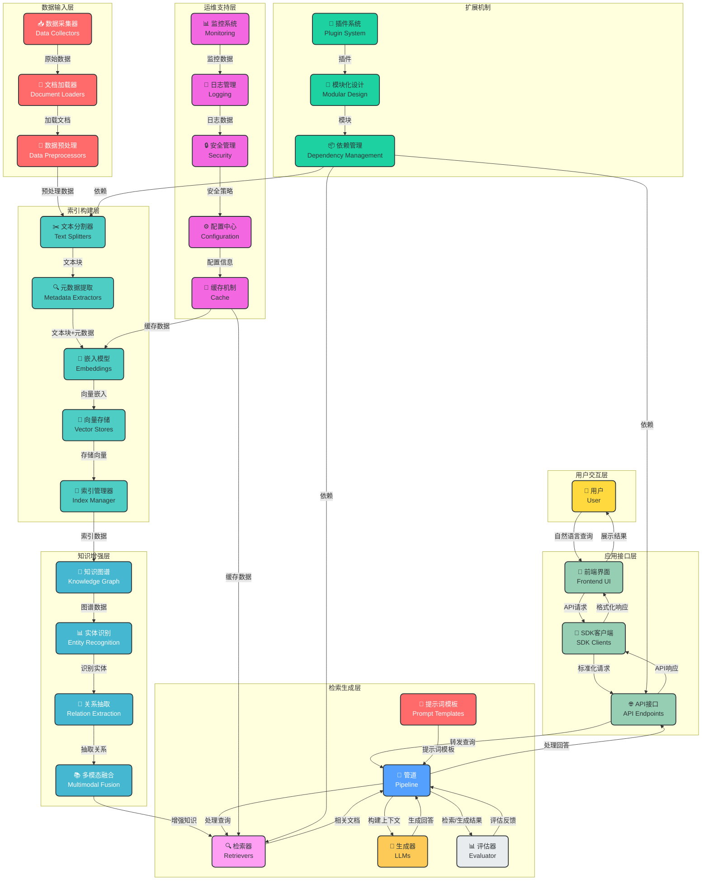

# 标准RAG知识库架构设计

## 1. 架构概述

本架构设计基于标准RAG（Retrieval-Augmented Generation）模式，结合了现代知识库系统的最佳实践，提供了一个完整、可扩展、高性能的知识库解决方案。架构分为数据输入层、索引构建层、知识增强层、检索生成层、应用接口层和运维支持层六个主要部分。

## 2. 详细架构图

## 3. 组件详细设计

### 3.1 数据输入层

#### 数据采集器 (Data Collectors)
- **功能**：从多种来源采集数据，包括文件系统、数据库、API接口、网页爬虫等
- **支持格式**：文本文件、PDF、Word、Excel、Markdown、HTML等
- **实现方式**：模块化设计，支持插件扩展

#### 文档加载器 (Document Loaders)
- **功能**：将不同格式的文档加载为统一的内部表示
- **支持库**：LangChain Document Loaders、Unstructured.io等
- **性能优化**：支持并行加载和批处理

#### 数据预处理 (Data Preprocessors)
- **功能**：清洗数据、去重、格式转换、编码处理等
- **处理步骤**：
  1. 数据清洗：去除噪声、特殊字符等
  2. 数据标准化：统一格式、编码
  3. 数据验证：检查数据完整性和有效性

### 3.2 索引构建层

#### 文本分割器 (Text Splitters)
- **功能**：将长文本分割为合适大小的文本块
- **分割策略**：
  - 基于字符数的分割
  - 基于句子的分割
  - 基于段落的分割
  - 基于语义的分割
- **优化考虑**：保持文本块的语义完整性，设置合理的重叠度

#### 元数据提取 (Metadata Extractors)
- **功能**：从文档中提取元数据，如标题、作者、创建时间、标签等
- **提取方式**：
  - 基于规则的提取
  - 基于NLP的提取
  - 基于模板的提取
- **元数据存储**：与文本块一起存储，用于检索过滤和排序

#### 嵌入模型 (Embeddings)
- **功能**：将文本转换为向量表示
- **支持模型**：
  - OpenAI Embeddings
  - Hugging Face Embeddings
  - 自定义嵌入模型
- **性能优化**：
  - 批处理嵌入
  - 缓存嵌入结果
  - 支持异步嵌入

#### 向量存储 (Vector Stores)
- **功能**：存储和检索向量嵌入
- **支持存储**：
  - LanceDB
  - FAISS
  - Pinecone
  - Milvus
  - Chroma
- **优化考虑**：
  - 索引优化
  - 分区策略
  - 压缩技术
  - 副本和备份

#### 索引管理器 (Index Manager)
- **功能**：管理多个索引，支持索引的创建、更新、删除和切换
- **索引类型**：
  - 主索引：完整的知识库索引
  - 增量索引：新添加文档的索引
  - 专用索引：特定领域或用途的索引
- **索引操作**：
  - 批量构建
  - 增量更新
  - 索引合并
  - 索引优化

### 3.3 知识增强层

#### 知识图谱 (Knowledge Graph)
- **功能**：构建和管理实体之间的关系网络
- **构建方式**：
  - 从文本中自动提取
  - 手动标注
  - 从外部知识库导入
- **查询能力**：支持基于图的查询和推理

#### 实体识别 (Entity Recognition)
- **功能**：识别文本中的实体，如人物、组织、地点、时间等
- **实现方式**：
  - 基于规则的识别
  - 基于NLP模型的识别
  - 基于知识库的识别
- **实体链接**：将识别的实体链接到知识图谱中

#### 关系抽取 (Relation Extraction)
- **功能**：提取实体之间的关系
- **抽取方式**：
  - 基于规则的抽取
  - 基于NLP模型的抽取
  - 基于模式的抽取
- **关系类型**：支持多种关系类型，如上下位关系、因果关系、关联关系等

#### 多模态融合 (Multimodal Fusion)
- **功能**：融合文本、图像、音频等多模态数据
- **融合方式**：
  - 多模态嵌入
  - 跨模态检索
  - 多模态生成
- **应用场景**：支持包含图像、音频的文档检索和生成

### 3.4 检索生成层

#### 检索器 (Retrievers)
- **功能**：根据用户查询检索相关文档
- **检索类型**：
  - 向量检索：基于语义相似度
  - 关键词检索：基于精确匹配
  - 混合检索：结合向量和关键词
  - 图检索：基于知识图谱的检索
- **检索优化**：
  - 重排序机制
  - 上下文感知检索
  - 个性化检索
  - 多索引融合检索

#### 管道 (Pipeline)
- **功能**：协调检索和生成过程，管理数据流
- **管道步骤**：
  1. 接收用户查询
  2. 预处理查询
  3. 执行检索
  4. 构建上下文
  5. 生成回答
  6. 后处理回答
- **优化考虑**：
  - 并行处理
  - 缓存机制
  - 错误处理

#### 生成器 (LLMs)
- **功能**：基于检索的上下文生成回答
- **支持模型**：
  - OpenAI GPT系列
  - Anthropic Claude
  - Hugging Face models
  - 本地部署模型
- **生成策略**：
  - 单次生成
  - 多轮对话
  - 流式生成
  - 逐步精化

#### 提示词模板 (Prompt Templates)
- **功能**：管理和优化提示词，提高生成质量
- **模板类型**：
  - 问答模板
  - 摘要模板
  - 对话模板
  - 定制模板
- **模板管理**：
  - 版本控制
  - A/B测试
  - 动态调整

#### 评估器 (Evaluator)
- **功能**：评估检索和生成的质量
- **评估维度**：
  - 检索相关性
  - 回答准确性
  - 回答完整性
  - 回答一致性
  - 回答时效性
- **评估方法**：
  - 自动化评估
  - 人工评估
  - 混合评估

### 3.5 应用接口层

#### API接口 (API Endpoints)
- **功能**：提供标准化的API接口，支持外部系统集成
- **接口类型**：
  - RESTful API
  - GraphQL API
  - WebSocket API
- **接口功能**：
  - 知识库查询
  - 文档管理
  - 索引操作
  - 系统管理
- **安全考虑**：
  - API密钥认证
  - OAuth2认证
  - 请求速率限制
  - 输入验证

#### SDK客户端 (SDK Clients)
- **功能**：为不同语言提供SDK，简化集成
- **支持语言**：
  - Python
  - JavaScript/TypeScript
  - Java
  - Go
  - 其他主流语言
- **SDK功能**：
  - 封装API调用
  - 错误处理
  - 重试机制
  - 缓存管理

#### 前端界面 (Frontend UI)
- **功能**：提供用户友好的界面，支持知识库交互
- **界面功能**：
  - 自然语言查询
  - 文档浏览
  - 结果展示
  - 历史记录
  - 个性化设置
- **技术栈**：
  - React/Vue/Angular
  - 响应式设计
  - 实时交互

### 3.6 运维支持层

#### 监控系统 (Monitoring)
- **功能**：监控系统运行状态和性能
- **监控指标**：
  - 查询响应时间
  - 检索准确率
  - 系统资源使用率
  - 错误率和类型
- **监控工具**：
  - Prometheus
  - Grafana
  - ELK Stack
  - 自定义监控

#### 日志管理 (Logging)
- **功能**：记录系统运行日志，用于故障排查和分析
- **日志类型**：
  - 应用日志
  - 访问日志
  - 错误日志
  - 审计日志
- **日志处理**：
  - 结构化日志
  - 日志聚合
  - 日志分析
  - 日志归档

#### 安全管理 (Security)
- **功能**：保护系统和数据安全
- **安全措施**：
  - 数据加密
  - 访问控制
  - 漏洞扫描
  - 安全审计
  - 防注入攻击
- **合规考虑**：
  - GDPR
  - HIPAA
  - 其他行业标准

#### 配置中心 (Configuration)
- **功能**：集中管理系统配置
- **配置类型**：
  - 系统配置
  - 模型配置
  - 检索配置
  - 部署配置
- **配置管理**：
  - 版本控制
  - 环境隔离
  - 配置热更新
  - 配置验证

#### 缓存机制 (Cache)
- **功能**：缓存频繁访问的数据，提高系统性能
- **缓存层级**：
  - 应用级缓存
  - 数据库级缓存
  - 分布式缓存
- **缓存策略**：
  - LRU (Least Recently Used)
  - LFU (Least Frequently Used)
  - FIFO (First In First Out)
- **缓存优化**：
  - 缓存预热
  - 缓存失效策略
  - 缓存一致性

### 3.7 扩展机制

#### 插件系统 (Plugin System)
- **功能**：通过插件扩展系统功能
- **插件类型**：
  - 数据加载插件
  - 文本分割插件
  - 嵌入模型插件
  - 检索器插件
  - 生成器插件
- **插件管理**：
  - 插件注册
  - 插件加载
  - 插件卸载
  - 插件依赖管理

#### 模块化设计 (Modular Design)
- **功能**：将系统拆分为独立的模块，提高可维护性和可扩展性
- **模块划分**：
  - 核心模块：必选功能
  - 扩展模块：可选功能
  - 自定义模块：用户定制功能
- **模块通信**：
  - 基于接口的通信
  - 事件驱动通信
  - 消息队列通信

#### 依赖管理 (Dependency Management)
- **功能**：管理系统依赖，确保版本兼容性和安全性
- **依赖类型**：
  - 核心依赖
  - 可选依赖
  - 开发依赖
- **依赖管理工具**：
  - pip (Python)
  - npm (JavaScript)
  - Maven (Java)
  - 其他语言的包管理工具

## 4. 数据流设计

### 4.1 索引构建流程

1. **数据采集**：从各种来源采集数据
2. **文档加载**：将数据加载为统一的文档格式
3. **数据预处理**：清洗和标准化数据
4. **文本分割**：将文档分割为文本块
5. **元数据提取**：从文档中提取元数据
6. **文本嵌入**：将文本块转换为向量
7. **向量存储**：将向量和元数据存储到向量数据库
8. **索引优化**：优化索引结构，提高检索性能

### 4.2 检索生成流程

1. **接收查询**：接收用户的自然语言查询
2. **查询预处理**：对查询进行清洗、标准化和增强
3. **查询嵌入**：将查询转换为向量
4. **向量检索**：在向量数据库中检索相关文本块
5. **知识图谱增强**：使用知识图谱补充相关信息
6. **上下文构建**：构建包含检索结果的上下文
7. **提示词生成**：根据上下文和查询生成提示词
8. **LLM生成**：使用LLM生成回答
9. **回答后处理**：对生成的回答进行处理和优化
10. **返回结果**：将回答返回给用户
11. **评估反馈**：评估检索和生成质量，收集反馈

## 5. 可扩展性设计

### 5.1 水平扩展

- **数据分片**：将向量数据分片存储，支持大规模知识库
- **服务集群**：部署多个服务实例，负载均衡
- **读写分离**：将读操作和写操作分离，优化性能
- **缓存分层**：使用多级缓存，提高响应速度

### 5.2 垂直扩展

- **模块插件化**：核心功能模块化，支持按需加载
- **算法可替换**：支持替换嵌入模型、检索算法和生成模型
- **配置可定制**：提供细粒度的配置选项，适应不同场景
- **API可扩展**：支持自定义API端点，满足特殊需求

### 5.3 技术栈选择

- **语言**：Python (核心), JavaScript (前端), Go (服务端)
- **框架**：FastAPI (API), LangChain (RAG), React (前端)
- **数据库**：PostgreSQL (元数据), LanceDB/FAISS (向量)
- **缓存**：Redis, Memcached
- **消息队列**：RabbitMQ, Kafka
- **容器化**：Docker, Kubernetes

## 6. 部署和运维

### 6.1 部署模式

- **本地部署**：适合小规模应用和开发测试
- **容器部署**：使用Docker容器，简化部署和管理
- **云服务部署**：使用AWS, Azure, GCP等云服务，提供弹性扩展
- **混合部署**：关键数据本地部署，计算资源云部署

### 6.2 运维最佳实践

- **自动化部署**：使用CI/CD流程，实现自动化部署
- **监控告警**：设置合理的监控指标和告警阈值
- **日志管理**：集中管理日志，建立日志分析系统
- **备份恢复**：定期备份数据，建立灾难恢复机制
- **性能优化**：定期分析性能瓶颈，进行系统优化
- **安全加固**：定期进行安全扫描，修复漏洞
- **容量规划**：根据业务增长，提前规划系统容量

### 6.3 升级和迁移

- **版本管理**：使用语义化版本控制，管理系统版本
- **兼容性策略**：保持API兼容性，减少升级影响
- **迁移工具**：提供数据迁移工具，支持平滑升级
- **回滚机制**：建立完善的回滚机制，应对升级失败
- **灰度发布**：采用灰度发布策略，降低升级风险

## 7. 最佳实践建议

### 7.1 性能优化

- **向量存储选择**：根据数据规模和查询模式选择合适的向量存储
- **嵌入模型选择**：在性能和质量之间找到平衡点
- **检索策略优化**：结合多种检索策略，提高检索准确性
- **缓存策略优化**：合理设置缓存大小和过期时间
- **批处理优化**：使用批处理减少API调用和数据库操作

### 7.2 质量提升

- **数据质量**：确保输入数据的质量，进行必要的清洗和标准化
- **分割策略**：选择合适的文本分割策略，保持语义完整性
- **提示词优化**：不断优化提示词模板，提高生成质量
- **评估反馈**：建立评估和反馈机制，持续改进系统
- **人工干预**：在关键场景下，结合人工审核和干预

### 7.3 成本控制

- **资源合理分配**：根据实际需求分配计算和存储资源
- **模型选择**：在效果和成本之间找到平衡点
- **缓存策略**：合理使用缓存，减少重复计算
- **批处理**：使用批处理减少API调用次数
- **按需扩展**：根据负载情况，动态调整资源分配

### 7.4 安全性

- **数据加密**：对敏感数据进行加密存储和传输
- **访问控制**：实施细粒度的访问控制，防止未授权访问
- **输入验证**：对所有输入进行严格验证，防止注入攻击
- **安全审计**：记录所有敏感操作，便于审计和追踪
- **漏洞扫描**：定期进行安全扫描，发现和修复漏洞

## 8. 架构评估

### 8.1 优势

- **完整性**：涵盖了RAG系统的所有核心组件和功能
- **可扩展性**：模块化设计，支持水平和垂直扩展
- **高性能**：优化的数据流和缓存机制，提供快速响应
- **可靠性**：完善的监控、日志和容错机制
- **安全性**：多层次的安全措施，保护系统和数据
- **易用性**：提供友好的API和前端界面，简化集成和使用

### 8.2 适用场景

- **企业知识库**：存储和检索企业内部知识
- **客户支持**：提供智能客服，回答客户问题
- **教育培训**：构建教育资源库，支持个性化学习
- **医疗健康**：管理医疗知识，辅助诊断和治疗
- **金融服务**：提供金融知识查询，支持投资决策
- **法律助手**：管理法律文档，辅助法律研究

## 9. 总结

本架构设计提供了一个完整、可扩展、高性能的标准RAG知识库解决方案，结合了现代知识库系统的最佳实践。通过模块化设计和插件系统，支持灵活的功能扩展和定制。通过完善的运维支持和监控系统，确保系统稳定运行和持续优化。

该架构不仅满足当前的知识库需求，也为未来的技术发展和业务增长预留了空间，是构建现代智能知识库的理想选择。