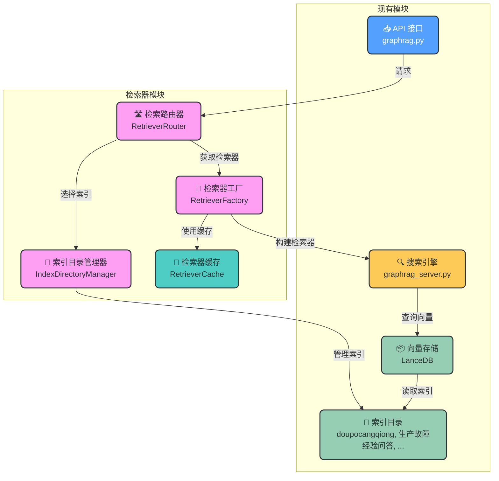

我需要查看docs/rag.md文件，了解项目对检索器的期望，然后分析现有代码中的检索功能，判断用户的判断是否合理。
        
            
toolName: view_files
            
status: success
          
            
filePath: /Users/wangqiao/Downloads/github_project/fastapi-enterprise-framework-template/docs/rag.md
          
我需要分析现有代码中的检索功能，判断用户的判断是否合理，并设计一个检索器模块来将用户输入和索引目录关联起来。
        
            
toolName: no_need_execute
            
status: no_need_execute
          
          
我需要先了解项目的整体结构，然后查找与检索功能相关的代码文件。
        
            
toolName: view_folder
            
status: success
          
/Users/wangqiao/Downloads/github_project/fastapi-enterprise-framework-template
          
让我查看graphrag相关的API文件，这可能包含检索功能的实现。
        
            
toolName: view_files
            
status: success
          
            
filePath: /Users/wangqiao/Downloads/github_project/fastapi-enterprise-framework-template/app/api/v1/graphrag.py
          
现在我需要查看GraphRAGService类的实现，特别是local_search方法，这是检索功能的核心。
        
            
toolName: view_files
            
status: success
          
            
filePath: /Users/wangqiao/Downloads/github_project/fastapi-enterprise-framework-template/app/domains/graphrag/services/graphrag_service.py
          
我需要查看graphrag_server.py文件，了解搜索引擎的具体实现。
        
            
toolName: view_files
            
status: success
          
            
filePath: /Users/wangqiao/Downloads/github_project/fastapi-enterprise-framework-template/docs/mcp_rag_agent_graphrag_demo/graphrag_server.py
          
让我查看一下batch_build_index.py文件，了解批量构建索引的实现，这可能与检索功能相关。
        
            
toolName: view_files
            
status: success
          
            
filePath: /Users/wangqiao/Downloads/github_project/fastapi-enterprise-framework-template/batch_build_index.py
          
现在我已经了解了项目中的检索功能实现，让我总结一下核心组件和流程。# 检索功能实现分析

## 核心组件

1. **GraphRAGService类** (`/Users/wangqiao/Downloads/github_project/fastapi-enterprise-framework-template/app/domains/graphrag/services/graphrag_service.py`)
   - 封装了三种搜索功能：本地搜索、全局搜索、DRIFT搜索
   - 实现了搜索引擎的延迟初始化

2. **API接口** (`/Users/wangqiao/Downloads/github_project/fastapi-enterprise-framework-template/app/api/v1/graphrag.py`)
   - `/chat`：接受查询请求，调用本地搜索并返回结果
   - `/tools`：返回支持的工具列表

3. **搜索引擎构建** (`/Users/wangqiao/Downloads/github_project/fastapi-enterprise-framework-template/docs/mcp_rag_agent_graph_demo/graphrag_server.py`)
   - `build_local_search_engine()`：构建本地搜索引擎
   - `build_global_search_engine()`：构建全局搜索引擎
   - `build_drift_search_engine()`：构建DRIFT搜索引擎

4. **批量索引构建** (`/Users/wangqiao/Downloads/github_project/fastapi-enterprise-framework-template/batch_build_index.py`)
   - 遍历指定目录下的所有文件
   - 为每个文件创建独立的索引目录
   - 复制配置文件和输入数据
   - 执行`graphrag index`命令构建索引

## 检索流程

1. **请求处理**：用户发送查询请求到`/chat`接口
2. **搜索引擎初始化**：如果本地搜索引擎未初始化，调用`build_local_search_engine()`构建
3. **数据加载**：
   - 从Parquet文件加载实体、关系、社区报告和文本单元数据
   - 将实体描述嵌入加载到LanceDB向量存储
4. **搜索执行**：调用搜索引擎的`asearch()`方法执行异步搜索
5. **结果返回**：将搜索结果格式化为`ChatResponse`对象返回给用户

## 技术栈

- **FastAPI**：构建API服务
- **GraphRAG**：实现基于知识图谱的检索
- **LanceDB**：向量存储和检索
- **Pandas**：数据处理
- **OpenAI API/阿里通义**：LLM和嵌入模型

## 搜索类型

1. **本地搜索（LocalSearch）**
   - 基于实体和关系的搜索
   - 使用混合上下文构建器，结合文本单元、社区报告、实体和关系
   - 配置参数：`text_unit_prop`、`community_prop`、`top_k_mapped_entities`等

2. **全局搜索（GlobalSearch）**
   - 基于社区报告的搜索
   - 支持使用完整社区报告或社区摘要
   - 实现了map-reduce模式，处理大规模数据

3. **DRIFT搜索（DRIFTSearch）**
   - 结合实体、关系和报告的混合搜索
   - 支持实体文本嵌入和报告内容嵌入

## 配置管理

- 通过`settings.yaml`和`.env`文件配置
- 支持不同的LLM和嵌入模型
- 可配置搜索参数（如`max_tokens`、`temperature`等）
- 支持自定义响应类型（如"multiple paragraphs"）

## 数据结构

- **实体表**：`create_final_nodes`、`create_final_entities`
- **社区表**：`create_final_communities`、`create_final_community_reports`
- **文本单元表**：`create_final_text_units`
- **关系表**：`create_final_relationships`

## 向量存储

- 使用LanceDB作为向量存储
- 支持实体描述嵌入和报告内容嵌入
- 向量存储路径：`{DATA_DIR}/lancedb`

## 索引构建流程

1. 创建索引目录结构
2. 复制配置文件和输入数据
3. 执行`graphrag index`命令
4. 生成Parquet格式的索引文件
5. 构建向量存储

## 总结

该项目实现了一个基于GraphRAG的智能检索系统，支持多种搜索类型，使用向量存储和知识图谱技术，提供了灵活的配置选项和批量索引构建功能。系统通过FastAPI暴露API接口，可与其他系统集成，适用于基于结构化知识的问答场景。
        
          
根据现有代码分析和rag.md的架构图，我需要设计一个检索器模块，实现动态关联用户输入和索引目录的功能。## 分析判断

您的判断是**合理的**。根据项目代码分析和 `docs/rag.md` 的架构图，现有项目确实存在以下情况：

### 已实现的功能

1. **索引构建阶段**：
   - 已实现文档加载、文本分割、嵌入模型和向量存储
   - `batch_build_index.py` 支持批量构建索引
   - `/docs/mcp_rag_agent_graphrag_demo/doupocangqiong` 是一个完整的索引目录示例

2. **基础检索功能**：
   - 实现了本地搜索、全局搜索和 DRIFT 搜索三种搜索类型
   - 通过 `graphrag_server.py` 提供搜索引擎构建和搜索方法
   - 提供了 FastAPI 接口 `/chat` 和 `/tools`

### 缺失的功能

1. **灵活的检索器模块**：
   - 现有检索功能硬编码绑定了固定的索引目录 `doupocangqiong`
   - 缺少将用户输入和索引目录动态关联的机制
   - 无法灵活选择不同的索引进行检索

2. **索引目录管理**：
   - 缺少索引目录的注册和管理机制
   - 无法动态发现和使用新构建的索引

3. **检索器配置**：
   - 缺少灵活的检索器配置选项
   - 无法根据不同场景调整检索参数

## 检索器模块设计

### 核心功能

1. **索引目录管理**：
   - 自动发现和注册可用的索引目录
   - 支持手动添加和删除索引目录
   - 提供索引目录的元数据管理

2. **动态检索器构建**：
   - 根据索引目录动态构建检索器
   - 支持不同类型的检索器（本地、全局、DRIFT）
   - 提供检索器缓存机制

3. **检索路由**：
   - 将用户输入与合适的索引目录关联
   - 支持基于规则或模型的路由策略
   - 提供多索引融合检索功能

4. **API 扩展**：
   - 扩展现有 API，支持指定索引目录
   - 提供索引目录列表查询接口
   - 支持检索器配置调整

### 架构设计

### 实现步骤

1. **创建索引目录管理器**：
   - 实现 `IndexDirectoryManager` 类，管理所有可用的索引目录
   - 提供 `list_indexes()`、`get_index()`、`add_index()` 等方法
   - 支持自动发现 `./output/` 目录下的索引

2. **创建检索器工厂**：
   - 实现 `RetrieverFactory` 类，根据索引目录动态构建检索器
   - 支持构建不同类型的检索器
   - 实现检索器缓存，避免重复构建

3. **创建检索路由器**：
   - 实现 `RetrieverRouter` 类，根据用户输入选择合适的索引
   - 支持基于规则的路由（如关键词匹配）
   - 支持基于模型的路由（如使用 LLM 判断索引相关性）

4. **扩展 API 接口**：
   - 在 `graphrag.py` 中添加 `index` 参数，支持指定索引目录
   - 添加 `/indexes` 接口，返回可用索引列表
   - 添加 `/retriever/config` 接口，支持调整检索配置

5. **修改现有服务**：
   - 修改 `GraphRAGService`，支持动态指定索引目录
   - 修改 `graphrag_server.py`，支持动态构建搜索引擎

### 预期效果

1. **灵活性**：用户可以根据需要选择不同的索引进行检索
2. **扩展性**：新构建的索引可以自动被发现和使用
3. **高性能**：通过检索器缓存，避免重复构建搜索引擎
4. **易用性**：提供简洁的 API 接口，方便集成到其他系统

## 实现建议

1. **先实现核心功能**：从索引目录管理器和检索器工厂开始，逐步扩展功能
2. **保持兼容性**：确保现有 API 接口继续工作，不破坏现有功能
3. **添加配置选项**：允许通过配置文件调整检索器行为
4. **实现文档**：为新模块添加详细的文档和使用示例
5. **测试**：为新功能添加单元测试和集成测试

通过实现这个检索器模块，您可以将用户输入和索引目录动态关联起来，实现灵活的检索功能，完善项目的 RAG 架构。