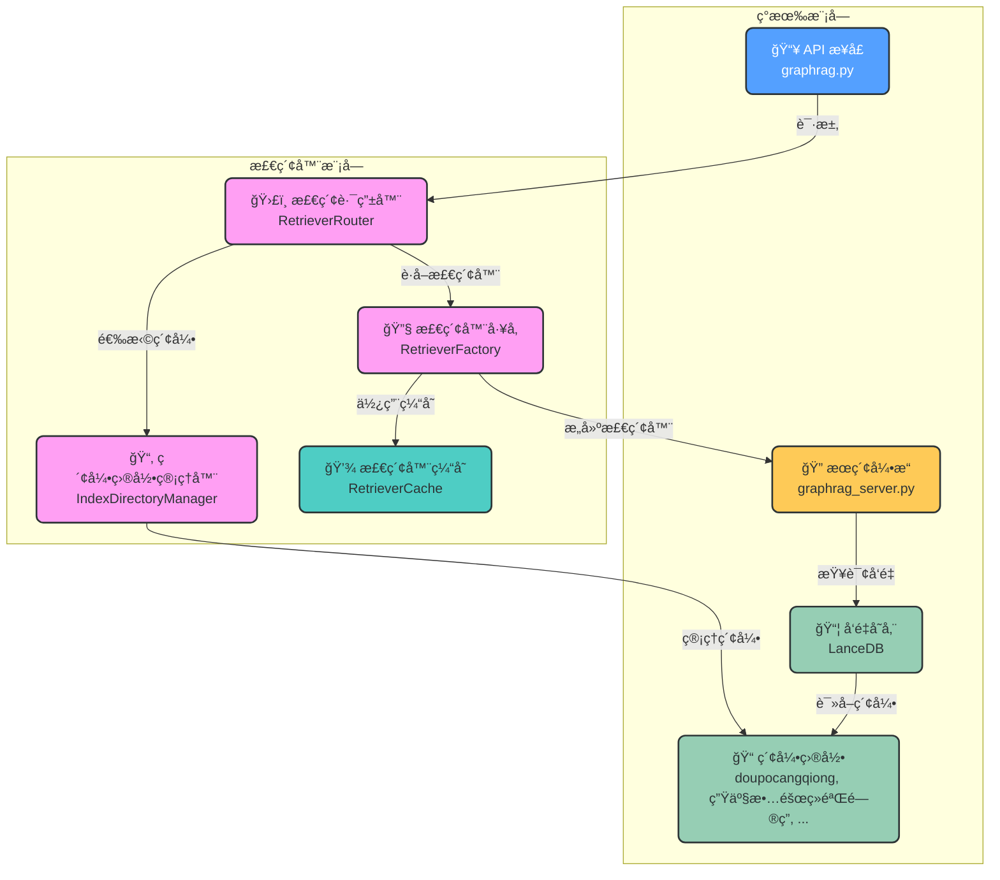

我需è¦æŸ¥çœ‹docs/rag.md文件，了解项目对检索器的期望，然å分æç°æœ‰ä»£ç ä¸­çš„检索功能，判断用户的判断是å¦åˆç†ã€‚
        
            
toolName: view_files
            
status: success
          
            
filePath: /Users/wangqiao/Downloads/github_project/fastapi-enterprise-framework-template/docs/rag.md
          
我需è¦åˆ†æç°æœ‰ä»£ç ä¸­çš„检索功能，判断用户的判断是å¦åˆç†ï¼Œå¹¶è®¾è®¡ä¸€ä¸ªæ£€ç´¢å™¨æ¨¡å—æ¥å°†ç”¨æˆ·è¾“入和索引目录关è”èµ·æ¥ã€‚
        
            
toolName: no_need_execute
            
status: no_need_execute
          
          
我需è¦å…ˆäº†è§£é¡¹ç›®çš„整体结æ„，然å查找ä¸æ£€ç´¢åŠŸèƒ½ç›¸å…³çš„代ç æ–‡ä»¶ã€‚
        
            
toolName: view_folder
            
status: success
          
/Users/wangqiao/Downloads/github_project/fastapi-enterprise-framework-template
          
让我查看graphrag相关的API文件，这å¯èƒ½åŒ…å«æ£€ç´¢åŠŸèƒ½çš„å®ç°ã€‚
        
            
toolName: view_files
            
status: success
          
            
filePath: /Users/wangqiao/Downloads/github_project/fastapi-enterprise-framework-template/app/api/v1/graphrag.py
          
ç°åœ¨æˆ‘需è¦æŸ¥çœ‹GraphRAGService类的å®ç°ï¼Œç‰¹åˆ«æ˜¯local_search方法，这是检索功能的核心。
        
            
toolName: view_files
            
status: success
          
            
filePath: /Users/wangqiao/Downloads/github_project/fastapi-enterprise-framework-template/app/domains/graphrag/services/graphrag_service.py
          
我需è¦æŸ¥çœ‹graphrag_server.py文件，了解æœç´¢å¼•æ“的具体å®ç°ã€‚
        
            
toolName: view_files
            
status: success
          
            
filePath: /Users/wangqiao/Downloads/github_project/fastapi-enterprise-framework-template/docs/mcp_rag_agent_graphrag_demo/graphrag_server.py
          
让我查看一下batch_build_index.py文件，了解批é‡æ„建索引的å®ç°ï¼Œè¿™å¯èƒ½ä¸æ£€ç´¢åŠŸèƒ½ç›¸å…³ã€‚
        
            
toolName: view_files
            
status: success
          
            
filePath: /Users/wangqiao/Downloads/github_project/fastapi-enterprise-framework-template/batch_build_index.py
          
ç°åœ¨æˆ‘å·²ç»äº†è§£äº†é¡¹ç›®ä¸­çš„检索功能å®ç°ï¼Œè®©æˆ‘总结一下核心组件和æµç¨‹ã€‚# 检索功能å®ç°åˆ†æ

## 核心组件

1. **GraphRAGServiceç±»** (`/Users/wangqiao/Downloads/github_project/fastapi-enterprise-framework-template/app/domains/graphrag/services/graphrag_service.py`)
   - å°è£…了三ç§æœç´¢åŠŸèƒ½ï¼šæœ¬åœ°æœç´¢ã€å…¨å±€æœç´¢ã€DRIFTæœç´¢
   - å®ç°äº†æœç´¢å¼•æ“的延迟åˆå§‹åŒ–

2. **APIæ¥å£** (`/Users/wangqiao/Downloads/github_project/fastapi-enterprise-framework-template/app/api/v1/graphrag.py`)
   - `/chat`：æ¥å—查询请求，调用本地æœç´¢å¹¶è¿”å›ç»“æœ
   - `/tools`：返å›æ”¯æŒçš„工具列表

3. **æœç´¢å¼•æ“æ„建** (`/Users/wangqiao/Downloads/github_project/fastapi-enterprise-framework-template/docs/mcp_rag_agent_graph_demo/graphrag_server.py`)
   - `build_local_search_engine()`：æ„建本地æœç´¢å¼•æ“
   - `build_global_search_engine()`：æ„建全局æœç´¢å¼•æ“
   - `build_drift_search_engine()`：æ„建DRIFTæœç´¢å¼•æ“

4. **批é‡ç´¢å¼•æ„建** (`/Users/wangqiao/Downloads/github_project/fastapi-enterprise-framework-template/batch_build_index.py`)
   - éå†æŒ‡å®šç›®å½•ä¸‹çš„所有文件
   - 为æ¯ä¸ªæ–‡ä»¶åˆ›å»ºç‹¬ç«‹çš„索引目录
   - å¤åˆ¶é…置文件和输入数æ®
   - 执行`graphrag index`命令æ„建索引

## 检索æµç¨‹

1. **请求处ç†**：用户å‘é€æŸ¥è¯¢è¯·æ±‚到`/chat`æ¥å£
2. **æœç´¢å¼•æ“åˆå§‹åŒ–**：如æœæœ¬åœ°æœç´¢å¼•æ“未åˆå§‹åŒ–，调用`build_local_search_engine()`æ„建
3. **æ•°æ®åŠ è½½**：
   - ä»Parquet文件加载å®ä½“ã€å…³ç³»ã€ç¤¾åŒºæŠ¥å‘Šå’Œæ–‡æœ¬å•å…ƒæ•°æ®
   - å°†å®ä½“æ述嵌入加载到LanceDBå‘é‡å­˜å‚¨
4. **æœç´¢æ‰§è¡Œ**：调用æœç´¢å¼•æ“çš„`asearch()`方法执行异步æœç´¢
5. **结æœè¿”å›**：将æœç´¢ç»“æœæ ¼å¼åŒ–为`ChatResponse`对象返å›ç»™ç”¨æˆ·

## 技术栈

- **FastAPI**：æ„建APIæœåŠ¡
- **GraphRAG**：å®ç°åŸºäºçŸ¥è¯†å›¾è°±çš„检索
- **LanceDB**：å‘é‡å­˜å‚¨å’Œæ£€ç´¢
- **Pandas**：数æ®å¤„ç†
- **OpenAI API/阿里通义**：LLM和嵌入模å‹

## æœç´¢ç±»å‹

1. **本地æœç´¢ï¼ˆLocalSearch）**
   - 基äºå®ä½“和关系的æœç´¢
   - 使用混åˆä¸Šä¸‹æ–‡æ„建器，结åˆæ–‡æœ¬å•å…ƒã€ç¤¾åŒºæŠ¥å‘Šã€å®ä½“和关系
   - é…ç½®å‚数：`text_unit_prop`ã€`community_prop`ã€`top_k_mapped_entities`ç­‰

2. **全局æœç´¢ï¼ˆGlobalSearch）**
   - 基äºç¤¾åŒºæŠ¥å‘Šçš„æœç´¢
   - 支æŒä½¿ç”¨å®Œæ•´ç¤¾åŒºæŠ¥å‘Šæˆ–社区摘è¦
   - å®ç°äº†map-reduce模å¼ï¼Œå¤„ç†å¤§è§„模数æ®

3. **DRIFTæœç´¢ï¼ˆDRIFTSearch）**
   - 结åˆå®ä½“ã€å…³ç³»å’ŒæŠ¥å‘Šçš„æ··åˆæœç´¢
   - 支æŒå®ä½“文本嵌入和报告内容嵌入

## é…置管ç†

- 通过`settings.yaml`å’Œ`.env`文件é…ç½®
- 支æŒä¸åŒçš„LLM和嵌入模å‹
- å¯é…ç½®æœç´¢å‚数（如`max_tokens`ã€`temperature`等）
- 支æŒè‡ªå®šä¹‰å“应类å‹ï¼ˆå¦‚"multiple paragraphs"）

## æ•°æ®ç»“æ„

- **å®ä½“表**：`create_final_nodes`ã€`create_final_entities`
- **社区表**：`create_final_communities`ã€`create_final_community_reports`
- **文本å•å…ƒè¡¨**：`create_final_text_units`
- **关系表**：`create_final_relationships`

## å‘é‡å­˜å‚¨

- 使用LanceDB作为å‘é‡å­˜å‚¨
- 支æŒå®ä½“æ述嵌入和报告内容嵌入
- å‘é‡å­˜å‚¨è·¯å¾„：`{DATA_DIR}/lancedb`

## 索引æ„建æµç¨‹

1. 创建索引目录结æ„
2. å¤åˆ¶é…置文件和输入数æ®
3. 执行`graphrag index`命令
4. 生æˆParquetæ ¼å¼çš„索引文件
5. æ„建å‘é‡å­˜å‚¨

## 总结

该项目å®ç°äº†ä¸€ä¸ªåŸºäºGraphRAG的智能检索系统，支æŒå¤šç§æœç´¢ç±»å‹ï¼Œä½¿ç”¨å‘é‡å­˜å‚¨å’ŒçŸ¥è¯†å›¾è°±æŠ€æœ¯ï¼Œæ供了çµæ´»çš„é…置选项和批é‡ç´¢å¼•æ„建功能。系统通过FastAPI暴露APIæ¥å£ï¼Œå¯ä¸å…¶ä»–系统集æˆï¼Œé€‚用äºåŸºäºç»“æ„化知识的问答场景。
        
          
æ ¹æ®ç°æœ‰ä»£ç åˆ†æå’Œrag.mdçš„æ¶æ„图，我需è¦è®¾è®¡ä¸€ä¸ªæ£€ç´¢å™¨æ¨¡å—，å®ç°åŠ¨æ€å…³è”用户输入和索引目录的功能。## 分æ判断

您的判断是**åˆç†çš„**。根æ®é¡¹ç›®ä»£ç åˆ†æå’Œ `docs/rag.md` çš„æ¶æ„图，ç°æœ‰é¡¹ç›®ç¡®å®å­˜åœ¨ä»¥ä¸‹æƒ…况：

### å·²å®ç°çš„功能

1. **索引æ„建阶段**：
   - å·²å®ç°æ–‡æ¡£åŠ è½½ã€æ–‡æœ¬åˆ†å‰²ã€åµŒå…¥æ¨¡å‹å’Œå‘é‡å­˜å‚¨
   - `batch_build_index.py` 支æŒæ‰¹é‡æ„建索引
   - `/docs/mcp_rag_agent_graphrag_demo/doupocangqiong` 是一个完整的索引目录示例

2. **基础检索功能**：
   - å®ç°äº†æœ¬åœ°æœç´¢ã€å…¨å±€æœç´¢å’Œ DRIFT æœç´¢ä¸‰ç§æœç´¢ç±»å‹
   - 通过 `graphrag_server.py` æä¾›æœç´¢å¼•æ“æ„建和æœç´¢æ–¹æ³•
   - æ供了 FastAPI æ¥å£ `/chat` å’Œ `/tools`

### 缺失的功能

1. **çµæ´»çš„检索器模å—**：
   - ç°æœ‰æ£€ç´¢åŠŸèƒ½ç¡¬ç¼–ç ç»‘定了固定的索引目录 `doupocangqiong`
   - 缺少将用户输入和索引目录动æ€å…³è”的机制
   - 无法çµæ´»é€‰æ‹©ä¸åŒçš„索引进行检索

2. **索引目录管ç†**：
   - 缺少索引目录的注册和管ç†æœºåˆ¶
   - 无法动æ€å‘ç°å’Œä½¿ç”¨æ–°æ„建的索引

3. **检索器é…ç½®**：
   - 缺少çµæ´»çš„检索器é…置选项
   - 无法根æ®ä¸åŒåœºæ™¯è°ƒæ•´æ£€ç´¢å‚æ•°

## 检索器模å—设计

### 核心功能

1. **索引目录管ç†**：
   - 自动å‘ç°å’Œæ³¨å†Œå¯ç”¨çš„索引目录
   - 支æŒæ‰‹åŠ¨æ·»åŠ å’Œåˆ é™¤ç´¢å¼•ç›®å½•
   - æ供索引目录的元数æ®ç®¡ç†

2. **动æ€æ£€ç´¢å™¨æ„建**：
   - æ ¹æ®ç´¢å¼•ç›®å½•åŠ¨æ€æ„建检索器
   - 支æŒä¸åŒç±»å‹çš„检索器（本地ã€å…¨å±€ã€DRIFT）
   - æ供检索器缓存机制

3. **检索路由**：
   - 将用户输入ä¸åˆé€‚的索引目录关è”
   - 支æŒåŸºäºè§„则或模å‹çš„路由策略
   - æ供多索引èåˆæ£€ç´¢åŠŸèƒ½

4. **API 扩展**：
   - 扩展ç°æœ‰ API，支æŒæŒ‡å®šç´¢å¼•ç›®å½•
   - æ供索引目录列表查询æ¥å£
   - 支æŒæ£€ç´¢å™¨é…置调整

### æ¶æ„设计

### å®ç°æ­¥éª¤

1. **创建索引目录管ç†å™¨**：
   - å®ç° `IndexDirectoryManager` 类，管ç†æ‰€æœ‰å¯ç”¨çš„索引目录
   - æä¾› `list_indexes()`ã€`get_index()`ã€`add_index()` 等方法
   - 支æŒè‡ªåŠ¨å‘ç° `./output/` 目录下的索引

2. **创建检索器工å‚**：
   - å®ç° `RetrieverFactory` 类，根æ®ç´¢å¼•ç›®å½•åŠ¨æ€æ„建检索器
   - 支æŒæ„建ä¸åŒç±»å‹çš„检索器
   - å®ç°æ£€ç´¢å™¨ç¼“存，é¿å…é‡å¤æ„建

3. **创建检索路由器**：
   - å®ç° `RetrieverRouter` 类，根æ®ç”¨æˆ·è¾“入选择åˆé€‚的索引
   - 支æŒåŸºäºè§„则的路由（如关键è¯åŒ¹é…）
   - 支æŒåŸºäºæ¨¡å‹çš„路由（如使用 LLM 判断索引相关性）

4. **扩展 API æ¥å£**：
   - 在 `graphrag.py` 中添加 `index` å‚数，支æŒæŒ‡å®šç´¢å¼•ç›®å½•
   - 添加 `/indexes` æ¥å£ï¼Œè¿”å›å¯ç”¨ç´¢å¼•åˆ—表
   - 添加 `/retriever/config` æ¥å£ï¼Œæ”¯æŒè°ƒæ•´æ£€ç´¢é…ç½®

5. **修改ç°æœ‰æœåŠ¡**：
   - 修改 `GraphRAGService`，支æŒåŠ¨æ€æŒ‡å®šç´¢å¼•ç›®å½•
   - 修改 `graphrag_server.py`，支æŒåŠ¨æ€æ„建æœç´¢å¼•æ“

### 预期效æœ

1. **çµæ´»æ€§**：用户å¯ä»¥æ ¹æ®éœ€è¦é€‰æ‹©ä¸åŒçš„索引进行检索
2. **扩展性**：新æ„建的索引å¯ä»¥è‡ªåŠ¨è¢«å‘ç°å’Œä½¿ç”¨
3. **高性能**：通过检索器缓存，é¿å…é‡å¤æ„建æœç´¢å¼•æ“
4. **易用性**：æ供简æ´çš„ API æ¥å£ï¼Œæ–¹ä¾¿é›†æˆåˆ°å…¶ä»–系统

## å®ç°å»ºè®®

1. **å…ˆå®ç°æ ¸å¿ƒåŠŸèƒ½**：ä»ç´¢å¼•ç›®å½•ç®¡ç†å™¨å’Œæ£€ç´¢å™¨å·¥å‚开始，é€æ­¥æ‰©å±•åŠŸèƒ½
2. **ä¿æŒå…¼å®¹æ€§**：确ä¿ç°æœ‰ API æ¥å£ç»§ç»­å·¥ä½œï¼Œä¸ç ´åç°æœ‰åŠŸèƒ½
3. **添加é…置选项**：å…许通过é…置文件调整检索器行为
4. **å®ç°æ–‡æ¡£**：为新模å—添加详细的文档和使用示例
5. **测试**：为新功能添加å•å…ƒæµ‹è¯•å’Œé›†æˆæµ‹è¯•

通过å®ç°è¿™ä¸ªæ£€ç´¢å™¨æ¨¡å—，您å¯ä»¥å°†ç”¨æˆ·è¾“入和索引目录动æ€å…³è”èµ·æ¥ï¼Œå®ç°çµæ´»çš„检索功能，完善项目的 RAG æ¶æ„。