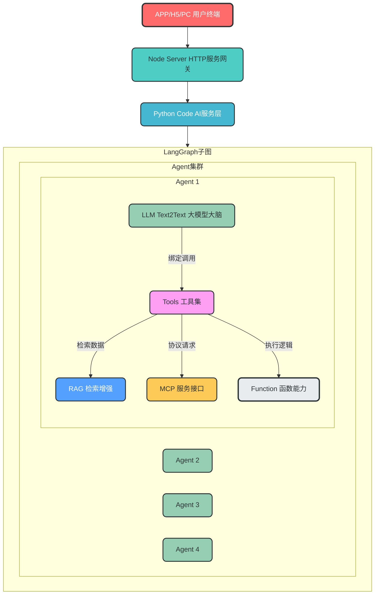

```mermaid
flowchart TB
    %% 层级1：用户接入层
    A[APP/H5/PC 用户终端] --> B[Node Server HTTP服务网关]
    %% 层级2：服务中转层
    B --> C[Python Code AI服务层]
    %% 层级3：核心编排层
    C --> LangGraph子图
    
    %% LangGraph子图
    subgraph LangGraph子图
        subgraph Agent集群
            direction LR
            subgraph Agent1[Agent 1]
                E1[LLM Text2Text 大模型大脑]
                E1 -- 绑定调用 --> F1[Tools 工具集]
                F1 -- 检索数据 --> G1[RAG 检索增强]
                F1 -- 协议请求 --> H1[MCP 服务接口]
                F1 -- 执行逻辑 --> I1[Function 函数能力]
            end
            Agent2[Agent 2]
            Agent3[Agent 3]
            Agent4[Agent 4]
        end
    end

    %% 样式美化
    classDef style1 fill:#FF6B6B,stroke:#2D3436,stroke-width:3px,color:white,rx:8,ry:8
    classDef style2 fill:#4ECDC4,stroke:#2D3436,stroke-width:2px,color:#2D3436,rx:8,ry:8
    classDef style3 fill:#45B7D1,stroke:#2D3436,stroke-width:2px,color:white,rx:8,ry:8
    classDef style4 fill:#96CEB4,stroke:#2D3436,stroke-width:2px,color:#2D3436,rx:8,ry:8
    classDef style5 fill:#FF9FF3,stroke:#2D3436,stroke-width:2px,color:#2D3436,rx:8,ry:8
    classDef style6 fill:#54A0FF,stroke:#2D3436,stroke-width:2px,color:white,rx:8,ry:8
    classDef style7 fill:#FECA57,stroke:#2D3436,stroke-width:2px,color:#2D3436,rx:8,ry:8
    classDef style8 fill:#E9ECEF,stroke:#2D3436,stroke-width:3px,color:#2D3436,rx:8,ry:8
    
    class A style1
    class B style2
    class C style3
    class E1 style4
    class F1 style5
    class G1 style6
    class H1 style7
    class I1 style8
    class Agent2,Agent3,Agent4 style4
```