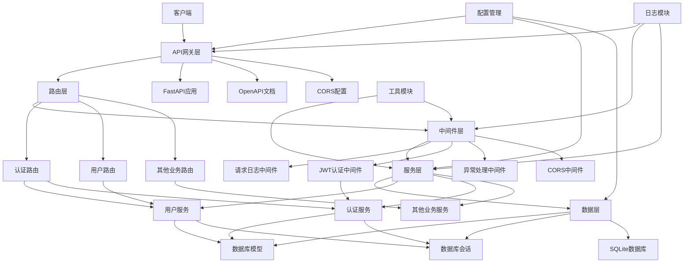

# FastAPI企业级架构设计

## 系统架构图

## 架构说明

### 1. 核心功能
- **用户注册**：完整的用户注册功能，包含用户名、密码、邮箱等必填字段
- **用户登录**：安全的用户登录功能，包含JWT认证

### 2. 技术栈
- **框架**：FastAPI
- **数据库**：SQLite
- **虚拟环境**：uv
- **认证**：JWT
- **密码加密**：bcrypt

### 3. 模块划分

#### 3.1 配置管理
- **文件**：`app/core/config.py`
- **功能**：管理环境变量和配置加载
- **技术**：Pydantic Settings

#### 3.2 路由模块
- **文件**：`app/api/v1/`
- **功能**：定义API端点
- **组件**：
  - 认证路由（注册、登录）
  - 用户路由（获取用户信息）

#### 3.3 中间件模块
- **文件**：`app/middleware/`
- **功能**：处理请求
- **组件**：
  - 请求日志中间件
  - JWT认证中间件
  - CORS中间件

#### 3.4 服务层
- **文件**：`app/services/`
- **功能**：业务逻辑实现
- **组件**：
  - 用户服务（注册、登录）

#### 3.5 数据层
- **文件**：`app/models/`、`app/database/`
- **功能**：数据库操作和模型定义
- **技术**：SQLAlchemy ORM
- **组件**：
  - 用户模型
  - 数据库连接
  - 数据库会话

#### 3.6 工具模块
- **文件**：`app/utils/`
- **功能**：常用工具函数
- **组件**：
  - 密码加密和验证
  - JWT令牌生成和验证

#### 3.7 日志模块
- **文件**：`app/logger/`
- **功能**：记录系统运行日志
- **技术**：Python logging模块
- **组件**：
  - 控制台日志
  - 文件日志

#### 3.8 异常处理
- **文件**：`app/exceptions/`
- **功能**：自定义异常和全局异常捕获
- **组件**：
  - 自定义异常类
  - 全局异常处理器

#### 3.9 测试模块
- **文件**：`tests/`
- **功能**：单元测试和集成测试
- **技术**：pytest
- **组件**：
  - API测试
  - 服务层测试
  - 工具函数测试

### 4. 调用流程

#### 4.1 用户注册流程
1. 客户端发送注册请求
2. API网关层接收请求
3. 路由层将请求转发到注册端点
4. 中间件层处理请求（日志记录、CORS检查）
5. 服务层验证请求数据
6. 服务层检查用户名和邮箱是否已存在
7. 服务层对密码进行加密
8. 服务层将用户数据保存到数据库
9. 服务层返回注册成功响应
10. 客户端接收响应

#### 4.2 用户登录流程
1. 客户端发送登录请求
2. API网关层接收请求
3. 路由层将请求转发到登录端点
4. 中间件层处理请求（日志记录、CORS检查）
5. 服务层验证用户名和密码
6. 服务层生成JWT令牌
7. 服务层返回登录成功响应和JWT令牌
8. 客户端接收响应并保存JWT令牌

#### 4.3 受保护资源访问流程
1. 客户端发送请求，携带JWT令牌
2. API网关层接收请求
3. 路由层将请求转发到相应端点
4. 中间件层处理请求
   - 日志记录
   - CORS检查
   - JWT认证中间件验证令牌
5. 服务层处理业务逻辑
6. 服务层访问数据库
7. 服务层返回响应
8. 客户端接收响应

### 5. 代码规范
- 符合PEP8规范
- 适当的注释
- 清晰的模块划分
- 合理的命名规范

### 6. 优化建议
1. **分阶段优化**：先实施核心优化（如仓储模式），再逐步添加高级功能
2. **保持向后兼容**：优化过程中确保现有功能正常运行
3. **添加自动化测试**：确保优化后的代码质量
4. **完善文档**：记录架构决策和优化方案
5. **进行性能测试**：验证优化效果

## 交付成果

- ✅ 完整的系统架构图
- ✅ 各模块间清晰的调用关系
- ✅ 代码符合PEP8规范并有适当注释
- ✅ 核心功能实现（用户注册、用户登录）
- ✅ 各模块完整实现和整合
- ✅ 测试模块实现

## 运行说明

1. **创建虚拟环境**：`uv venv`
2. **激活虚拟环境**：`source .venv/Scripts/activate`
3. **安装依赖**：`uv add fastapi uvicorn sqlalchemy pydantic-settings python-jose bcrypt python-multipart email-validator pytest pytest-cov`
4. **运行应用**：`python -m app.main`
5. **访问API文档**：http://localhost:8000/docs
6. **运行测试**：`uv run pytest`
